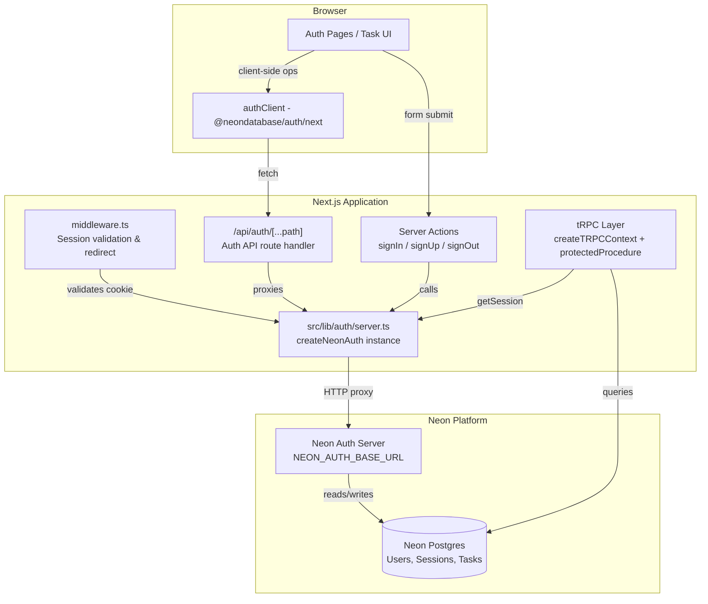

# Design Document: Neon Auth Integration

## Overview

This design integrates Neon Auth (the `@neondatabase/auth` SDK built on Better Auth) into the FlowState Next.js application. The integration provides email/password authentication, session management via signed HTTP-only cookies, route protection through Next.js middleware, and user-task ownership enforced at the tRPC layer.

The architecture leverages Neon Auth's server-side SDK (`@neondatabase/auth/next/server`) which proxies authentication requests to the Neon Auth server, caches session data in signed cookies, and exposes a unified `auth` object for API routes, middleware, server actions, and session retrieval. The client SDK (`@neondatabase/auth/next`) handles browser-side auth operations (form submissions).

Key design decisions:
- **Server actions for auth forms**: Sign-in and sign-up use Next.js server actions calling `auth.signIn.email()` / `auth.signUp.email()` directly, avoiding extra client-side API calls.
- **Middleware-based route protection**: A single `middleware.ts` file validates session cookies and redirects unauthenticated users, keeping protection logic centralized.
- **tRPC context enrichment**: Session data is fetched once per request in `createTRPCContext` and threaded through all procedures, enabling a `protectedProcedure` that enforces auth at the type level.
- **User-task ownership via DB column**: A `userId` column on the tasks table with a database index ensures efficient per-user queries and prevents cross-user data access.

## Architecture



### Request Flow

1. **Unauthenticated request to protected route**: Browser → middleware.ts → detects missing/invalid session cookie → redirects to `/auth/sign-in?redirectTo=<path>`
2. **Sign-in**: Browser → server action → `auth.signIn.email()` → Neon Auth Server validates credentials → sets signed session cookie → redirects to `/`
3. **Authenticated tRPC call**: Browser → tRPC client → `createTRPCContext` calls `auth.getSession()` (reads cached cookie) → `protectedProcedure` verifies session → procedure handler executes with `ctx.session.user`

## Components and Interfaces

### 1. Auth Server Instance (`src/lib/auth/server.ts`)

```typescript
import { createNeonAuth } from "@neondatabase/auth/next/server";

export const auth = createNeonAuth({
  baseUrl: process.env.NEON_AUTH_BASE_URL!,
  cookies: {
    secret: process.env.NEON_AUTH_COOKIE_SECRET!,
  },
});
```

Exposes: `auth.handler()`, `auth.middleware()`, `auth.getSession()`, `auth.signIn.email()`, `auth.signUp.email()`, `auth.signOut()`

### 2. Auth Client (`src/lib/auth/client.ts`)

```typescript
"use client";
import { createAuthClient } from "@neondatabase/auth/next";

export const authClient = createAuthClient();
```

Used for client-side operations like `authClient.signOut()`.

### 3. Auth API Route (`src/app/api/auth/[...path]/route.ts`)

```typescript
import { auth } from "~/lib/auth/server";

export const { GET, POST } = auth.handler();
```

Catch-all route proxying all auth requests to the Neon Auth server.

### 4. Middleware (`src/middleware.ts`)

```typescript
import { auth } from "~/lib/auth/server";

export default auth.middleware({
  loginUrl: "/auth/sign-in",
});

export const config = {
  matcher: [
    "/((?!_next/static|_next/image|favicon.ico|api/auth|auth/).*)",
  ],
};
```

Protects all routes except static assets, the auth API, and auth pages. The SDK's middleware handles session validation, token refresh, and redirect with `redirectTo` query parameter.

### 5. tRPC Context Extension (`src/server/api/trpc.ts`)

```typescript
import { auth } from "~/lib/auth/server";

export const createTRPCContext = async (opts: { headers: Headers }) => {
  let session: { user: { id: string; email: string; name: string } } | null = null;

  try {
    const result = await auth.getSession();
    if (result.data?.user?.id && result.data.user.email && result.data.user.name) {
      session = {
        user: {
          id: result.data.user.id,
          email: result.data.user.email,
          name: result.data.user.name,
        },
      };
    }
  } catch {
    // Treat unexpected errors as unauthenticated
    session = null;
  }

  return {
    db,
    session,
    ...opts,
  };
};
```

### 6. Protected Procedure (`src/server/api/trpc.ts`)

```typescript
import { TRPCError } from "@trpc/server";

const enforceAuth = t.middleware(async ({ ctx, next }) => {
  if (!ctx.session?.user) {
    throw new TRPCError({ code: "UNAUTHORIZED" });
  }
  return next({
    ctx: {
      session: {
        user: ctx.session.user,
      },
    },
  });
});

export const protectedProcedure = t.procedure
  .use(timingMiddleware)
  .use(enforceAuth);
```

### 7. Environment Schema Extension (`src/env.js`)

```javascript
server: {
  // ... existing vars
  NEON_AUTH_BASE_URL: z.string().url().refine(
    (val) => val.startsWith("https://"),
    { message: "NEON_AUTH_BASE_URL must start with https://" },
  ),
  NEON_AUTH_COOKIE_SECRET: z.string().min(32, {
    message: "NEON_AUTH_COOKIE_SECRET must be at least 32 characters",
  }),
},
```

### 8. Auth Pages

| Page | Path | Purpose |
|------|------|---------|
| Sign In | `/auth/sign-in/page.tsx` | Email/password login form |
| Sign Up | `/auth/sign-up/page.tsx` | Registration form (name, email, password) |

Both pages use server actions that call the `auth` instance directly. Forms use `useActionState` (React 19) for pending state and error handling.

### 9. Sign-Out Component

A shared component (e.g., `UserMenu`) rendered in the app layout for protected routes. Calls `authClient.signOut()` on the client side, then redirects to `/auth/sign-in`.

## Data Models

### Updated Tasks Table Schema

```typescript
import { sql } from "drizzle-orm";
import {
  index,
  pgTableCreator,
  serial,
  timestamp,
  varchar,
} from "drizzle-orm/pg-core";

export const createTable = pgTableCreator(
  (name) => `flow_state_${name}`,
);

export const tasks = createTable(
  "task",
  {
    id: serial("id").primaryKey(),
    title: varchar("title", { length: 256 }).notNull(),
    status: varchar("status", { length: 20 }).notNull().default("active"),
    userId: varchar("user_id", { length: 255 }).notNull(),
    createdAt: timestamp("createdAt", { withTimezone: true })
      .default(sql`CURRENT_TIMESTAMP`)
      .notNull(),
    updatedAt: timestamp("updatedAt", { withTimezone: true }).$onUpdate(
      () => new Date(),
    ),
  },
  (t) => [
    index("task_status_idx").on(t.status),
    index("task_user_id_idx").on(t.userId),
  ],
);
```

### Session Shape (from `auth.getSession()`)

```typescript
interface SessionData {
  user: {
    id: string;        // Neon Auth user ID
    email: string;     // User's email address
    name: string;      // User's display name
    image?: string;    // Optional avatar URL
    emailVerified: boolean;
    createdAt: string;
    updatedAt: string;
  };
  session: {
    id: string;
    token: string;
    expiresAt: string;
  };
}
```

### tRPC Context Type

```typescript
interface TRPCContext {
  db: typeof db;
  headers: Headers;
  session: {
    user: {
      id: string;
      email: string;
      name: string;
    };
  } | null;
}
```

### Migration Strategy for Existing Tasks

The migration adding `userId` must handle existing rows. Strategy:
1. Add `userId` column as nullable first
2. Run a data migration script that either assigns existing tasks to a designated admin user or deletes orphaned tasks
3. Alter column to `NOT NULL`
4. Add the index

This is handled via Drizzle Kit's migration generation (`pnpm db:generate` → `pnpm db:migrate`), with a custom SQL migration step for the data backfill.


## Correctness Properties

*A property is a characteristic or behavior that should hold true across all valid executions of a system — essentially, a formal statement about what the system should do. Properties serve as the bridge between human-readable specifications and machine-verifiable correctness guarantees.*

### Property 1: Environment schema validates URL format and secret length

*For any* string value provided as `NEON_AUTH_BASE_URL`, the environment schema SHALL accept it if and only if it is a valid URL starting with `https://`. *For any* string value provided as `NEON_AUTH_COOKIE_SECRET`, the schema SHALL accept it if and only if its length is 32 characters or more.

**Validates: Requirements 1.6, 1.7**

### Property 2: Middleware auth decision

*For any* incoming request to a protected route, the middleware SHALL allow the request to proceed if and only if the request carries a valid, non-expired session cookie. If the session is invalid or missing, the middleware SHALL redirect to `/auth/sign-in` with a `redirectTo` query parameter equal to the originally requested path.

**Validates: Requirements 3.1, 3.2, 3.3, 3.7**

### Property 3: Middleware route exclusion

*For any* request path matching the exclusion patterns (`/auth/*`, `/_next/static/*`, `/_next/image/*`, `/favicon.ico`, `/api/auth/*`), the middleware SHALL not perform session validation and SHALL allow the request to proceed regardless of authentication state.

**Validates: Requirements 3.4**

### Property 4: Sign-up client-side validation rejects invalid input

*For any* name value that is empty or composed entirely of whitespace, or *for any* email value that does not conform to a valid email format, the sign-up form SHALL display a field-specific validation error and SHALL NOT submit the form to the server.

**Validates: Requirements 4.4**

### Property 5: Password length boundary validation

*For any* password string with length less than 8 or greater than 128 characters, the sign-up flow SHALL return a validation error. *For any* password string with length between 8 and 128 (inclusive), the password SHALL pass length validation.

**Validates: Requirements 4.5**

### Property 6: Sign-in client-side validation rejects empty fields

*For any* form state where the email field or the password field is empty, the sign-in form SHALL display a validation error identifying the empty field(s) and SHALL NOT submit the request to the server.

**Validates: Requirements 5.6**

### Property 7: tRPC context session mapping

*For any* result from `auth.getSession()`, if the result contains a non-null session with a user object having non-null `id`, `email`, and `name` fields, then `ctx.session` SHALL be a non-null object containing those exact values. *For any* other result (null, missing fields, or thrown error), `ctx.session` SHALL be null.

**Validates: Requirements 7.1, 7.2, 7.4**

### Property 8: protectedProcedure enforcement

*For any* tRPC context, the `protectedProcedure` SHALL execute the procedure handler if and only if `ctx.session` is non-null and `ctx.session.user` contains non-null `id`, `email`, and `name`. For all other context states, it SHALL throw a tRPC error with code `UNAUTHORIZED`.

**Validates: Requirements 8.1, 8.2, 8.3, 8.4**

### Property 9: Task creation ownership

*For any* authenticated user creating a task with any valid title, the resulting task record in the database SHALL have its `userId` field set to the authenticated user's ID.

**Validates: Requirements 9.2**

### Property 10: Task query isolation

*For any* set of tasks in the database owned by different users, when user X queries their tasks, the result SHALL contain only tasks where `userId` equals X's user ID, and SHALL contain all such tasks.

**Validates: Requirements 9.3**

### Property 11: Task mutation ownership with NOT_FOUND on failure

*For any* authenticated user attempting to update or delete a task, the operation SHALL succeed if and only if the task exists and its `userId` matches the authenticated user's ID. If the task does not exist or belongs to another user, the operation SHALL return a `NOT_FOUND` error without distinguishing between the two cases.

**Validates: Requirements 9.4, 9.5**

### Property 12: Error clearing on new submission

*For any* auth form displaying one or more error messages from a previous submission, when a new form submission is initiated, all previously displayed error messages SHALL be cleared before the new submission proceeds.

**Validates: Requirements 10.5**

## Error Handling

### Auth Server Unreachable

| Scenario | Behavior | Error Code |
|----------|----------|------------|
| DNS resolution failure | Return 502 to client | `NETWORK_DNS` |
| Connection refused | Return 502 to client | `NETWORK_REFUSED` |
| Request timeout (>10s) | Return 502 to client | `NETWORK_TIMEOUT` |
| TLS/certificate error | Return 502 to client | `NETWORK_TLS` |
| Connection reset | Return 502 to client | `NETWORK_RESET` |

The Neon Auth SDK handles these internally and returns stable `NETWORK_*` error codes. The auth pages translate these into user-friendly messages ("Could not complete the request. Please try again.").

### Form Validation Errors

- **Client-side**: Zod schemas validate before submission. Errors displayed inline next to the relevant field.
- **Server-side**: Auth server returns structured errors (e.g., "email already registered"). Displayed at the top of the form or next to the relevant field.

### tRPC Error Handling

| Scenario | tRPC Code | User-Facing Message |
|----------|-----------|---------------------|
| No session / invalid session | `UNAUTHORIZED` | Redirect to sign-in |
| Task not found or not owned | `NOT_FOUND` | "Task not found" |
| Invalid input (Zod) | `BAD_REQUEST` | Field-specific validation errors |

### Middleware Error Handling

- Malformed cookies, crypto verification failures → treat as unauthenticated → redirect to sign-in
- Token refresh failure → allow current request with existing valid token (no user interruption)

### Sign-Out Error Handling

- Network failure during sign-out → display error toast, retain user on current page
- Successful sign-out → clear React Query cache, clear client state, redirect to `/auth/sign-in`

## Testing Strategy

### Unit Tests (Vitest)

Unit tests cover specific examples and edge cases:

- **Environment validation**: Test that missing/invalid env vars produce correct error messages
- **tRPC context creation**: Test session mapping with mocked `auth.getSession()` responses
- **protectedProcedure**: Test that it throws UNAUTHORIZED for null sessions and passes through valid sessions
- **Task router**: Test CRUD operations with mocked DB, verifying userId filtering and ownership checks
- **Form validation schemas**: Test boundary cases for email format, password length, name whitespace
- **Error message display**: Test that errors appear and clear correctly

### Property-Based Tests (Vitest + fast-check)

Property tests verify universal correctness properties across generated inputs:

- **Library**: `fast-check` (already in devDependencies)
- **Runner**: Vitest with minimum 100 iterations per property
- **Tag format**: `Feature: neon-auth, Property {number}: {title}`

Properties to implement:
1. Env schema URL/secret validation (generate random strings, verify accept/reject boundary)
2. Middleware auth decision (generate session states × route paths, verify allow/redirect)
3. Middleware route exclusion (generate excluded paths, verify bypass)
4. Sign-up validation (generate invalid names/emails, verify rejection)
5. Password length validation (generate passwords of varying length, verify boundary at 8 and 128)
6. Sign-in validation (generate empty/non-empty field combinations, verify behavior)
7. tRPC context mapping (generate getSession results, verify context.session)
8. protectedProcedure enforcement (generate context states, verify allow/throw)
9. Task creation ownership (generate user IDs × task inputs, verify userId assignment)
10. Task query isolation (generate multi-user task sets, verify filtering)
11. Task mutation ownership (generate user × task ownership combinations, verify success/NOT_FOUND)
12. Error clearing (generate error states × new submissions, verify clearing)

### Integration Tests

Integration tests verify end-to-end flows with the actual Neon Auth server (run in CI with test credentials):

- Sign-up → sign-in → access protected route → sign-out flow
- Session cookie lifecycle (creation, caching, refresh, invalidation)
- Auth API route proxying (valid/invalid requests)

### Test Configuration

```typescript
// vitest.config.ts additions for auth tests
env: {
  SKIP_ENV_VALIDATION: "1",
  NEON_AUTH_BASE_URL: "https://test.neonauth.example.com",
  NEON_AUTH_COOKIE_SECRET: "test-secret-that-is-at-least-32-characters-long",
}
```

Each property test references its design document property via comment tag:
```typescript
// Feature: neon-auth, Property 10: Task query isolation
test.prop([...generators], (inputs) => { /* ... */ }, { numRuns: 100 });
```
