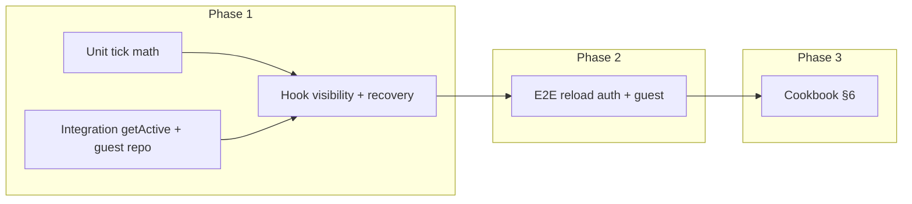

# Phase 1 Test Rollout — Critical-Path Persistence & Timer — Plan Brief

> Full plan: `context/changes/testing-critical-path-persistence-timer/plan.md`
> Research: `context/changes/testing-critical-path-persistence-timer/research.md`

## What & Why

Test-plan Phase 1 must prove two failure scenarios cannot regress silently: **(1)** page refresh during an active Pomodoro restores the same tasks, running phase, and sane remaining time; **(2)** work-cycle elapsed time stays within ±2s when the tab was backgrounded. The rollout adds tests and cookbook docs only — cheapest layers first, browser proofs only where hooks cannot close the gap.

## Starting Point

Recovery is anchored on persisted cycle rows + task lists (Postgres or guest snapshot), recomputed in `usePomodoroCycle` via wall-clock `endTime`. Existing coverage includes auth hook recovery tests, `cycle.getActive` integration, guest reload e2e (panel only), and timer tick unit tests — but no authenticated reload e2e, no visibility/drift tests, and no ±2s assertions. E2E forces main-thread timer (`NEXT_PUBLIC_E2E_MAIN_THREAD_TIMER=1`).

## Desired End State

Contributors have failing tests if refresh loses user-visible state or if visibility recalc/tick math exceeds ±2s on the fallback path; auth and guest both covered at hook + targeted e2e; `test-plan.md` §6.1–§6.3 and §6.6 document how to add similar tests. Full `pnpm test` and `CI=true pnpm test:e2e` stay green.

## Key Decisions Made

| Decision | Choice | Why (1 sentence) | Source |
| -------- | ------ | ---------------- | ------ |
| Auth reload e2e oracle | Panel + countdown ±2s | Matches PRD NFR and test-plan “user-visible restored state” | Plan |
| Timer proof layer | Hook visibility + unit tick math | Cost × signal; jsdom/Worker e2e not required for Phase 1 | Plan |
| Guest coverage | Hook tests + extend guest e2e | Parity with auth behind same hook; fast + browser proof | Plan |
| Expired while tab closed | Hook + integration only | High impact, cheap; no extra e2e | Plan |
| Session timeout + RUNNING | Defer Phase 3 | Avoid product-scope creep in test rollout | Plan |
| Time cut priority | Cut Worker e2e first | Aligns with hook-only timer strategy | Plan |
| Cookbook | Full §6 update in Phase 3 | Test-plan orchestrator requires patterns on ship | Plan |

## Scope

**In scope:**

- Shared countdown tolerance helper (Vitest + Playwright)
- Extensions: `cycle.test.ts`, `guest-repositories.test.ts`, `use-pomodoro-cycle.test.tsx`, timer tick tests
- Auth mid-cycle reload e2e; guest reload countdown assertion
- `test-plan.md` cookbook §6.1, §6.2, §6.3, §6.6

**Out of scope:**

- Risks #3–#7, guest merge, CI gate wiring (later rollout phases)
- Worker-enabled Playwright project
- Session-timeout / stale RUNNING semantics
- Product code changes unless tests expose a separate bug

## Architecture / Approach

Single oracle (`countdown-tolerance`) feeds hook and e2e assertions. Risk #2 stops at hook layer; Risk #1 adds browser reload proofs.

## Phases at a Glance

| Phase | What it delivers | Key risk |
| ----- | ---------------- | -------- |
| 1. Oracles & cheap layers | Helpers + unit/integration/hook tests | Visibility test may need careful `visibilityState` stubbing |
| 2. Browser proofs | Auth + guest reload e2e with countdown | E2e flake on countdown parse if UI format changes |
| 3. Cookbook & closure | §6 updates + full suite green | Doc drift if reference paths not updated |

**Prerequisites:** F-02 auth e2e fixture; existing Vitest/Playwright config; `research.md` complete.

**Estimated effort:** ~2–3 implementation sessions across 3 phases.

## Open Risks & Assumptions

- Countdown UI format (`formatRemainingMs` mm:ss) is stable — tolerance helper depends on it.
- Hook visibility tests model fallback path; production Worker under real browser throttle is **not** e2e-proven in Phase 1 (accepted tradeoff).
- `page.clock` in e2e proves reload recovery with synthetic time, not real wall-clock background throttle — acceptable for Risk #1; Risk #2 uses hook math instead.

## Success Criteria (Summary)

- Refresh mid-cycle (auth + guest): tasks + running panel + countdown within ±2s.
- Background/tab return: hook tests fail if visibility recalc drifts beyond ±2s on fallback path.
- Cookbook §6 filled; Phase 1 row in `test-plan.md` §3 can move to `complete` after implement.
