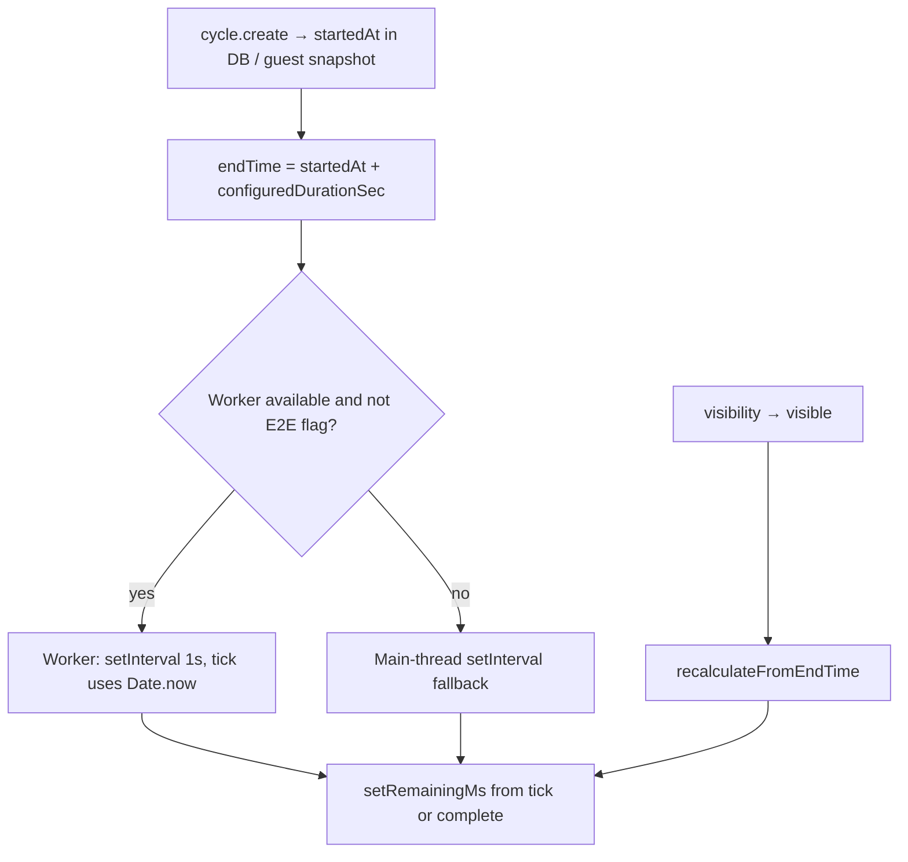

# Research: Phase 1 — critical-path persistence & timer (risks #1 and #2)

**Date**: 2026-06-04T12:00:00+02:00  
**Researcher**: Cursor Agent (Auto)  
**Git Commit**: `766ac44d3ab151cc9a0fe09523cd8ed78a886396`  
**Branch**: `testing-critical-path-persistence-timer`  
**Repository**: [konrad-kaluzny-ceneo/FlowState](https://github.com/konrad-kaluzny-ceneo/FlowState)

## Research Question

Ground test-plan Phase 1 (`testing-critical-path-persistence-timer`) for:

- **Risk #1**: Page refresh or crash during an active Pomodoro leaves the user with a missing or wrong task list or cycle state.
- **Risk #2**: Work cycle elapsed time drifts beyond ±2 seconds when the browser tab is backgrounded.

Per `change.md`: prove persisted state **round-trips** to user-visible recovery (not “save was called”), and prove timer behavior under background throttling — **jsdom fake timers alone are insufficient** for Risk #2.

## Summary

FlowState anchors recovery on **persisted cycle rows** (`startedAt`, `configuredDurationSec`, `state`, `kind`, `taskId`) plus task lists (Postgres for authenticated users, `flowstate:guest-v1` localStorage snapshot for guests). On mount, [`usePomodoroCycle`](https://github.com/konrad-kaluzny-ceneo/FlowState/blob/766ac44d3ab151cc9a0fe09523cd8ed78a886396/src/hooks/use-pomodoro-cycle.ts#L242-L294) calls `cycles.getActive()` and recomputes UI from wall-clock `endTime = startedAt + duration`; countdown state is **not** stored separately.

Timer ticks use a **Web Worker** (wall-clock `endTime - Date.now()` per second) with main-thread fallback and a **visibility** recalc on refocus. The ±2s NFR exists in PRD/test-plan only — **no assertion in `src/`**.

**Existing signal**: Strong unit/hook coverage for auth recovery and server `getActive`; one guest E2E reload test. **Gaps**: no authenticated mid-cycle `reload` e2e; no `visibilitychange`/background drift tests; Playwright sets `NEXT_PUBLIC_E2E_MAIN_THREAD_TIMER=1`, so current e2e does not exercise the Worker path.

**Recommended layers for `/10x-plan`**: integration (`createCaller` + DB fixture) and hook tests (visibility + controlled time) before targeted e2e; add at least one browser proof for auth refresh and, only if cheaper layers cannot simulate throttle, a short real-time background-tab e2e **without** the E2E main-thread timer flag.

## Detailed Findings

### Risk #1 — Persistence & refresh recovery

#### Storage boundaries

| Mode | Tasks | Sessions / cycles | Read on recovery |
|------|-------|-------------------|------------------|
| Authenticated | Postgres `flow_state_task` | Postgres via Prisma | `cycle.getActive` tRPC → server repositories |
| Guest | `guestSnapshotV1` in `localStorage` key `flowstate:guest-v1` | Same snapshot arrays | `guest-repositories.getActive` (first `RUNNING`) |

Duration **presets** (`flowstate:lastDurationSec`, break keys) are separate localStorage — not cycle state.

#### Recovery entry chain

1. RSC home prefetches `task.list` + `cycle.getActive` when authenticated ([`page.tsx`](https://github.com/konrad-kaluzny-ceneo/FlowState/blob/766ac44d3ab151cc9a0fe09523cd8ed78a886396/src/app/page.tsx)).
2. `PomodoroDashboard` loads tasks (guest: `useGuestDomainTasks` + `useSyncExternalStore`; auth: suspense query).
3. `usePomodoroCycle` mount effect → `recoverActiveCycle()` once per data mode ([`use-pomodoro-cycle.ts#L242-L294`](https://github.com/konrad-kaluzny-ceneo/FlowState/blob/766ac44d3ab151cc9a0fe09523cd8ed78a886396/src/hooks/use-pomodoro-cycle.ts#L242-L294)).
4. `resumeFromActiveCycle` sets focus from cycle task, computes `endTime`, starts worker or marks `completed` if already past end ([`L213-L238`](https://github.com/konrad-kaluzny-ceneo/FlowState/blob/766ac44d3ab151cc9a0fe09523cd8ed78a886396/src/hooks/use-pomodoro-cycle.ts#L213-L238)).
5. Auth recovery also loads `countCompletedWork` for break cadence; guest filters completed WORK cycles in snapshot ([`L255-L275`](https://github.com/konrad-kaluzny-ceneo/FlowState/blob/766ac44d3ab151cc9a0fe09523cd8ed78a886396/src/hooks/use-pomodoro-cycle.ts#L255-L275)).

**Not persisted**: idle focus (`selectTask` is React-only) — acceptable unless risk scope includes “wrong focus” without an active cycle.

#### Edge cases to cover in tests

- **Expired while tab closed**: `endTime <= Date.now()` → `completed` + alarm without worker ([`L230-L233`](https://github.com/konrad-kaluzny-ceneo/FlowState/blob/766ac44d3ab151cc9a0fe09523cd8ed78a886396/src/hooks/use-pomodoro-cycle.ts#L230-L233)).
- **Stale RUNNING cycle after session timeout**: `getActive` filters `userId` + `RUNNING` only — does not require `ACTIVE` session ([`cycle.ts` `getActive`](https://github.com/konrad-kaluzny-ceneo/FlowState/blob/766ac44d3ab151cc9a0fe09523cd8ed78a886396/src/server/api/routers/cycle.ts)).
- **Guest task missing for `taskId`**: cycle resumes with `task: null` in domain mapping.
- **Login merge**: `import-guest-snapshot` expires RUNNING guest cycles at import — Phase 3 risk; optional smoke only in Phase 1.

#### Existing tests (Risk #1)

| Layer | File | What it proves |
|-------|------|----------------|
| Hook (auth mock) | `use-pomodoro-cycle.test.tsx` | Resume running; expired → completed; worker `endTime` |
| Server | `cycle.test.ts` | `getActive`; create → complete flow |
| E2E guest | [`guest-trial.spec.ts`](https://github.com/konrad-kaluzny-ceneo/FlowState/blob/766ac44d3ab151cc9a0fe09523cd8ed78a886396/e2e/guest-trial.spec.ts#L32-L37) | Task + `timer-panel-running` after `reload` |
| E2E auth | `pomodoro-cycle.spec.ts` | Full cycle with `page.clock` — **no reload** |

**Gap**: Authenticated mid-cycle `page.reload()` asserting task list, phase (`running`/`completed`), and user-visible remaining time (countdown text or tolerance), not internal save payloads.

---

### Risk #2 — Timer authority & background-tab drift

#### Clock model

- **Pure tick math**: [`getTimerTickResult`](https://github.com/konrad-kaluzny-ceneo/FlowState/blob/766ac44d3ab151cc9a0fe09523cd8ed78a886396/src/workers/timer-worker-logic.ts) — unit-tested.
- **Worker loop**: [`timer-worker.ts`](https://github.com/konrad-kaluzny-ceneo/FlowState/blob/766ac44d3ab151cc9a0fe09523cd8ed78a886396/src/workers/timer-worker.ts) — not loaded in Vitest as a real Worker.
- **E2E bypass**: `NEXT_PUBLIC_E2E_MAIN_THREAD_TIMER=1` in [`playwright.config.ts`](https://github.com/konrad-kaluzny-ceneo/FlowState/blob/766ac44d3ab151cc9a0fe09523cd8ed78a886396/playwright.config.ts) forces main-thread path ([`use-pomodoro-cycle.ts#L80-L82`](https://github.com/konrad-kaluzny-ceneo/FlowState/blob/766ac44d3ab151cc9a0fe09523cd8ed78a886396/src/hooks/use-pomodoro-cycle.ts#L80-L82)).

#### Visibility handling

Only on **visible**: `recalculateFromEndTime()` ([`L296-L308`](https://github.com/konrad-kaluzny-ceneo/FlowState/blob/766ac44d3ab151cc9a0fe09523cd8ed78a886396/src/hooks/use-pomodoro-cycle.ts#L296-L308)). No handlers while hidden — design assumes Worker ticks continue; fallback main-thread `setInterval` is throttled in background (documented in S-01 research).

#### Existing tests (Risk #2)

| File | Limitation |
|------|------------|
| `timer-worker.test.ts` | Fake timers; simulates interval on main thread |
| `use-pomodoro-cycle.test.tsx` | `FakeWorker` completes instantly — no throttle |
| `pomodoro-cycle.spec.ts` | `page.clock.runFor(15*60*1000+2000)` — synthetic, main-thread timer |

**No test** references `visibility`, `drift`, or ±2s tolerance.

#### What jsdom can vs cannot prove

| Can | Cannot |
|-----|--------|
| `getTimerTickResult` for arbitrary `now` | Real Worker scheduling under browser throttle |
| Hook transitions when `FakeWorker` posts `complete` | Wall-clock elapsed at cycle end in hidden tab |
| Fallback path with `vi.advanceTimersByTime` | That production e2e uses Worker (flag disables it) |

Test-plan challenger applies: **fake timers in jsdom do not prove throttled-tab behavior**.

---

### Test pyramid recommendations for `/10x-plan`

| Risk | Cheapest layer first | Add e2e when |
|------|----------------------|--------------|
| #1 | Integration: `createCaller` active cycle + task ownership; hook: guest `loadSnapshot` recovery path | Auth `reload` mid-running cycle; assert `timer-countdown` / overlay |
| #2 | Unit: tick math + late `now`; hook: fire `visibilitychange` after advancing fake time; fallback sparse ticks | Only if hook tests cannot model hidden-tab completion within duration+2s |

**Reference tests to extend** (not replace):

- [`use-pomodoro-cycle.test.tsx`](https://github.com/konrad-kaluzny-ceneo/FlowState/blob/766ac44d3ab151cc9a0fe09523cd8ed78a886396/src/hooks/use-pomodoro-cycle.test.tsx) — recovery, `endTime`, `FakeWorker`
- [`cycle.test.ts`](https://github.com/konrad-kaluzny-ceneo/FlowState/blob/766ac44d3ab151cc9a0fe09523cd8ed78a886396/src/server/api/routers/cycle.test.ts) — `getActive` integration
- [`guest-trial.spec.ts`](https://github.com/konrad-kaluzny-ceneo/FlowState/blob/766ac44d3ab151cc9a0fe09523cd8ed78a886396/e2e/guest-trial.spec.ts) — reload skeleton
- [`timer-worker.test.ts`](https://github.com/konrad-kaluzny-ceneo/FlowState/blob/766ac44d3ab151cc9a0fe09523cd8ed78a886396/src/workers/timer-worker.test.ts) — tick contract

**Anti-patterns** (from test-plan): asserting save-format fields; testing raw `setInterval` without worker/visibility path; using only `page.clock` as proof of background ±2s.

#### Phase 1 non-goals

- Guest→account merge integrity (Risk #5 / S-08) — beyond minimal guest reload extension
- Mid-cycle task-done prompt (S-03 / Risk #3)
- Check-in gate (S-05 / Risk #7)
- CI gate wiring (Phase 4)

Cookbook §6.1 / §6.3 / §6.5 remain **TBD** until this phase ships — plan should end with cookbook updates per test-plan orchestrator.

## Code References

- `src/hooks/use-pomodoro-cycle.ts` — recovery, worker/fallback, visibility ([242-308](https://github.com/konrad-kaluzny-ceneo/FlowState/blob/766ac44d3ab151cc9a0fe09523cd8ed78a886396/src/hooks/use-pomodoro-cycle.ts#L242-L308))
- `src/workers/timer-worker-logic.ts` — `getTimerTickResult`
- `src/workers/timer-worker.ts` — Worker interval loop
- `src/server/api/routers/cycle.ts` — `getActive`, `create`, `complete`
- `src/lib/guest/store.ts`, `schema.ts`, `guest-repositories.ts` — guest snapshot persistence
- `src/lib/repositories/server-repositories.ts` — auth cycle repository
- `src/app/page.tsx` — authenticated prefetch
- `e2e/guest-trial.spec.ts` — guest reload
- `e2e/pomodoro-cycle.spec.ts` — auth cycle (no reload)
- `playwright.config.ts` — `NEXT_PUBLIC_E2E_MAIN_THREAD_TIMER`

## Architecture Insights

1. **Single source of truth for recovery** is the RUNNING cycle row (+ task list), not client countdown state.
2. **Wall-clock deadline** (`endTime`) decouples display from interval drift; Worker + visibility recalc implement S-01 design.
3. **Data mode abstraction** (`useRepositories`) unifies guest and auth behind the same hook — tests must cover **both** modes for Risk #1 parity.
4. **Module-level recovery guard** (`activeCycleRecoveredForMode`) prevents double recovery per SPA session; `resetActiveCycleRecoveryForTests()` exists for Vitest.
5. **E2E trades fidelity for determinism** via main-thread timer + `page.clock` — adequate for UI flows, **not** for Risk #2 NFR proof.

## Historical Context (from prior changes)

| Artifact | Relevant decision |
|----------|-------------------|
| [`context/changes/first-pomodoro-cycle/research.md`](context/changes/first-pomodoro-cycle/research.md) | Server `startedAt` + client wall clock; Worker for background; Visibility safety net |
| [`context/changes/first-pomodoro-cycle/plan.md`](context/changes/first-pomodoro-cycle/plan.md) | `getActive`, `usePomodoroCycle` recovery, `timer-worker`, e2e with `page.clock`, manual refresh/background checklist |
| [`context/changes/full-session-with-breaks/plan.md`](context/changes/full-session-with-breaks/plan.md) | Break kinds in recovery; `countCompletedWork` on resume |
| [`context/changes/full-session-with-breaks/reviews/impl-review.md`](context/changes/full-session-with-breaks/reviews/impl-review.md) | Recovery guard per session/mode; `completedWorkCycles` on recovery |
| [`context/changes/session-domain-model/plan.md`](context/changes/session-domain-model/plan.md) | Cycle row as refresh anchor; timer deferred to S-01 |
| [`context/changes/e2e-test-infra/research.md`](context/changes/e2e-test-infra/research.md) | NFRs need Playwright; auth `storageState` pattern |
| [`context/foundation/test-plan.md`](context/foundation/test-plan.md) | Risk table, layer guidance, Phase 1 row |
| [`context/changes/guest-local-storage-merge/plan.md`](context/changes/guest-local-storage-merge/plan.md) | Guest refresh via repositories (shipped); Phase 3 for merge risks |

`context/archive/` has no shipped change artifacts — history is under `context/changes/`.

## Related Research

- `context/changes/first-pomodoro-cycle/research.md` — timer architecture and throttle analysis
- `context/changes/e2e-test-infra/research.md` — browser verification rationale

## Open Questions

1. **Auth refresh e2e scope**: Assert countdown text vs `data-testid` running panel only — plan should pick oracle (user-visible remaining within tolerance).
2. **Risk #2 e2e project**: Dedicated Playwright project without `E2E_MAIN_THREAD_TIMER` vs hook-only proof — cost × signal decision in plan.
3. **Session timeout + RUNNING cycle**: Include integration case in Phase 1 or defer?
4. **Guest hook unit tests**: Required for parity with auth recovery, or guest e2e sufficient for Phase 1?
