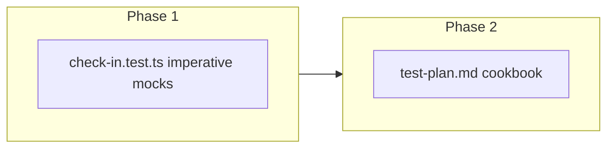

# Risk #7 Check-In Persistence — Plan Brief

> Full plan: `context/changes/testing-check-in-persistence/plan.md`
> Research: `context/changes/testing-check-in-persistence/research.md`

## What & Why

Close the **integration slice** of test-plan **Risk #7**: declared energy at cycle end must persist server-side and be readable via `checkIn.list` for future suggestion logic (S-06). Isolation/IDOR is already covered in `check-in-isolation.test.ts`; this rollout adds imperative **create → list** contract tests before S-05 UI lands. No Playwright — modal gate proof stays in test-plan Phase 2.

## Starting Point

Check-in router has `list` + `create` only (`check-in.ts`). `check-in-isolation.test.ts` covers fast-check security properties but seeds list data directly and ignores `orderBy`/`take` in its mock. No client code calls `checkIn` yet.

## Desired End State

Contributors have failing tests if energy fails to round-trip through create/list, if list ordering/limit regresses, or if enum values break. `test-plan.md` §6.2 and §6.6 document the pattern. `pnpm test` stays green.

## Key Decisions Made

| Decision | Choice | Why (1 sentence) | Source |
| -------- | ------ | ---------------- | ------ |
| Test file layout | New `check-in.test.ts` | Separates imperative persistence from fast-check isolation — Phase 3 pattern | Plan |
| Cookbook placement | Extend §6.2 + §6.6 ad-hoc note | No new §3 rollout row; mirrors how ad-hoc slices are documented | Plan |
| List limit test | Include 101-row smoke | Proves `DEFAULT_LIST_LIMIT` wiring, not just happy path | Plan |
| Isolation tests | Leave unchanged | Avoid duplicating CONFLICT/IDOR; narrow diff | Research |
| E2E | Deferred | UI gate is Phase 2 scope per test-plan | Research |

## Scope

**In scope:**

- New `check-in.test.ts` (create shape, create→list, 3 energies, ordering, limit)
- `test-plan.md` §6.2 bullet + §6.6 ad-hoc note

**Out of scope:**

- Playwright check-in modal / skip tests
- Changes to `check-in-isolation.test.ts`
- Real DB fixtures, S-06 scoring, guest check-ins, product fixes

## Architecture / Approach

In-memory Prisma mock with `findMany` honoring `orderBy` + `take`; `createCaller` on `checkInRouter`.

## Phases at a Glance

| Phase | What it delivers | Key risk |
| ----- | ---------------- | -------- |
| 1. Persistence tests | Risk #7 server contract coverage | Mock must implement sort/take or ordering/limit tests are false positives |
| 2. Cookbook sync | §6.2 + §6.6 documentation | Stale cross-references if test names drift |

**Prerequisites:** Phase 3 test patterns shipped; check-in router stable  
**Estimated effort:** ~1 session, 2 phases

## Open Risks & Assumptions

- S-05 UI will consume the same create/list contract — integration oracle should remain valid when UI lands
- Full-repo `pnpm check` may have pre-existing failures; verify scoped biome on changed files

## Success Criteria (Summary)

- New tests fail if `energy` does not persist or list contract breaks
- Three energy enums and list limit (100) covered
- Cookbook enables a contributor to extend check-in tests without reading the router first
