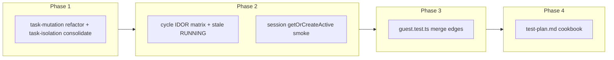

# Phase 3 Test Rollout — Isolation, Abuse & Guest Merge — Plan Brief

> Full plan: `context/changes/testing-isolation-abuse-guest-merge/plan.md`
> Research: `context/changes/testing-isolation-abuse-guest-merge/research.md`

## What & Why

Test-plan Phase 3 must prove three failure scenarios cannot regress silently: **(4)** authenticated users cannot read or mutate another user's domain data; **(6)** valid sessions cannot access foreign resources via ID manipulation; **(5)** guest trial data merges into the account without loss or silent overwrite. The rollout adds Vitest integration tests and cookbook docs — cheapest layers first, no Playwright in this change.

## Starting Point

Production routers already enforce ownership on all 17 protected procedures (`userId` filters + `findFirst` pre-checks). Partial test signal exists (`*-isolation.test.ts`, some `cycle.test.ts` IDOR cases, `guest.test.ts` happy-path merge), but `task-mutation.test.ts` uses a weak ownership stub, cycle gaps remain (`getActive`, `countCompletedWork`, `create(taskId)`), and guest merge edge cases are untested. Vitest uses in-memory Prisma mocks only (Phase 1 precedent).

## Desired End State

Contributors have failing tests if cross-user isolation or IDOR regresses, if guest merge mishandles collisions/RUNNING/expiry/empty snapshots, and if stale RUNNING behavior changes unexpectedly. `test-plan.md` §6.5 documents merge/isolation patterns; Phase 3 rollout row marked complete. `pnpm check`, `pnpm typecheck`, `pnpm test` stay green.

## Key Decisions Made

| Decision | Choice | Why (1 sentence) | Source |
| -------- | ------ | ---------------- | ------ |
| DB fixture strategy | In-memory Prisma mocks only | Matches Phase 1 and all existing router tests; zero Neon CI setup | Plan |
| E2E scope | Integration only — defer guest-merge e2e | User constraint: cheapest signal first; browser proof in follow-up | Plan |
| Task list tests | Consolidate into `task-isolation.test.ts` | Remove duplicate Property 10 coverage in `task-query.test.ts` | Plan |
| Guest merge edges | Core matrix (expired RUNNING, account RUNNING closure, empty snapshot, null taskId) | Highest Risk #5 signal without server-action/e2e scope creep | Plan |
| Session router | One `getOrCreateActive` smoke with victim session | Cheap write-path proof; skip broader session IDOR | Plan |
| Stale RUNNING deferral | Include as documented-behavior test | Closes Phase 1 deferral without mandating product fix in this rollout | Plan |
| Error code oracle | Assert `NOT_FOUND` / empty, not `FORBIDDEN` | Matches production policy across all routers | Research |
| Product changes | Test-only unless separate bug | Isolation code is sound; rollout adds signal not features | Research |

## Scope

**In scope:**

- Refactor `task-mutation.test.ts`; consolidate task list isolation
- Cycle IDOR matrix + stale RUNNING documentation test
- Session `getOrCreateActive` dual-user smoke
- Guest merge integration edge cases in `guest.test.ts`
- `test-plan.md` §6.5, §6.2 IDOR refs, §6.6 Phase 3 notes, §3 status row

**Out of scope:**

- Playwright `guest-merge.spec.ts`
- Real Postgres/Neon Vitest fixtures
- Failed-import retry UX tests; server-action tests
- Risks #3/#7, CI gates (Phases 2/4 of test-plan)
- Roadmap S-08 activation
- Router/product fixes unless test exposes separate defect

## Architecture / Approach

Dual-user pattern: seed victim rows in module-scoped arrays → `createCaller` with attacker session → assert `NOT_FOUND` or empty/null/0.

## Phases at a Glance

| Phase | What it delivers | Key risk |
| ----- | ---------------- | -------- |
| 1. Task hardening | Stateful multi-user mock; no duplicate list tests | Refactor breaks existing property tests |
| 2. Cycle & session IDOR | Closes highest IDOR gaps + stale RUNNING doc test | Stale RUNNING may document surprising behavior |
| 3. Guest merge | Core Risk #5 integration edges | Mock `updateMany` must mirror real state updates |
| 4. Cookbook sync | §6.5 + Phase 3 row complete | Stale cross-references to `task-query.test.ts` |

**Prerequisites:** Phase 1 test rollout complete; `pnpm test` green on current branch  
**Estimated effort:** ~1–2 sessions across 4 phases (test-only, no e2e)

## Open Risks & Assumptions

- In-memory mocks may not catch SQL-layer filter omissions — accepted per Phase 1 precedent
- Stale RUNNING test documents current `getActive` semantics; product fix is a follow-up if undesired
- Guest-merge e2e deferred — Risk #5 lacks browser proof until separate change
- `task-query.test.ts` removal may need reference grep in docs/AGENTS.md

## Success Criteria (Summary)

- Cross-user IDOR and list isolation regressions fail `pnpm test`
- Guest merge edge cases (expiry, collision path, empty import, RUNNING closure) fail on regression
- `test-plan.md` cookbook enables a new contributor to add isolation/merge tests without reading research
