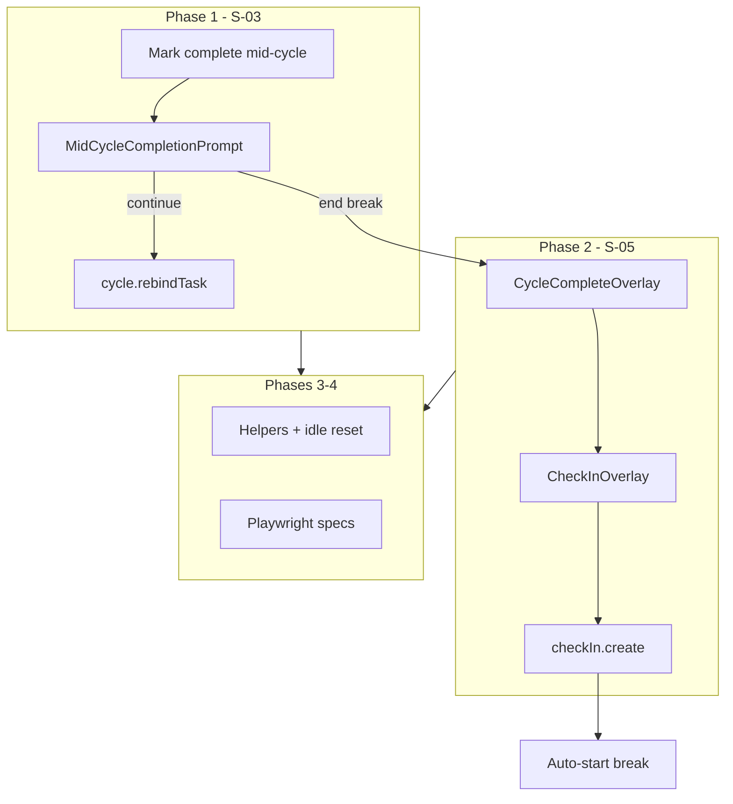

# Phase 2 Test Rollout — Active-Slice Browser Proofs — Plan Brief

> Full plan: `context/changes/testing-active-slice-browser-proofs/plan.md`
> Research: `context/changes/testing-active-slice-browser-proofs/research.md`

## What & Why

Test-plan Phase 2 must prove two mindfulness controls cannot regress: **(3)** marking a task done mid-cycle always surfaces FR-015 choices (continue with next task vs end cycle and break; last-task edge shows end-only), and **(7)** every completed WORK cycle requires an energy check-in before break starts, with persistence readable via `checkIn.create`. Research found both features missing in product code — this plan bundles minimal S-03 + S-05 UI with Playwright proofs rather than writing e2e against disabled buttons.

## Starting Point

S-01 cycle-end overlay and Phase 1 e2e infrastructure exist. Mark-complete is disabled during running cycles (`cycleLocked`). Check-in server API is implemented and integration-tested; no client UI or gate. Roadmap slices S-03 and S-05 are `active` with no prior implementation.

## Desired End State

Authenticated Playwright specs fail if mid-cycle prompt is skipped or wrong choices appear, or if break starts without check-in. `pomodoro-cycle.spec.ts` updated for S-05 regression. Test-plan §6.3/§6.6 documents Phase 2 patterns and deferrals. Full `pnpm test` and `CI=true pnpm test:e2e` green.

## Key Decisions Made

| Decision | Choice | Why (1 sentence) | Source |
| -------- | ------ | ---------------- | ------ |
| Product + e2e bundling | Single change: S-03 + S-05 + e2e | Unblocks Phase 2 without waiting on separate product PRs | Plan |
| Check-in enforcement | UI gate only | Matches test-plan e2e focus; integration already covers persistence contract | Plan |
| Guest e2e | Defer all guest proofs | PRD excludes guest check-in; keeps Phase 2 auth-focused | Plan |
| Skip-vector e2e | Core gate + persistence oracle | Cost × signal; Escape/refresh/end-session deferred | Plan |
| Existing specs | Update `pomodoro-cycle.spec.ts` | Prevents S-01 regression when S-05 lands | Plan |
| Mid-cycle spec split | Two files (multi-task + last-task) | Clear failure signals per research scenarios | Plan |

## Scope

**In scope:**

- S-03: mid-cycle prompt, `cycle.rebindTask`, hook + task-list wiring, testids
- S-05: check-in overlay, hook awaiting-check-in state, auth-only client wiring
- E2e helpers (`check-in.ts`, extended `work-cycle.ts`, `idle-cycle.ts`)
- Specs: `mid-cycle-completion.spec.ts`, `mid-cycle-last-task.spec.ts`, `check-in-gate.spec.ts`
- Cookbook §6.3/§6.6 Phase 2 addendum

**Out of scope:**

- Guest Playwright proofs, server `cycle.complete` hardening, skip-vector matrix e2e
- S-06 suggestion reader, FR-019 `interruptionCount`, CI Phase 4 gates, axe a11y scans

## Architecture / Approach

Product lands in Phases 1–2; e2e helpers and specs in Phases 3–4 follow Phase 1 patterns (`fixtures.ts`, `work-cycle.ts`).

## Phases at a Glance

| Phase | What it delivers | Key risk |
| ----- | ---------------- | -------- |
| 1. S-03 mid-cycle prompt | FR-015 UI + rebind API | Task picker UX for "continue with next task" |
| 2. S-05 check-in gate | FR-020 overlay + hook state split | Regression of S-01 confirm ergonomics |
| 3. E2e infrastructure | Helpers + pomodoro-cycle update | Idle reset ordering with new overlay |
| 4. Browser proofs + cookbook | 3 new specs + test-plan §6 | Flake if testids drift from product |

**Prerequisites:** Phase 1 e2e infra; `testing-check-in-persistence` integration shipped; research complete.

**Estimated effort:** ~3–4 implementation sessions across 4 phases (2 product, 2 test/doc).

## Open Risks & Assumptions

- Mid-cycle "continue" requires task selection UI when multiple active tasks remain — plan assumes selectable list in prompt.
- Guest WORK cycles skip check-in per PRD; guest mid-cycle product path works but is untested in browser until follow-up.
- API bypass of check-in gate remains possible without server hardening (accepted for MVP).

## Success Criteria (Summary)

- Mid-cycle mark-done during WORK cycle shows FR-015 prompt; last-task shows end-only option
- WORK cycle-end cannot reach break without energy selection; `checkIn.create` fires with correct payload
- Full Playwright suite green; test-plan cookbook updated for Phase 2
