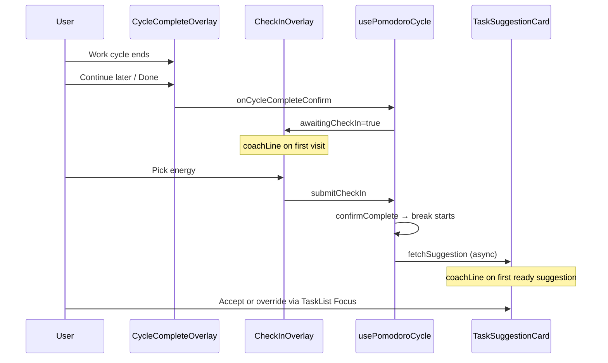

# Research: First-Run Wedge Onboarding (S-11)

**Date**: 2026-06-07T18:00:00+02:00  
**Researcher**: Cursor Agent  
**Git Commit**: `ff90a806772a4f0a7fc1b75456ec045c3388619d`  
**Branch**: `main`  
**Repository**: [konrad-kaluzny-ceneo/FlowState](https://github.com/konrad-kaluzny-ceneo/FlowState)

## Research Question

How should FlowState implement S-11 (first-run wedge onboarding): dismissible first-run flow teaching check-in → suggestion wedge, empty-list guidance when active tasks = 0, and inline one-line coach at first-ever check-in and first suggestion — using existing overlay/substrate from S-06 and guest localStorage patterns from S-08?

## Scope Decisions (pre-aligned)

Research scope was **tightly scoped** by the slice brief and decision proxy — no user clarification step needed.

| Decision | Choice | Confidence |
|----------|--------|------------|
| First-run audience | **Both guest and auth**, tailored copy | 90% |
| Empty-list guide | **Show whenever active count is zero** (calm line + CTA) | 92% |
| Coach tips | **Two sequential one-liners** — check-in first, suggestion second — subcopy on existing overlays only | 91% |
| Persist seen flags | **localStorage**, keys scoped per user/guest (matches S-08 device-local pattern) | 88% |

## Summary

**S-11 is greenfield UI guidance — no onboarding, tour, coach, or dismissible first-run flow exists today.** The codebase has strong overlay and empty-state *substrate* to extend:

1. **First-run modal** — follow existing fixed-overlay pattern (`CycleCompleteOverlay`, `MidCycleCompletionOverlay`, `MidCycleCompletionPrompt`): centered card, `data-testid`, dismiss CTA. Mount from `HomeShell` or `PomodoroDashboardBody` on first visit when flags unset.

2. **Empty-list guidance** — replace bare `"No active tasks"` in `task-list.tsx:270-271` with contextual copy + CTA when `activeTasks.length === 0`. Suggestion card already has a richer empty message at `task-suggestion-card.tsx:136-139`.

3. **Coach subcopy** — inject optional `coachLine?: string` into `CheckInOverlay` (below existing subcopy at line 55-57) and `TaskSuggestionCard` (below heading at line 95). Show only when respective `*CoachSeen` flag is false; set flag on first render or first interaction — **no second blocking modal**.

4. **Guest vs auth split** — `PomodoroDashboard` already gates wedge features: auth gets `enableCheckInGate` + `enableSuggestionGate`; guest does not (`pomodoro-dashboard.tsx:194-208`). Guest first-run copy must teach task + cycle trial and **preview** the wedge unlocked after sign-in; auth first-run teaches the live check-in → suggestion flow.

5. **localStorage** — extend the established `flowstate:` namespace (`duration-storage.ts`, `guest/schema.ts`). No User/preferences model in Prisma — server persistence would require new schema; localStorage is the low-friction match. Auth keys should include `userId` from session; guest keys use a `:guest` suffix. Coordinate with S-14: first-run modal timing after merge must not stack with merge-success UI.

6. **E2E** — follow `seed.spec.ts` / `task-suggestion.spec.ts` patterns; add `data-testid`s for first-run overlay and empty-guide; clear scoped onboarding keys in `beforeEach`; extend `ensureIdleCycle` to dismiss first-run if visible.

**Overall confidence: 89/100** — substrate is clear; remaining 11% is copy/coordination with S-14 and exact z-index/modal stacking during concurrent overlays.

## Detailed Findings

### 1. Existing onboarding / empty-state UI — none shipped

| Surface | Current behavior | File |
|---------|------------------|------|
| Home tagline | Static `"Manage your tasks. Stay in flow."` | [`home-shell.tsx:21`](https://github.com/konrad-kaluzny-ceneo/FlowState/blob/ff90a806772a4f0a7fc1b75456ec045c3388619d/src/app/_components/home-shell.tsx#L21) |
| Guest banner | Persistent amber banner — device-only storage CTA | [`guest-banner.tsx:6-28`](https://github.com/konrad-kaluzny-ceneo/FlowState/blob/ff90a806772a4f0a7fc1b75456ec045c3388619d/src/app/_components/guest-banner.tsx#L6-L28) |
| Active list empty | Plain text: `"No active tasks"` | [`task-list.tsx:270-271`](https://github.com/konrad-kaluzny-ceneo/FlowState/blob/ff90a806772a4f0a7fc1b75456ec045c3388619d/src/app/_components/task-list.tsx#L270-L271) |
| Suggestion empty | `"No active tasks — add one or end session."` | [`task-suggestion-card.tsx:136-139`](https://github.com/konrad-kaluzny-ceneo/FlowState/blob/ff90a806772a4f0a7fc1b75456ec045c3388619d/src/app/_components/task-suggestion-card.tsx#L136-L139) |
| First-run / tour / coach | **Not present** in `src/` | grep across codebase |

**Dismissible overlay precedent:** Error banners use inline Dismiss buttons (`pomodoro-dashboard.tsx:70-76`, `task-list.tsx:177-183`). Blocking modals use full-screen backdrop without escape dismiss — check-in is mandatory (`check-in-overlay.tsx`). First-run should add an explicit **"Got it" / dismiss** button (roadmap: dismissible first-run flow).

**Recommended overlay shell for first-run:**

```tsx
// Pattern from cycle-complete-overlay.tsx:40-43
<div className="fixed inset-0 z-[55] flex items-center justify-center bg-black/60 p-4" data-testid="first-run-overlay" role="dialog">
```

Use `z-[55]` — above dashboard content and cycle-complete (`z-50`), below check-in gate (`z-[60]`) so a first-run modal never blocks an in-progress check-in if user dismisses late.

### 2. Check-in and suggestion overlays (S-06) — coach injection points

#### Check-in overlay

[`check-in-overlay.tsx`](https://github.com/konrad-kaluzny-ceneo/FlowState/blob/ff90a806772a4f0a7fc1b75456ec045c3388619d/src/app/_components/check-in-overlay.tsx) — blocking modal after work cycle confirm:

- Mounted when `enableCheckInGate && pomodoro.awaitingCheckIn` ([`pomodoro-dashboard.tsx:159-167`](https://github.com/konrad-kaluzny-ceneo/FlowState/blob/ff90a806772a4f0a7fc1b75456ec045c3388619d/src/app/_components/pomodoro-dashboard.tsx#L159-L167))
- Existing subcopy slot: `<p className="mt-2 text-sm text-white/60">Select one before your break starts.</p>` (lines 55-57)
- **Coach injection:** add optional `coachLine?: string` rendered as a second `<p>` with distinct but calm styling (e.g. `text-purple-200/70 text-xs mt-1`) between heading and energy buttons
- **Trigger:** first auth check-in only — guest never sees this overlay (`onCycleCompleteConfirm` skips check-in when `mode === "guest"`, [`use-pomodoro-cycle.ts:817-824`](https://github.com/konrad-kaluzny-ceneo/FlowState/blob/ff90a806772a4f0a7fc1b75456ec045c3388619d/src/hooks/use-pomodoro-cycle.ts#L817-L824))

#### Task suggestion card

[`task-suggestion-card.tsx`](https://github.com/konrad-kaluzny-ceneo/FlowState/blob/ff90a806772a4f0a7fc1b75456ec045c3388619d/src/app/_components/task-suggestion-card.tsx) — **inline card during break**, not a modal:

- Shown when `enableSuggestionGate && isBreakRunning && pendingSuggestion !== idle` ([`pomodoro-dashboard.tsx:56-59, 92-115`](https://github.com/konrad-kaluzny-ceneo/FlowState/blob/ff90a806772a4f0a7fc1b75456ec045c3388619d/src/app/_components/pomodoro-dashboard.tsx#L56-L115))
- Fetched after `submitCheckIn` succeeds → `fetchSuggestion(workCycleId)` ([`use-pomodoro-cycle.ts:860-862`](https://github.com/konrad-kaluzny-ceneo/FlowState/blob/ff90a806772a4f0a7fc1b75456ec045c3388619d/src/hooks/use-pomodoro-cycle.ts#L860-L862))
- **Coach injection:** optional `coachLine` below `<h2>Suggested next task</h2>` (line 95), above loading/ready content
- **Trigger:** first suggestion with `status === "ready"` — not on loading/error/empty

#### Wedge flow sequence (auth)



### 3. Guest vs auth localStorage patterns (S-08)

#### Established conventions

| Key | Scope | Purpose |
|-----|-------|---------|
| `flowstate:guest-v1` | Device | Versioned guest snapshot blob ([`schema.ts:5`](https://github.com/konrad-kaluzny-ceneo/FlowState/blob/ff90a806772a4f0a7fc1b75456ec045c3388619d/src/lib/guest/schema.ts#L5)) |
| `flowstate:lastDurationSec` (+ break keys) | Device-shared | Duration prefs ([`duration-storage.ts:12-14`](https://github.com/konrad-kaluzny-ceneo/FlowState/blob/ff90a806772a4f0a7fc1b75456ec045c3388619d/src/lib/duration-storage.ts#L12-L14)) |
| `flowstate:guest-import-done` | sessionStorage | One-shot import guard ([`import-guard.ts:4-5`](https://github.com/konrad-kaluzny-ceneo/FlowState/blob/ff90a806772a4f0a7fc1b75456ec045c3388619d/src/lib/guest/import-guard.ts#L4-L5)) |

Guest store API: `loadSnapshot` / `saveSnapshot` / `mutateSnapshot` with subscriber pattern ([`store.ts`](https://github.com/konrad-kaluzny-ceneo/FlowState/blob/ff90a806772a4f0a7fc1b75456ec045c3388619d/src/lib/guest/store.ts)).

#### Recommended onboarding storage

New module e.g. `src/lib/onboarding/storage.ts`:

```typescript
// Proposed keys (plan phase)
const ONBOARDING_KEY_GUEST = "flowstate:onboarding:guest";
const onboardingKeyAuth = (userId: string) => `flowstate:onboarding:${userId}`;

interface OnboardingState {
  firstRunDismissed: boolean;
  checkInCoachSeen: boolean;
  suggestionCoachSeen: boolean;
}
```

- **Guest:** read/write `flowstate:onboarding:guest` — survives refresh, cleared only if user clears site data
- **Auth:** read/write `flowstate:onboarding:{userId}` — per-account on shared devices; requires client-side session userId (available via Neon Auth client or a thin hook)
- **No server model** — Prisma has Task/Session/Cycle/CheckIn/SuggestionDecision only; no User profile table ([`schema.prisma`](https://github.com/konrad-kaluzny-ceneo/FlowState/blob/ff90a806772a4f0a7fc1b75456ec045c3388619d/prisma/schema.prisma))
- **Post-merge note:** guest onboarding flags stay on `:guest` key; auth user starts fresh on `:userId` key — acceptable (guest first-run ≠ auth first-run copy anyway). S-14 merge-success should not reset auth onboarding flags.

#### Data mode wiring

[`DataModeProvider`](https://github.com/konrad-kaluzny-ceneo/FlowState/blob/ff90a806772a4f0a7fc1b75456ec045c3388619d/src/lib/data-mode/data-mode-context.tsx) exposes `mode: "guest" | "authenticated"`. Onboarding hooks should accept `mode` + optional `userId` to select storage key.

### 4. First-run dismissible flow — recommended shape

**Trigger conditions:**

| Mode | Show first-run when |
|------|---------------------|
| Guest | `!firstRunDismissed` on first `/` visit (no tasks required) |
| Auth | `!firstRunDismissed` on first `/` visit **or** first visit with zero historical check-ins (optional stricter gate — default: flag-only) |

**Content (tailored copy — implementer drafts in plan):**

- **Guest:** Add tasks → focus → run a cycle → sign in to unlock energy check-ins and smart next-task suggestions
- **Auth:** After first cycle ends you'll check in on energy → FlowState suggests what to focus on next (with rationale) → accept or pick any task

**Dismiss:** primary CTA sets `firstRunDismissed: true`; no "remind me later" (avoid nag loop).

**Mount point:** [`HomeShell`](https://github.com/konrad-kaluzny-ceneo/FlowState/blob/ff90a806772a4f0a7fc1b75456ec045c3388619d/src/app/_components/home-shell.tsx) — sibling to `GuestBanner` / `PomodoroDashboard`, has `isAuthenticated` prop for copy variant.

**S-14 coordination:** [`GuestImportOnMount`](https://github.com/konrad-kaluzny-ceneo/FlowState/blob/ff90a806772a4f0a7fc1b75456ec045c3388619d/src/app/_components/guest-import-on-mount.tsx) runs silently on auth mount. When S-14 adds merge-success UI, defer first-run until merge modal dismissed (plan should define priority: merge-success > first-run).

### 5. Empty-list guidance — replace minimal placeholder

Current:

```270:271:src/app/_components/task-list.tsx
{activeTasks.length === 0 ? (
  <p className="text-sm text-white/50">No active tasks</p>
```

**Decision:** show whenever `activeTasks.length === 0` — not one-shot. Copy should be calm, single line + CTA (e.g. link-style button to focus add-task input or pre-fill placeholder hint). Do **not** hide after first task added then re-show on zero — that's the intended recurring behavior.

**Visibility rules:**

- Show in Active section always when count is zero
- Hide during `cycleLocked` edit flows? No — user may complete last task mid-session; guide still useful
- Guest and auth: same structural component, optional copy variant (guest: mention sign-in for suggestions)

Consider extracting `EmptyActiveTasksGuide` component for testability.

### 6. E2E test patterns

#### Infrastructure

- Auth specs: [`e2e/fixtures.ts`](https://github.com/konrad-kaluzny-ceneo/FlowState/blob/ff90a806772a4f0a7fc1b75456ec045c3388619d/e2e/fixtures.ts) — per-test API user, localStorage seeding supported
- Guest specs: `guest-chromium` project, `testMatch: /guest-.*\.spec\.ts/` ([`playwright.config.ts:49-53`](https://github.com/konrad-kaluzny-ceneo/FlowState/blob/ff90a806772a4f0a7fc1b75456ec045c3388619d/playwright.config.ts#L49-L53))
- Guest tests clear localStorage: [`guest-trial.spec.ts:22-23`](https://github.com/konrad-kaluzny-ceneo/FlowState/blob/ff90a806772a4f0a7fc1b75456ec045c3388619d/e2e/guest-trial.spec.ts#L22-L23)

#### Relevant helpers

| Helper | Role for S-11 |
|--------|---------------|
| [`ensureIdleCycle`](https://github.com/konrad-kaluzny-ceneo/FlowState/blob/ff90a806772a4f0a7fc1b75456ec045c3388619d/e2e/helpers/idle-cycle.ts) | **Must extend** — dismiss `first-run-overlay` if visible before cycle setup |
| [`completeCheckIn`](https://github.com/konrad-kaluzny-ceneo/FlowState/blob/ff90a806772a4f0a7fc1b75456ec045c3388619d/e2e/helpers/check-in.ts) | Assert coach subcopy visible on first check-in only |
| [`expectSuggestionVisible`](https://github.com/konrad-kaluzny-ceneo/FlowState/blob/ff90a806772a4f0a7fc1b75456ec045c3388619d/e2e/helpers/suggestion.ts) | Extend to optionally assert coach line |
| [`completeWorkCycleWithCheckIn`](https://github.com/konrad-kaluzny-ceneo/FlowState/blob/ff90a806772a4f0a7fc1b75456ec045c3388619d/e2e/helpers/work-cycle.ts) | Reuse for wedge coach E2E path |

#### Recommended new spec structure

```
e2e/first-run-onboarding.spec.ts   # auth path
e2e/guest-first-run.spec.ts        # guest path (guest-chromium)
```

**Test cases (minimum):**

1. Auth: first visit shows first-run overlay → dismiss → flag set → revisit hidden
2. Auth: empty active list shows guidance line + CTA
3. Auth: first check-in shows coach subcopy; second cycle does not
4. Auth: first suggestion shows coach subcopy; second cycle does not
5. Guest: first-run copy differs; no check-in/suggestion coaches
6. Regression: existing `task-suggestion.spec.ts` passes with `ensureIdleCycle` dismissing first-run

**Required `data-testid` contracts (new):**

- `first-run-overlay`
- `first-run-dismiss-btn`
- `empty-active-tasks-guide`
- `check-in-coach-line` (optional — or assert text content)
- `suggestion-coach-line`

Preserve existing IDs per S-12 risk note: `check-in-overlay`, `task-suggestion-card`, `suggestion-accept-btn`, etc.

## Code References

- `src/app/_components/home-shell.tsx:12-27` — top-level layout; first-run mount point
- `src/app/_components/pomodoro-dashboard.tsx:56-115` — suggestion card visibility gate
- `src/app/_components/pomodoro-dashboard.tsx:159-167` — check-in overlay gate (auth only)
- `src/app/_components/pomodoro-dashboard.tsx:194-208` — auth vs guest dashboard split
- `src/app/_components/check-in-overlay.tsx:39-74` — check-in modal; subcopy injection site
- `src/app/_components/task-suggestion-card.tsx:90-157` — suggestion card; coach + empty states
- `src/app/_components/task-list.tsx:128-129, 270-271` — activeTasks filter; empty placeholder
- `src/app/_components/cycle-complete-overlay.tsx:40-43` — overlay shell pattern (z-50)
- `src/app/_components/guest-banner.tsx:6-28` — existing guest messaging pattern
- `src/hooks/use-pomodoro-cycle.ts:807-874` — cycle confirm → check-in → suggestion pipeline
- `src/lib/guest/schema.ts:5` — `flowstate:guest-v1` key convention
- `src/lib/duration-storage.ts:12-14` — `flowstate:` prefix precedent
- `src/lib/guest/import-guard.ts:4-48` — sessionStorage one-shot guards
- `e2e/seed.spec.ts:1-100` — exemplar spec structure
- `e2e/task-suggestion.spec.ts:23-141` — wedge E2E proof (S-06)
- `e2e/helpers/idle-cycle.ts:5-50` — pre-test overlay dismissal loop

## Architecture Insights

1. **Non-blocking coach is mandatory** — check-in is already one gate; roadmap explicitly forbids a second blocking modal for coaching. Subcopy-only preserves the mindfulness loop.

2. **Feature gating is already mode-aware** — do not enable check-in/suggestion coaches for guest; guest first-run is educational about future unlock, not live wedge demo.

3. **localStorage over server** — no profile entity; cross-device "seen" sync is out of MVP scope. Auth userId-scoped keys prevent flag bleed on shared machines.

4. **Empty guide is state-driven, not flag-driven** — differs from first-run/coach which are once-per-user (or once-per-flag). Shows on `activeTasks.length === 0` regardless of history.

5. **Z-index stack:** cycle-complete / mid-cycle / first-run ≈ z-50–55; check-in z-60; errors inline. Plan explicit stacking if first-run could overlap cycle-complete on slow dismiss.

6. **Hook vs component responsibility** — onboarding flag reads/writes belong in a small `useOnboardingState(mode, userId)` hook; overlay components stay presentational with optional props.

## Historical Context (from prior changes)

- [`context/archive/2026-06-07-adaptive-task-suggestion/research.md`](context/archive/2026-06-07-adaptive-task-suggestion/research.md) — S-06 UX decision: suggestion as inline break card, not third modal; check-in z-60; guest excluded from suggestion. **S-11 coaches attach to these surfaces.**

- [`context/archive/2026-05-29-guest-local-storage-merge/plan.md`](context/archive/2026-05-29-guest-local-storage-merge/plan.md) — guest scope intentionally narrower (no check-ins/breaks/scoring in guest slice at ship time); `flowstate:` localStorage namespace birthed here. **S-11 guest copy must respect this parity gap.**

- [`context/foundation/roadmap.md` S-11 section](context/foundation/roadmap.md) — merged P-204+P-205; risk: naggy copy / stacked coaching; coordinate with S-14 merge handoff.

- [`context/changes/adaptive-task-suggestion/research.md`](context/changes/adaptive-task-suggestion/research.md) — live duplicate of archived S-06 research if still on disk.

## Related Research

- `context/archive/2026-06-07-adaptive-task-suggestion/research.md` — wedge overlay substrate (S-06)
- `context/archive/2026-05-28-e2e-test-infra/research.md` — Playwright + auth fixture origins
- `context/changes/account-recovery-flow/research.md` — auth page patterns (adjacent to S-14)

## Open Questions

1. **Auth userId source on client** — confirm Neon Auth client hook/session accessor for scoping keys (likely existing in auth client; verify in plan, do not invent new auth path).

2. **S-14 merge-success timing** — when both fire post sign-in-with-guest-data, which modal wins? Recommend: merge-success first, first-run on next paint after dismiss (defer to S-14 plan or shared `OnboardingOrchestrator`).

3. **First-run on returning auth user with empty task list** — flag says dismissed but empty-guide still shows; confirm product intent (yes per decision proxy).

4. **Coach dismissal event** — mark `checkInCoachSeen` on overlay mount vs first energy tap? Recommend: on first energy selection (user actually engaged with check-in).

5. **Unit test location** — mirror `duration-storage.test.ts` / `guest/store.test.ts` for onboarding storage parse/clamp/SSR guards.

## Decision Proxy Resolutions (≥80% confidence)

| Unknown | Resolution | Evidence |
|---------|------------|----------|
| Guest only vs auth only vs both | **Both, tailored copy** | `PomodoroDashboard` already splits modes; guest banner exists; PRD FR-003b + wedge FR-021 require different surfaces |
| Empty-list hide after first cycle vs always at zero | **Always when zero** | Current empty copy is too minimal; roadmap expanded scope explicitly; recurring zero is valid (last task completed) |
| One coach tip vs two | **Two sequential one-liners** | Check-in and suggestion are distinct moments in pipeline (`submitCheckIn` → `fetchSuggestion`); single combined tip would land awkwardly on one surface only |
| localStorage vs server | **localStorage per user/guest** | No profile schema; S-08 device-local precedent; sessionStorage only for one-shot guards not durable flags |
