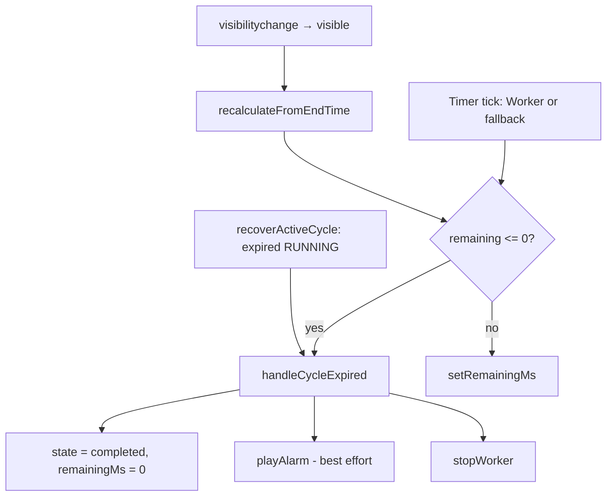

# Research: Background tab return catch-up (S-22)

**Date**: 2026-06-08T12:00:00+02:00  
**Researcher**: Cursor Agent (Auto)  
**Git Commit**: `501f1cc40dd2f03201ce7faccf73b1884b559830`  
**Branch**: `features/background-tab-return-catchup`  
**Repository**: [konrad-kaluzny-ceneo/FlowState](https://github.com/konrad-kaluzny-ceneo/FlowState)

## Research Question

How does cycle completion work when the tab is backgrounded? Where is `visibilitychange` handled? What gates exist after a work cycle ends (check-in, break confirm, suggestion)? What would we need for a calm catch-up overlay when the user returns after a cycle ended while the tab was hidden?

## Scope Decisions (decision proxy — no user Q&A)

| Decision | Choice | Rationale |
|----------|--------|-----------|
| Audio on return | Visual-only catch-up; **no alarm replay** on tab focus | Calm UX; pairs with S-20 mute path; roadmap unknown defers to user — proxy picks least alarming default |
| Elapsed time | Show relative “ended X ago” from client `cycleEndedAtMs` | Roadmap allows implementer choice; improves missed-transition context without new server fields |
| Gate wrapping | Catch-up frames **first pending gate only**; do not stack catch-up over check-in + suggestion | Roadmap risk: duplicate overlays; single next action per S-22 outcome |
| Guest mode | Work/break catch-up only (no check-in/suggestion gates) | PRD FR-003b — guest slice excludes check-in and scoring |
| Auth scope | Full wedge: work confirm → check-in → break → suggestion accept | Prerequisites S-05/S-06 shipped |

## Summary

Cycle completion is **client-authoritative**: when wall-clock `endTime` is reached, `handleCycleExpired` stops the timer, sets hook `state` to `"completed"`, and plays the alarm. This can fire from the Web Worker `complete` message, main-thread fallback `setInterval`, or `recalculateFromEndTime` on tab return. **`visibilitychange` is handled only on become-visible** — it recalculates remaining time and may trigger completion if the tab was throttled and expiry was missed while hidden.

There is **no** `endedWhileHidden` flag or catch-up surface today. Existing gates already render when the user returns, but without context (“what finished”, “how long ago”, calm handoff). The wedge after WORK expiry is: `CycleCompleteOverlay` → `onCycleCompleteConfirm` → `awaitingCheckIn` + `CheckInOverlay` (auth) → `submitCheckIn` → `confirmComplete` → break auto-start → `fetchSuggestion` → inline `TaskSuggestionCard` during break → break-end `CycleCompleteOverlay`.

**Duplicate-completion is already guarded** (`stateRef.current !== "running"` in `handleCycleExpired`). The roadmap duplicate-overlay risk applies to **adding** a catch-up shell without a one-shot dismiss flag — not to double-firing completion.

**Recommended approach:** extend `use-pomodoro-cycle` with `endedWhileHidden` + `cycleEndedAtMs` + `pendingCatchUpGate` enum; set when `handleCycleExpired` (or expired recovery on mount) runs while `document.visibilityState !== "visible"`; render a thin `TabReturnCatchUpOverlay` header/shell in `pomodoro-dashboard` that wraps the existing gate UI and clears on first interaction. No server/schema changes required for MVP.

## Detailed Findings

### 1. Cycle completion pipeline



**`handleCycleExpired`** ([`use-pomodoro-cycle.ts:185-194`](https://github.com/konrad-kaluzny-ceneo/FlowState/blob/501f1cc40dd2f03201ce7faccf73b1884b559830/src/hooks/use-pomodoro-cycle.ts#L185-L194)):

- Guard: only runs when `stateRef.current === "running"`.
- Sets `state` to `"completed"`, `remainingMs` to 0, stops worker, calls `audioRef.current.playAlarm()`.
- Does **not** call `cycles.complete` — server row stays `RUNNING` until user confirms via `confirmComplete`.

**Completion sources:**

| Source | Trigger | Notes |
|--------|---------|-------|
| Worker | `timer-worker.ts` posts `{ type: "complete" }` | Worker ticks use wall-clock; not throttled in background on desktop |
| Fallback interval | `startFallbackTimer` tick when `remaining <= 0` | Throttled in background tabs — visibility recalc is the safety net |
| Visibility recalc | `recalculateFromEndTime` on tab visible | Catches throttled fallback expiry |
| Mount recovery | `resumeFromActiveCycle` when `endTime <= Date.now()` | Refresh/tab-return with expired RUNNING cycle |

**Audio** ([`audio.ts:85-121`](https://github.com/konrad-kaluzny-ceneo/FlowState/blob/501f1cc40dd2f03201ce7faccf73b1884b559830/src/lib/audio.ts#L85-L121)): Web Audio buffer or HTML `<audio>` fallback; swallows `NotAllowedError`/`AbortError` — alarm may be silent if autoplay blocked, especially when tab is hidden.

### 2. `visibilitychange` handling

**Single listener** in [`use-pomodoro-cycle.ts:378-390`](https://github.com/konrad-kaluzny-ceneo/FlowState/blob/501f1cc40dd2f03201ce7faccf73b1884b559830/src/hooks/use-pomodoro-cycle.ts#L378-L390):

```typescript
const onVisibilityChange = () => {
  if (document.visibilityState !== "visible") {
    return;
  }
  recalculateFromEndTime();
};
```

- **No handler while hidden** — design assumes Worker keeps ticking; fallback relies on recalc on return.
- **`recalculateFromEndTime`** ([`use-pomodoro-cycle.ts:269-286`](https://github.com/konrad-kaluzny-ceneo/FlowState/blob/501f1cc40dd2f03201ce7faccf73b1884b559830/src/hooks/use-pomodoro-cycle.ts#L269-L286)): early-returns if not `"running"`; if `remaining <= 0`, calls `handleCycleExpired`; else updates `remainingMs`.

**Existing test:** hook test proves ±2s recalc on visible (fallback path, Worker blocked) — [`use-pomodoro-cycle.test.tsx:625-678`](https://github.com/konrad-kaluzny-ceneo/FlowState/blob/501f1cc40dd2f03201ce7faccf73b1884b559830/src/hooks/use-pomodoro-cycle.test.tsx#L625-L678). **No test** for completion fired while hidden or catch-up UX.

**E2E limitation** (test-plan §6.3): `NEXT_PUBLIC_E2E_MAIN_THREAD_TIMER=1` forces fallback path; no Playwright spec simulates real background throttle or Worker path.

### 3. Post-cycle gates (authenticated WORK wedge)

Orchestration lives in [`pomodoro-dashboard.tsx`](https://github.com/konrad-kaluzny-ceneo/FlowState/blob/501f1cc40dd2f03201ce7faccf73b1884b559830/src/app/_components/pomodoro-dashboard.tsx).

| Step | Hook state | UI | z-index | Persists on refresh? |
|------|------------|-----|---------|----------------------|
| 1. Work timer expires | `state === "completed"`, `cycleKind === "WORK"` | `CycleCompleteOverlay` — “Done” / “Continue later” | 50 | `completed` UI recovered from expired RUNNING; overlay shows again |
| 2. User confirms work end | `awaitingCheckIn === true`, `pendingMarkTaskDone` set | `CheckInOverlay` (cycle-complete hidden) | 60 | **Lost** — refresh returns to step 1 only |
| 3. Check-in submitted | `submitCheckIn` → `checkIn.create` → `confirmComplete` | Break auto-starts (`state === "running"`, break kind) | — | Break persisted as new RUNNING cycle |
| 4. During break | `pendingSuggestion` loading/ready | `TaskSuggestionCard` inline (not modal) | — | Suggestion is React-only; break cycle persists |
| 5. Break expires | `state === "completed"`, break kind | `CycleCompleteOverlay` break variant — “Continue” / suggested task | 50 | Same recovery pattern as work |

**Gate wiring:**

- `CycleCompleteOverlay` shown when `state === "completed"` **and** `!awaitingCheckIn` ([`pomodoro-dashboard.tsx:172-183`](https://github.com/konrad-kaluzny-ceneo/FlowState/blob/501f1cc40dd2f03201ce7faccf73b1884b559830/src/app/_components/pomodoro-dashboard.tsx#L172-L183)).
- `CheckInOverlay` when `enableCheckInGate && awaitingCheckIn` ([`pomodoro-dashboard.tsx:185-197`](https://github.com/konrad-kaluzny-ceneo/FlowState/blob/501f1cc40dd2f03201ce7faccf73b1884b559830/src/app/_components/pomodoro-dashboard.tsx#L185-L197)).
- `onCycleCompleteConfirm` for WORK + auth sets `awaitingCheckIn` instead of completing immediately ([`use-pomodoro-cycle.ts:863-887`](https://github.com/konrad-kaluzny-ceneo/FlowState/blob/501f1cc40dd2f03201ce7faccf73b1884b559830/src/hooks/use-pomodoro-cycle.ts#L863-L887)).
- `submitCheckIn` persists energy then `confirmComplete` + `fetchSuggestion` ([`use-pomodoro-cycle.ts:889-930`](https://github.com/konrad-kaluzny-ceneo/FlowState/blob/501f1cc40dd2f03201ce7faccf73b1884b559830/src/hooks/use-pomodoro-cycle.ts#L889-L930)).
- Guest: `enableCheckInGate={false}` — WORK confirm goes straight to `confirmComplete` ([`pomodoro-dashboard.tsx:249-252`](https://github.com/konrad-kaluzny-ceneo/FlowState/blob/501f1cc40dd2f03201ce7faccf73b1884b559830/src/app/_components/pomodoro-dashboard.tsx#L249-L252)).

**Suggestion gate** is non-blocking: card below timer during break ([`pomodoro-dashboard.tsx:69-132`](https://github.com/konrad-kaluzny-ceneo/FlowState/blob/501f1cc40dd2f03201ce7faccf73b1884b559830/src/app/_components/pomodoro-dashboard.tsx#L69-L132)). Accept pre-focuses task for break-end continue ([`use-pomodoro-cycle.ts:556-575`](https://github.com/konrad-kaluzny-ceneo/FlowState/blob/501f1cc40dd2f03201ce7faccf73b1884b559830/src/hooks/use-pomodoro-cycle.ts#L556-L575)).

### 4. What happens today when user returns to a backgrounded tab

| Scenario | User sees on return | Gap vs S-22 outcome |
|----------|---------------------|---------------------|
| Work cycle ended while hidden | `CycleCompleteOverlay` (if not yet confirmed) | No “ended X ago”; no calm handoff copy; alarm may have been missed |
| User confirmed work, check-in pending, then hid tab | `CheckInOverlay` | Same — no catch-up framing; **lost on refresh** |
| Check-in done, break running, suggestion ready | Timer + `TaskSuggestionCard` | User may not know work finished while away |
| Break ended while hidden | Break `CycleCompleteOverlay` | No elapsed-time context |
| Page refresh after hidden expiry | Recovered `completed` + overlay + alarm on mount | Same gap; `resumeFromActiveCycle` plays alarm ([`use-pomodoro-cycle.ts:305-308`](https://github.com/konrad-kaluzny-ceneo/FlowState/blob/501f1cc40dd2f03201ce7faccf73b1884b559830/src/hooks/use-pomodoro-cycle.ts#L305-L308)) |

**Overlay stacking:** `FirstRunOverlay` defers when `cycle-complete-overlay` is visible ([`home-shell.tsx:46-57`](https://github.com/konrad-kaluzny-ceneo/FlowState/blob/501f1cc40dd2f03201ce7faccf73b1884b559830/src/app/_components/home-shell.tsx#L46-L57)). Check-in (z-60) sits above cycle-complete (z-50).

### 5. Catch-up overlay — what to build

**Hook additions** (minimal contract for `/10x-plan`):

```typescript
type CatchUpGate =
  | "WORK_CONFIRM"      // CycleCompleteOverlay (work)
  | "CHECK_IN"          // CheckInOverlay
  | "BREAK_CONFIRM"     // CycleCompleteOverlay (break)
  | "SUGGESTION_ACCEPT" // TaskSuggestionCard ready during break

type CatchUpState = {
  endedWhileHidden: boolean;
  cycleEndedAtMs: number;
  gate: CatchUpGate;
} | null;
```

**Set `endedWhileHidden` when:**

- `handleCycleExpired()` runs and `document.visibilityState !== "visible"`, **or**
- `resumeFromActiveCycle` lands in `completed` on mount (tab was away / refresh) — treat as hidden expiry for catch-up purposes.

**Derive `gate` at expiry/return from hook state:**

| Conditions | `gate` |
|------------|--------|
| `state === "completed"`, WORK kind | `WORK_CONFIRM` |
| `awaitingCheckIn` | `CHECK_IN` |
| `state === "completed"`, break kind | `BREAK_CONFIRM` |
| `state === "running"`, break kind, `pendingSuggestion.status === "ready"` | `SUGGESTION_ACCEPT` |

**Clear `endedWhileHidden` on first interaction** with the underlying gate (overlay button, check-in energy, suggestion accept). Do not re-show on subsequent visibility events.

**UI pattern (recommended):** new `TabReturnCatchUpBanner` or shell component — calm header above existing gate:

- “Your work cycle finished” + task title (WORK) / “Your break finished” (BREAK)
- Relative time via `formatDistanceToNow(cycleEndedAtMs)` (or existing format helper)
- Single primary CTA label mapped to gate (“Continue to check-in”, “Start break”, “Accept suggestion”)
- Delegate actions to existing handlers — **do not duplicate** `confirmComplete` / `submitCheckIn` logic

**Do not:**

- Replay alarm on visibility (conflicts with calm UX and S-20)
- Add a second full-screen modal on top of check-in (fatigue)
- Persist `awaitingCheckIn` server-side in this slice (out of scope; refresh regression is pre-existing)

### 6. Risks and mitigations

| Risk | Evidence | Mitigation |
|------|----------|------------|
| Duplicate overlays | Roadmap S-22; visibility fires completion then user sees gate + new catch-up | One-shot `endedWhileHidden`; catch-up is a **header shell**, not a second gate; clear on first click |
| Double `handleCycleExpired` | Already guarded by `stateRef !== "running"` | Keep guard; add test for visible return when already `completed` |
| Alarm missed while hidden | `playAlarm` swallows blocked playback | Catch-up is primary visual cue; coordinate with S-20 mute (title pulse adjunct only) |
| `awaitingCheckIn` lost on refresh | React-only state | Document as known limitation; optional follow-up persistence slice |
| E2E cannot prove Worker background path | test-plan §6.6 | Hook unit tests for hidden expiry + gate derivation; Playwright uses `document.visibilityState` mock via `page.evaluate` or dedicated helper |
| Guest vs auth divergence | Guest skips check-in/suggestion | `enableCatchUp` follows same flags as check-in/suggestion gates |

## Code References

- `src/hooks/use-pomodoro-cycle.ts:185-194` — `handleCycleExpired` (completion + alarm)
- `src/hooks/use-pomodoro-cycle.ts:269-286` — `recalculateFromEndTime`
- `src/hooks/use-pomodoro-cycle.ts:305-308` — expired recovery plays alarm on mount
- `src/hooks/use-pomodoro-cycle.ts:378-390` — `visibilitychange` listener (visible only)
- `src/hooks/use-pomodoro-cycle.ts:863-930` — work confirm → check-in → complete + suggestion fetch
- `src/hooks/use-pomodoro-cycle.ts:683-721` — `startBreakAfterWorkComplete`
- `src/workers/timer-worker.ts:22-34` — worker tick → complete message
- `src/lib/audio.ts:85-121` — `playAlarm` (may fail silently when hidden)
- `src/app/_components/cycle-complete-overlay.tsx:30-119` — work/break end overlays
- `src/app/_components/check-in-overlay.tsx:40-85` — energy gate (z-60)
- `src/app/_components/pomodoro-dashboard.tsx:69-197` — gate orchestration + suggestion card
- `src/app/_components/task-suggestion-card.tsx` — inline suggestion during break
- `src/app/_components/home-shell.tsx:46-57` — first-run defers to cycle-complete
- `src/hooks/use-pomodoro-cycle.test.tsx:625-678` — visibility recalc ±2s test
- `src/hooks/use-pomodoro-cycle.test.tsx:760-803` — check-in gate after work confirm
- `e2e/helpers/work-cycle.ts:122-132` — `completeWorkCycleWithCheckIn` wedge helper
- `e2e/seed.spec.ts` — Risk #7 check-in gate exemplar

## Architecture Insights

1. **Two-layer state:** UI `state: "completed"` is orthogonal to DB `cycle.state: "RUNNING"` until `confirmComplete`. Catch-up must not call server `complete` early.
2. **Visibility is a clock sync hook, not a lifecycle hook** — it only recalculates; it does not know *why* the user was away.
3. **Wedge gates are composable overlays** — S-22 should extend presentation, not reorder the state machine.
4. **Suggestion is intentionally not a modal** (S-06 research) — catch-up for `SUGGESTION_ACCEPT` should elevate the card or add a calm banner, not introduce a third modal gate.
5. **Timer authority** is `startedAt + configuredDurationSec` on the client; `endedAt` is only set server-side on `cycles.complete` — use client `cycleEndedAtMs` for “how long ago” until confirm.

## Historical Context (from prior changes)

- [`context/archive/2026-05-28-first-pomodoro-cycle/research.md`](context/archive/2026-05-28-first-pomodoro-cycle/research.md) — Worker + visibility catch-up pattern chosen for ±2s NFR; audio fires in background when unlocked.
- [`context/archive/2026-06-04-testing-critical-path-persistence-timer/research.md`](context/archive/2026-06-04-testing-critical-path-persistence-timer/research.md) — visibility recalc documented; no catch-up UX; recommends hook tests before e2e.
- [`context/archive/2026-06-06-testing-active-slice-browser-proofs/plan.md`](context/archive/2026-06-06-testing-active-slice-browser-proofs/plan.md) — `awaitingCheckIn` / `pendingMarkTaskDone` contract for S-05.
- [`context/archive/2026-06-07-adaptive-task-suggestion/research.md`](context/archive/2026-06-07-adaptive-task-suggestion/research.md) — suggestion during break as non-blocking card; integration after `submitCheckIn`.

## Related Research

- `context/archive/2026-06-04-testing-critical-path-persistence-timer/research.md` — timer + visibility (Risk #2)
- `context/archive/2026-06-07-adaptive-task-suggestion/research.md` — suggestion wedge (S-06)
- `context/archive/2026-06-07-first-run-wedge-onboarding/research.md` — overlay stacking with check-in

## Open Questions

1. **Refresh during `awaitingCheckIn`** — pre-existing regression; fix requires persisting pending gate (localStorage or server). Defer unless product requires it in S-22.
2. **Break-ended catch-up when suggestion was never accepted** — show suggestion in catch-up or only break confirm? Proxy: if `pendingSuggestion.status === "ready"` during break running, use `SUGGESTION_ACCEPT`; if break already ended, fall through to `BREAK_CONFIRM`.
3. **S-20 coordination** — mute + title pulse vs catch-up primary path; `/10x-plan` should note S-20 must not ship without S-22 or pulse e2e (roadmap orchestrator note).
4. **iOS Safari full suspend** — visibility recalc on wake is the only completion path; same catch-up logic applies but needs manual QA.

## Recommended Approach (for `/10x-plan`)

1. **Hook phase:** Add `catchUp` state + set/clear helpers in `use-pomodoro-cycle.ts`; thread `document.visibilityState` into `handleCycleExpired` and expired recovery; export `dismissCatchUp` called by gate handlers.
2. **UI phase:** `tab-return-catchup.tsx` banner/shell; wire in `pomodoro-dashboard.tsx` above the active gate; optional copy module under `src/lib/onboarding/` or `src/lib/catch-up/`.
3. **Tests:** Hook tests — hidden expiry sets flag; visible return when already completed does not re-fire alarm or duplicate flag; gate derivation matrix. E2e — background tab simulation via `page.evaluate` + clock advance (pattern from `advanceClockThroughFastWork`).
4. **Out of scope:** Server persistence of catch-up, alarm replay, title/favicon pulse (S-20), persisting `awaitingCheckIn` across refresh.

**Confidence: 88/100** — completion and gate flow are fully traced in code; uncertainty is UX polish (exact copy, suggestion catch-up edge cases) and Playwright background simulation fidelity.
