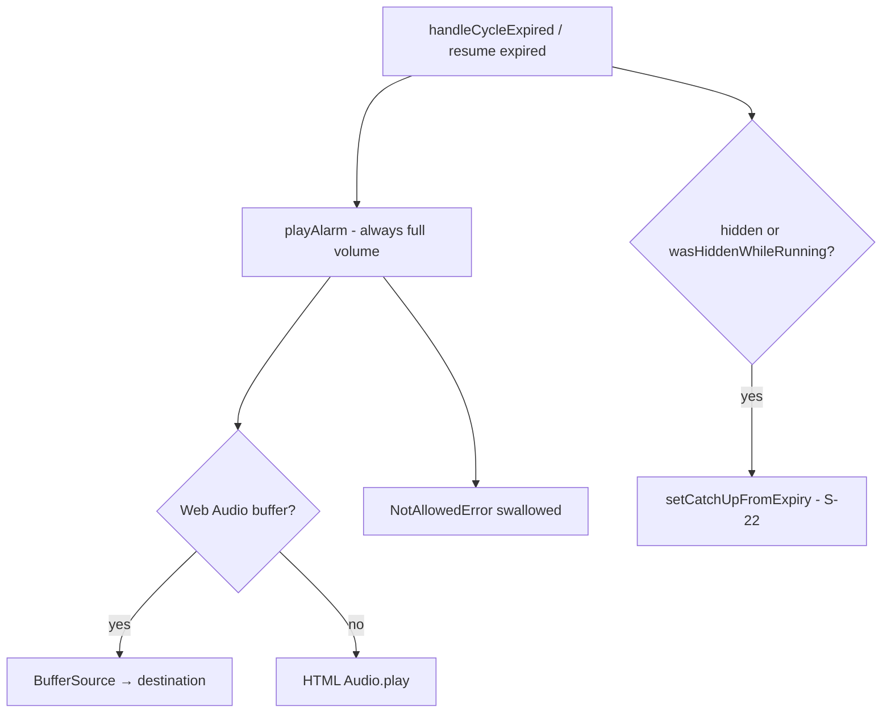

# Research: S-20 Persistent quiet cycle audio

**Date**: 2026-06-08T14:00:00+02:00  
**Researcher**: Cursor Agent (Auto)  
**Git Commit**: `2ee3a411d9b8c3e1918097b00ee9a92dbeffc42d`  
**Branch**: `features/persistent-quiet-cycle-audio`  
**Repository**: [konrad-kaluzny-ceneo/FlowState](https://github.com/konrad-kaluzny-ceneo/FlowState)

## Research Question

Ground implementation for S-20 persistent quiet cycle audio — mute/soften chime, persisted preferences (server profile logged-in, localStorage guests), title/favicon pulse when muted+backgrounded, integration with S-22 tab-return-catchup.

## Scope Decisions (decision proxy — no user Q&A)

| Decision | Choice | Rationale |
|----------|--------|-----------|
| Audio control shape | **Tri-state enum**: `normal` \| `soft` \| `muted` (not a continuous slider) | Roadmap says "mute or soften"; S-01 explicitly deferred volume slider as UX detail; tri-state maps cleanly to FR-013 ("signal" vs silence) without slider accessibility burden |
| Auth persistence | **New Prisma `UserPreference` row + tRPC `preference.get` / `preference.set`** | Roadmap outcome requires server profile for logged-in users; no model exists today; prior slices used localStorage-only as interim — S-20 is the designated server-preference slice |
| Guest persistence | **localStorage** key `flowstate:cycleEndAudio:guest` | Matches `duration-storage.ts`, `onboarding/storage.ts`, `work-type-duration-storage.ts` guest pattern |
| Auth localStorage fallback | **userId-scoped key** `flowstate:cycleEndAudio:{userId}` as optimistic cache after server fetch | Mirrors `work-type-duration-storage.ts:24` and avoids flash-of-wrong-audio before tRPC hydrates |
| Title/favicon pulse scope | **Work-end only** (`cycleKind === "WORK"`) when `muted` or `soft` and tab hidden at expiry | Roadmap: "work-end at minimum"; break-end deferred; reduces alarm fatigue |
| Pulse motion | **Respect `prefers-reduced-motion: reduce`** — title prefix only, skip favicon animation | Roadmap unknown resolved; no existing `matchMedia` usage in repo — add selectively here |
| S-22 coordination | **Catch-up remains primary visual cue**; pulse is adjunct while tab still hidden; **no alarm replay** on tab focus | S-22 shipped decision; S-22 plan explicitly defers mute e2e to S-20 |
| Soft volume level | **~0.25 gain** on Web Audio `GainNode`; HTML fallback `audio.volume = 0.25` | Single constant in `audio.ts`; tunable in plan without schema change |

## Summary

Cycle-end audio is centralized in `createAudioManager()` (`src/lib/audio.ts`) and invoked from **`handleCycleExpired`** and **expired mount recovery** in `use-pomodoro-cycle.ts` — always at full volume today, with no preference gate. Preferences are **not** stored anywhere for audio; Prisma has **no** `UserPreference` model. Established client patterns (`duration-storage.ts`, `onboarding/storage.ts`, `work-type-duration-storage.ts`) use `flowstate:*` localStorage keys with guest vs `userId` scoping — but roadmap S-20 requires **server persistence for authenticated users**, making this the first true profile-preference feature.

S-22 **background-tab-return-catchup** is **shipped on main**: `handleCycleExpired` sets `catchUp` when hidden, `TabReturnCatchUp` renders in `pomodoro-dashboard.tsx`, e2e uses `runWhileHidden` + `tab-return-catchup` testid. Muted users who background the tab still get catch-up on return; title/favicon pulse fills the gap **while the tab remains hidden**.

**Recommended approach:** Add `cycleEndAudioMode` enum + `UserPreference` Prisma model and tRPC router; add `src/lib/cycle-audio-preference/` for read/write (guest localStorage + auth server/cache); extend `createAudioManager` with `playAlarm({ mode })` gain/volume/skip; gate both `playAlarm` call sites in the hook; add `useCycleEndTabPulse` (or pure helper + effect in hook) for work-end hidden expiry when not `normal`; expose tri-state control in `TimerPanel` (near duration settings). E2e: extend S-22 hidden-expiry spec with mute pref + assert catch-up still visible + optional `document.title` assertion while hidden.

**Confidence: 88/100**

## Detailed Findings

### 1. Current audio implementation

**Manager** — [`src/lib/audio.ts`](https://github.com/konrad-kaluzny-ceneo/FlowState/blob/2ee3a411d9b8c3e1918097b00ee9a92dbeffc42d/src/lib/audio.ts):

- Factory `createAudioManager()` exposes `unlock`, `preload`, `playAlarm`, `dispose`.
- `playAlarm` (lines 85–121): Web Audio buffer source at **full gain**, or HTML `<audio>` fallback; swallows `NotAllowedError` / `AbortError` — may be **silent even when unmuted** if autoplay blocked (especially hidden tabs).
- No volume, mute, or preference parameters today.
- `primeHtmlAudioElement` uses `muted = true` only for unlock priming, not user preference.

**Call sites** — [`src/hooks/use-pomodoro-cycle.ts`](https://github.com/konrad-kaluzny-ceneo/FlowState/blob/2ee3a411d9b8c3e1918097b00ee9a92dbeffc42d/src/hooks/use-pomodoro-cycle.ts):

| Location | Lines | When |
|----------|-------|------|
| `handleCycleExpired` | 281 | Worker/fallback/visibility expiry — all cycle kinds |
| `resumeFromActiveCycle` | 399 | Mount/refresh with expired RUNNING cycle |

**Unlock/preload** — lines 934–935 on `start()`: user gesture unlocks AudioContext before cycle create; best-effort, non-blocking.

**Asset** — `POMODORO_ALARM_URL = "/sounds/pomodoro-complete.mp3"` (line 37).

**Tests** — [`src/lib/audio.test.ts`](https://github.com/konrad-kaluzny-ceneo/FlowState/blob/2ee3a411d9b8c3e1918097b00ee9a92dbeffc42d/src/lib/audio.test.ts): unlock, Web Audio play, HTML fallback, NotAllowedError swallow. **No volume/mute tests.**



### 2. User preference storage patterns

**Prisma** — [`prisma/schema.prisma`](https://github.com/konrad-kaluzny-ceneo/FlowState/blob/2ee3a411d9b8c3e1918097b00ee9a92dbeffc42d/prisma/schema.prisma): models `Task`, `Session`, `Cycle`, `CheckIn`, `SuggestionDecision` only. **No `UserPreference` or user profile table.** Auth user id is a string (`userId` on domain rows) from Neon Auth session — not a Prisma User model.

**tRPC routers** — [`src/server/api/root.ts`](https://github.com/konrad-kaluzny-ceneo/FlowState/blob/2ee3a411d9b8c3e1918097b00ee9a92dbeffc42d/src/server/api/root.ts): `task`, `session`, `cycle`, `checkIn`, `guest`, `suggestion` — **no preference router**.

**Guest localStorage precedents:**

| Module | Key pattern | Scope |
|--------|-------------|-------|
| `duration-storage.ts` | `flowstate:lastDurationSec`, break keys | Shared guest/auth (no userId) |
| `onboarding/storage.ts` | `flowstate:onboarding:guest` / `:userId` | Per scope |
| `work-type-duration-storage.ts` | `flowstate:workTypeDurationSec` / `:userId` | Per scope |

All follow: SSR-safe guards, try/catch on quota, parse validation, defaults on corrupt/missing.

**Guest import** — [`guest.import`](https://github.com/konrad-kaluzny-ceneo/FlowState/blob/2ee3a411d9b8c3e1918097b00ee9a92dbeffc42d/src/server/api/routers/guest.ts) merges tasks/sessions/cycles only; **does not migrate UX preferences**. Plan should copy guest `cycleEndAudio` localStorage value to server on first auth load or post-merge (optional nice-to-have).

### 3. S-22 catch-up overlay and mute coordination

**Shipped S-22 behavior** (on current branch base):

- `handleCycleExpired` (lines 271–286): after `playAlarm`, if `document.visibilityState !== "visible"` **or** `tabWasHiddenWhileRunningRef`, calls `setCatchUpFromExpiry`.
- `tabWasHiddenWhileRunningRef` set on `visibilitychange` when hidden + running (lines 497–506).
- `CatchUpState` — [`src/lib/catch-up/types.ts:7-11`](https://github.com/konrad-kaluzny-ceneo/FlowState/blob/2ee3a411d9b8c3e1918097b00ee9a92dbeffc42d/src/lib/catch-up/types.ts): `{ endedWhileHidden, cycleEndedAtMs, gate }`.
- UI — [`TabReturnCatchUp`](https://github.com/konrad-kaluzny-ceneo/FlowState/blob/2ee3a411d9b8c3e1918097b00ee9a92dbeffc42d/src/app/_components/tab-return-catchup.tsx) with `data-testid="tab-return-catchup"`.
- Dashboard wiring — [`pomodoro-dashboard.tsx:109-115, 287+`](https://github.com/konrad-kaluzny-ceneo/FlowState/blob/2ee3a411d9b8c3e1918097b00ee9a92dbeffc42d/src/app/_components/pomodoro-dashboard.tsx): catch-up above `CycleCompleteOverlay`, check-in, suggestion; `dismissCatchUp` on gate actions.

**Mute coordination rules (for S-20):**

1. **Do not replay alarm** on tab return — unchanged from S-22.
2. **Catch-up still shows** when hidden expiry — S-22 plan item 366: "Muted audio — catch-up still primary visual cue".
3. **Title pulse** runs only while `document.visibilityState !== "visible"` after work-end expiry when mode is `muted` or `soft`; stop on `visibilitychange → visible` or `dismissCatchUp`.
4. **`playAlarm` when `muted`**: no-op (skip Web Audio / HTML play) — avoids wasted autoplay attempts; pulse + catch-up carry FR-013 UI signal via visual paths.

### 4. Prisma schema — UserPreferences

**Finding:** None exists. Recommended new model:

```prisma
enum CycleEndAudioMode {
  NORMAL
  SOFT
  MUTED
}

model UserPreference {
  userId           String            @id @map("user_id") @db.VarChar(255)
  cycleEndAudioMode CycleEndAudioMode @default(NORMAL) @map("cycle_end_audio_mode")
  updatedAt        DateTime          @updatedAt @map("updated_at") @db.Timestamptz

  @@map("flow_state_user_preference")
}
```

Migration via `pnpm prisma migrate dev` only. Default `NORMAL` preserves current behavior for existing users.

### 5. E2E patterns from S-22 archive

**Reference specs:**

- [`e2e/background-tab-return.spec.ts`](https://github.com/konrad-kaluzny-ceneo/FlowState/blob/2ee3a411d9b8c3e1918097b00ee9a92dbeffc42d/e2e/background-tab-return.spec.ts) — auth hidden work expiry → catch-up → check-in wedge.
- [`e2e/guest-background-tab-return.spec.ts`](https://github.com/konrad-kaluzny-ceneo/FlowState/blob/2ee3a411d9b8c3e1918097b00ee9a92dbeffc42d/e2e/guest-background-tab-return.spec.ts) — guest variant.

**Reusable helpers:**

- [`e2e/helpers/visibility.ts`](https://github.com/konrad-kaluzny-ceneo/FlowState/blob/2ee3a411d9b8c3e1918097b00ee9a92dbeffc42d/e2e/helpers/visibility.ts) — `runWhileHidden`: mocks `document.visibilityState`, fires `visibilitychange`.
- `FAST_WORK_CLOCK_MS`, `startFocusedWorkCycle` from `e2e/helpers/work-cycle.ts`.
- `ensureIdleCycle`, `waitForCycleGetActive` from fixtures.

**S-20 e2e additions (recommended):**

1. Set preference to `muted` via UI or `localStorage` / test hook before cycle start.
2. `runWhileHidden` + clock advance → assert `tab-return-catchup` visible (regression guard).
3. While still hidden: `page.evaluate(() => document.title)` matches pulse prefix pattern.
4. After visible restore: title restored, catch-up + overlay flow unchanged.
5. Optional unit tests for `playAlarm({ mode: 'muted' })` no-op and soft gain.

**Note:** Headless cannot assert audible sound; assert **play mock** in Vitest and **visual/tab signals** in Playwright — same as S-01/S-22 convention.

### 6. PRD FR-013 and FR-014

From [`context/foundation/prd.md:104-107`](https://github.com/konrad-kaluzny-ceneo/FlowState/blob/2ee3a411d9b8c3e1918097b00ee9a92dbeffc42d/context/foundation/prd.md):

- **FR-013:** In-browser **audio signal** + **UI prompt** at work cycle end. Socrates note: volume/mute is UX detail, not an FR change — tri-state preference satisfies "signal" in `normal`/`soft`, visual prompt remains authoritative in `muted`.
- **FR-014:** User **confirms** transition (work → break → work). Unchanged — `CycleCompleteOverlay` / check-in / break gates remain; mute must not auto-skip confirmation.

**NFR (200ms acknowledgement):** Preference toggle should persist optimistically in UI; server round-trip can be async like other mutations — do not block cycle start on preference fetch (default `normal` until hydrated).

## Code References

- `src/lib/audio.ts:24-131` — `createAudioManager`; extend `playAlarm` signature
- `src/lib/audio.ts:85-121` — current full-volume playback paths
- `src/hooks/use-pomodoro-cycle.ts:37` — `POMODORO_ALARM_URL`
- `src/hooks/use-pomodoro-cycle.ts:196` — `audioRef` singleton per hook instance
- `src/hooks/use-pomodoro-cycle.ts:271-286` — `handleCycleExpired` + catch-up + alarm
- `src/hooks/use-pomodoro-cycle.ts:380-401` — expired recovery alarm + catch-up
- `src/hooks/use-pomodoro-cycle.ts:497-512` — `visibilitychange` listener
- `src/hooks/use-pomodoro-cycle.ts:907-938` — audio unlock on cycle start
- `src/hooks/use-pomodoro-cycle.ts:1505-1508` — `dismissCatchUp`
- `src/app/_components/timer-panel.tsx:54-64` — duration state; natural home for audio tri-state control
- `src/app/_components/tab-return-catchup.tsx:40` — `data-testid="tab-return-catchup"`
- `src/lib/duration-storage.ts:12-14` — `flowstate:` key namespace pattern
- `src/lib/onboarding/keys.ts:3-14` — guest vs userId key scoping
- `prisma/schema.prisma:49-142` — no preference model today
- `src/server/api/root.ts:14-21` — register new preference router here

## Architecture Insights

1. **Single choke point for alarm:** Only two `playAlarm()` calls — both in `use-pomodoro-cycle.ts`. Inject `cycleEndAudioMode` ref synced from preference hook; pass to `playAlarm({ mode })`.
2. **Audio manager extension:** Add optional `GainNode` between buffer source and destination for `soft`; early return for `muted`. HTML path: set `volume` before `play()`.
3. **Preference hook:** `useCycleEndAudioPreference(scope)` — guest reads/writes localStorage; auth uses `api.preference.get.useQuery` + `api.preference.set.useMutation` with localStorage cache keyed by `userId`.
4. **Title pulse module:** New `src/lib/cycle-end-tab-pulse.ts` — stores original `document.title`, toggles calm prefix (e.g. `● `) on interval (~1.5s), restores on stop; favicon swap optional behind `!prefers-reduced-motion`; link target `/favicon.ico` from [`layout.tsx:16`](https://github.com/konrad-kaluzny-ceneo/FlowState/blob/2ee3a411d9b8c3e1918097b00ee9a92dbeffc42d/src/app/layout.tsx).
5. **Hook integration:** In `handleCycleExpired`, after catch-up logic: if `cycleKind === "WORK"` && mode !== `normal` && hidden → `startTabPulse()`. On visibility visible / dismissCatchUp / new cycle start → `stopTabPulse()`.
6. **UI placement:** Tri-state segmented control in `TimerPanel` when idle (alongside break settings toggle) — visible before cycle start so user can mute proactively; persists immediately.

## Historical Context (from prior changes)

- [`context/archive/2026-05-28-first-pomodoro-cycle/plan.md`](context/archive/2026-05-28-first-pomodoro-cycle/plan.md) — explicitly out of scope: "Volume/mute controls (UX detail, not FR)"; deferred to post-MVP → now S-20.
- [`context/archive/2026-05-28-first-pomodoro-cycle/research.md`](context/archive/2026-05-28-first-pomodoro-cycle/research.md) — Web Audio background precision; autoplay unlock on Start click.
- [`context/archive/2026-06-08-background-tab-return-catchup/research.md`](context/archive/2026-06-08-background-tab-return-catchup/research.md) — S-22 pairs with S-20; alarm may fail silently when hidden; catch-up is primary visual.
- [`context/archive/2026-06-08-background-tab-return-catchup/plan.md:67`](context/archive/2026-06-08-background-tab-return-catchup/plan.md) — "S-20 mute must not ship without S-22 catch-up or title-pulse e2e" — **S-22 now shipped**, unblocking S-20.
- [`context/archive/2026-06-08-session-kickoff-suggestion/research.md`](context/archive/2026-06-08-session-kickoff-suggestion/research.md) — deferred Prisma `UserPreference` for work-type durations; S-20 is appropriate first server-preference table.
- [`context/archive/2026-06-07-first-run-wedge-onboarding/research.md`](context/archive/2026-06-07-first-run-wedge-onboarding/research.md) — "No User/preferences model in Prisma — server persistence would require new schema."

## Related Research

- [`context/archive/2026-06-08-background-tab-return-catchup/research.md`](context/archive/2026-06-08-background-tab-return-catchup/research.md) — visibility, catch-up gates, audio-on-return policy
- [`context/archive/2026-05-28-first-pomodoro-cycle/research.md`](context/archive/2026-05-28-first-pomodoro-cycle/research.md) — timer/audio architecture
- [`context/archive/2026-06-08-session-kickoff-suggestion/research.md`](context/archive/2026-06-08-session-kickoff-suggestion/research.md) — preference storage Phase 2 note

## Open Questions

1. **Guest → auth merge:** Should guest `cycleEndAudio` localStorage migrate to server on first authenticated session? (Recommend: yes on first `preference.set` or post-import hook — low risk, improves continuity.)
2. **Soft vs muted UX copy:** Exact labels ("Quiet" / "Off" vs "Soft" / "Muted") — plan/copy pass with S-12 wedge tone when available.
3. **Break-end pulse:** Defer per scope decision; document in plan negative space.
4. **Cross-device:** Server model enables sync; verify Neon Auth `userId` stability across providers.

## Recommended Approach (for `/10x-plan`)

| Phase | Deliverable |
|-------|-------------|
| 1 | Prisma `CycleEndAudioMode` + `UserPreference`; migration; `preference` tRPC router with Zod enum |
| 2 | `src/lib/cycle-audio-preference/` — types, localStorage helpers, constants; Vitest |
| 3 | Extend `audio.ts` — `playAlarm({ mode })`; Vitest for muted/soft/normal |
| 4 | `useCycleEndAudioPreference` hook; wire ref into `use-pomodoro-cycle` at both alarm sites |
| 5 | `cycle-end-tab-pulse.ts` + hook lifecycle; `prefers-reduced-motion` guard |
| 6 | `TimerPanel` tri-state UI + `data-testid="cycle-audio-preference"` |
| 7 | E2e: muted + hidden work expiry → catch-up + title pulse; guest + auth variants |

**Risks to verify in plan:**

- Autoplay policy may block even `soft` when tab hidden — accept; catch-up + pulse cover FR-013 visually.
- Title pulse must feel **calm** (single dot prefix, slow toggle) — not aggressive flashing (roadmap risk).
- Preference hydration race: cycle must not play full alarm before preference loads if user previously chose `muted` — load preference in dashboard mount before first cycle or read sync localStorage cache first.
- `resumeFromActiveCycle` expired path fires alarm on visible refresh — respect muted (no sound) but still show overlay/catch-up as today.
- tRPC isolation: preference router must use `protectedProcedure` + session `userId` only.
