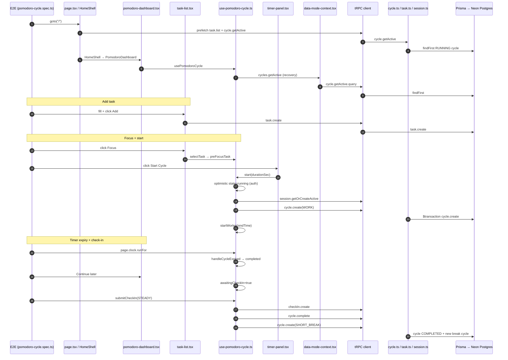
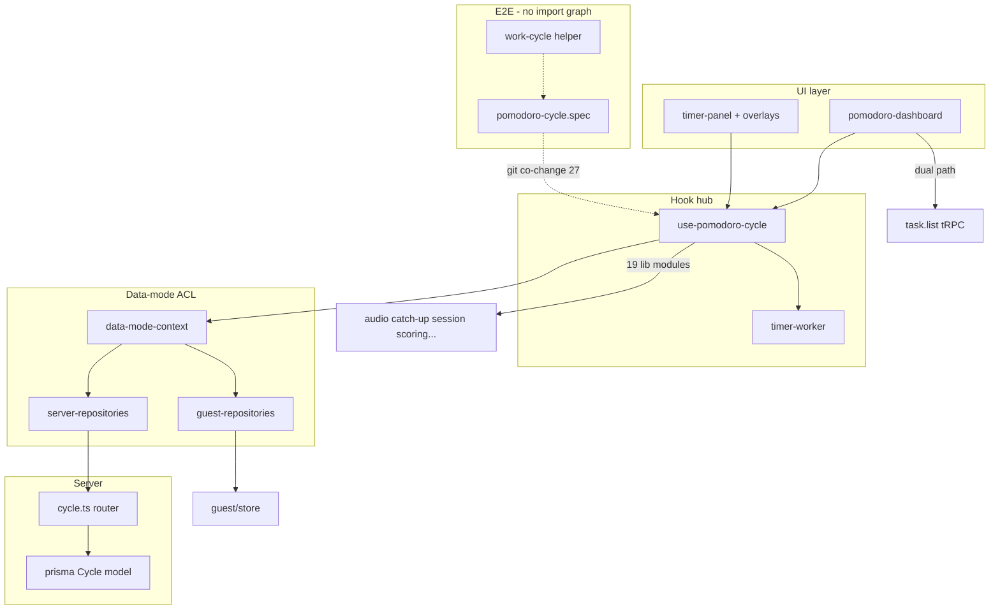

# Research: Pomodoro Timer Hub (Critical Application Area)

**Date**: 2026-06-14T12:00:00+02:00  
**Researcher**: Cursor Agent  
**Git Commit**: [`29a62d3`](https://github.com/konrad-kaluzny-ceneo/FlowState/commit/29a62d3f3ce4dcf3e96daa39919cd6f70e4dde5d)  
**Branch**: main  
**Repository**: [konrad-kaluzny-ceneo/FlowState](https://github.com/konrad-kaluzny-ceneo/FlowState)

## Research Question

Przeanalizuj hub timera Pomodoro (`use-pomodoro-cycle`), będący krytycznym elementem aplikacji — ze szczególną uwagą na powiązane obszary z [`context/map/repo-map.md`](https://github.com/konrad-kaluzny-ceneo/FlowState/blob/29a62d3f3ce4dcf3e96daa39919cd6f70e4dde5d/context/map/repo-map.md). Odtwórz ścieżkę E2E, zidentyfikuj luki w testach oraz blast radius (graf statyczny + git co-change). Skup się wyłącznie na stanie obecnego repozytorium.

## Summary

Hub timera Pomodoro to **vertical slice** od `/` przez `HomeShell` → `PomodoroDashboard` → [`use-pomodoro-cycle.ts`](https://github.com/konrad-kaluzny-ceneo/FlowState/blob/29a62d3f3ce4dcf3e96daa39919cd6f70e4dde5d/src/hooks/use-pomodoro-cycle.ts) → `DataModeProvider` / repozytoria → tRPC (`cycle`, `task`, `session`, `checkIn`, `suggestion`) → Prisma/Neon (auth) lub localStorage (guest). E2E belt (`pomodoro-cycle.spec.ts`) dowodzi wąskiej ścieżki auth: dodaj zadanie → focus → start → fake clock → continue later → check-in → break.

**Testy:** hook ma silne pokrycie unit (**2 854** linii testu, **65** przypadków `it`/`test`: 61 + 4 guest), router `cycle.ts` jest dobrze pokryty (**31** przypadków: 24 + 3 narrative + 4 property w isolation), ale **`data-mode-context`**, **`server-repositories`** i **`narrative-context`** nie mają plików testowych; dashboard to smoke overlay ze stubowanym hookiem (**10** testów, `vi.mock` hooka).

**Blast radius:** **19** fan-out + **9** fan-in w grafie depcruise (2026-06-15); git współzmienia hook z `_components` (35 commitów), `e2e/specs` (27) i `routers` (21) — liczby z artifact-1, nie ast-grep. Zmiana przepływu timera wymaga prawie zawsze: hook + dashboard + test hooka + co najmniej jeden spec E2E.

**Weryfikacja strukturalna:** sekcja [Weryfikacja ast-grep](#weryfikacja-ast-grep-2026-06-15) — 20 twierdzeń sprawdzonych wzorcami `ast-grep` / `depcruise`.

---

## Feature overview

### Co robi hub

[`use-pomodoro-cycle.ts`](https://github.com/konrad-kaluzny-ceneo/FlowState/blob/29a62d3f3ce4dcf3e96daa39919cd6f70e4dde5d/src/hooks/use-pomodoro-cycle.ts) jest **maszyną stanów** całego produktu Pomodoro. Odpowiada za:

| Obszar | Odpowiedzialność | Kluczowe pliki |
|--------|------------------|----------------|
| Cykl pracy/przerwy | Start, interrupt, complete, auto-break po WORK | Hook, [`cycle.ts`](https://github.com/konrad-kaluzny-ceneo/FlowState/blob/29a62d3f3ce4dcf3e96daa39919cd6f70e4dde5d/src/server/api/routers/cycle.ts), repozytoria |
| Timer | Worker + fallback main-thread (E2E) | [`timer-worker-logic.ts`](https://github.com/konrad-kaluzny-ceneo/FlowState/blob/29a62d3f3ce4dcf3e96daa39919cd6f70e4dde5d/src/workers/timer-worker-logic.ts), hook L80–88, L434–528 |
| Recovery | Przywrócenie RUNNING cycle po reload | Hook L589–642, `cycle.getActive` |
| Bramki UX (auth) | Check-in, sugestia, wind-down, kickoff, mid-cycle, intention, closure, catch-up | Hook + overlaye w [`pomodoro-dashboard.tsx`](https://github.com/konrad-kaluzny-ceneo/FlowState/blob/29a62d3f3ce4dcf3e96daa39919cd6f70e4dde5d/src/app/_components/pomodoro-dashboard.tsx) |
| Persystencja | ACL guest vs authenticated | [`data-mode-context.tsx`](https://github.com/konrad-kaluzny-ceneo/FlowState/blob/29a62d3f3ce4dcf3e96daa39919cd6f70e4dde5d/src/lib/data-mode/data-mode-context.tsx) |

### Entry point i warstwy

```
/ (page.tsx) — prefetch task.list + cycle.getActive (auth)
  └─ HomeShell — DataModeProvider (guest | authenticated)
       └─ PomodoroDashboard — fork guest vs auth (L519–536)
            └─ PomodoroDashboardBody
                 ├─ usePomodoroCycle()     ← hub
                 ├─ TaskList               ← useTaskMutations
                 ├─ TimerPanel             ← start/interrupt UI
                 └─ Overlays               ← complete, check-in, suggestion, wind-down…
                      ↓
            useRepositories()
                 ├─ guest: guest-repositories → localStorage
                 └─ auth:  server-repositories → tRPC → routers → Prisma/Neon
```

### Kanoniczna ścieżka E2E (auth, belt)

| Krok | Warstwa | Akcja | Referencja |
|------|---------|-------|------------|
| 1 | E2E | `page.goto("/")` | [`pomodoro-cycle.spec.ts:21`](https://github.com/konrad-kaluzny-ceneo/FlowState/blob/29a62d3f3ce4dcf3e96daa39919cd6f70e4dde5d/e2e/pomodoro-cycle.spec.ts#L21) |
| 2 | Route | Prefetch `task.list` + `cycle.getActive` | [`page.tsx:20–24`](https://github.com/konrad-kaluzny-ceneo/FlowState/blob/29a62d3f3ce4dcf3e96daa39919cd6f70e4dde5d/src/app/page.tsx#L20-L24) |
| 3 | Shell | `DataModeProvider` + `PomodoroDashboard` | [`home-shell.tsx:43–74`](https://github.com/konrad-kaluzny-ceneo/FlowState/blob/29a62d3f3ce4dcf3e96daa39919cd6f70e4dde5d/src/app/_components/home-shell.tsx#L43-L74) |
| 4 | Hook | Recovery `cycles.getActive()` | [`use-pomodoro-cycle.ts:589–642`](https://github.com/konrad-kaluzny-ceneo/FlowState/blob/29a62d3f3ce4dcf3e96daa39919cd6f70e4dde5d/src/hooks/use-pomodoro-cycle.ts#L589-L642) |
| 5 | UI | Dodaj zadanie (form → `createTask`) | [`work-cycle.ts:124–125`](https://github.com/konrad-kaluzny-ceneo/FlowState/blob/29a62d3f3ce4dcf3e96daa39919cd6f70e4dde5d/e2e/helpers/work-cycle.ts#L124-L125) → [`task-list.tsx:874–898`](https://github.com/konrad-kaluzny-ceneo/FlowState/blob/29a62d3f3ce4dcf3e96daa39919cd6f70e4dde5d/src/app/_components/task-list.tsx#L874-L898) |
| 6 | tRPC | `task.create` → Prisma | [`task.ts:54–84`](https://github.com/konrad-kaluzny-ceneo/FlowState/blob/29a62d3f3ce4dcf3e96daa39919cd6f70e4dde5d/src/server/api/routers/task.ts#L54-L84) |
| 7 | UI | Focus → `selectTask` → idle timer panel | [`work-cycle.ts:136–138`](https://github.com/konrad-kaluzny-ceneo/FlowState/blob/29a62d3f3ce4dcf3e96daa39919cd6f70e4dde5d/e2e/helpers/work-cycle.ts#L136-L138) → hook [`L1154–1199`](https://github.com/konrad-kaluzny-ceneo/FlowState/blob/29a62d3f3ce4dcf3e96daa39919cd6f70e4dde5d/src/hooks/use-pomodoro-cycle.ts#L1154-L1199) |
| 8 | UI | Start Cycle (1s w E2E) | [`timer-panel.tsx:167–174`](https://github.com/konrad-kaluzny-ceneo/FlowState/blob/29a62d3f3ce4dcf3e96daa39919cd6f70e4dde5d/src/app/_components/timer-panel.tsx#L167-L174) → hook [`start` L1285+](https://github.com/konrad-kaluzny-ceneo/FlowState/blob/29a62d3f3ce4dcf3e96daa39919cd6f70e4dde5d/src/hooks/use-pomodoro-cycle.ts#L1285) |
| 9 | Hook | Optimistic `running` (auth) | [`use-pomodoro-cycle.ts:1334–1367`](https://github.com/konrad-kaluzny-ceneo/FlowState/blob/29a62d3f3ce4dcf3e96daa39919cd6f70e4dde5d/src/hooks/use-pomodoro-cycle.ts#L1334-L1367) |
| 10 | tRPC | `session.getOrCreateActive` | hook [`L1381`](https://github.com/konrad-kaluzny-ceneo/FlowState/blob/29a62d3f3ce4dcf3e96daa39919cd6f70e4dde5d/src/hooks/use-pomodoro-cycle.ts#L1381) → [`session.ts:36–37`](https://github.com/konrad-kaluzny-ceneo/FlowState/blob/29a62d3f3ce4dcf3e96daa39919cd6f70e4dde5d/src/server/api/routers/session.ts#L36-L37) |
| 11 | tRPC | `cycle.create(WORK)` → transakcja Prisma | hook [`L1402–1412`](https://github.com/konrad-kaluzny-ceneo/FlowState/blob/29a62d3f3ce4dcf3e96daa39919cd6f70e4dde5d/src/hooks/use-pomodoro-cycle.ts#L1402-L1412) → [`cycle.ts:114–145`](https://github.com/konrad-kaluzny-ceneo/FlowState/blob/29a62d3f3ce4dcf3e96daa39919cd6f70e4dde5d/src/server/api/routers/cycle.ts#L114-L145) |
| 12 | Timer | Fake clock expiry → `completed` | [`work-cycle.ts:177–179`](https://github.com/konrad-kaluzny-ceneo/FlowState/blob/29a62d3f3ce4dcf3e96daa39919cd6f70e4dde5d/e2e/helpers/work-cycle.ts#L177-L179) → hook [`L434–457`](https://github.com/konrad-kaluzny-ceneo/FlowState/blob/29a62d3f3ce4dcf3e96daa39919cd6f70e4dde5d/src/hooks/use-pomodoro-cycle.ts#L434-L457) |
| 13 | UI | Continue later → check-in gate (auth) | [`cycle-complete-overlay.tsx:104–110`](https://github.com/konrad-kaluzny-ceneo/FlowState/blob/29a62d3f3ce4dcf3e96daa39919cd6f70e4dde5d/src/app/_components/cycle-complete-overlay.tsx#L104-L110) → hook [`L1924–1936`](https://github.com/konrad-kaluzny-ceneo/FlowState/blob/29a62d3f3ce4dcf3e96daa39919cd6f70e4dde5d/src/hooks/use-pomodoro-cycle.ts#L1924-L1936) |
| 14 | tRPC | `checkIn.create` → `cycle.complete` → `cycle.create(break)` | hook [`L1961–1964`](https://github.com/konrad-kaluzny-ceneo/FlowState/blob/29a62d3f3ce4dcf3e96daa39919cd6f70e4dde5d/src/hooks/use-pomodoro-cycle.ts#L1961-L1964), [`L1722–1730`](https://github.com/konrad-kaluzny-ceneo/FlowState/blob/29a62d3f3ce4dcf3e96daa39919cd6f70e4dde5d/src/hooks/use-pomodoro-cycle.ts#L1722-L1730), [`L1586–1610`](https://github.com/konrad-kaluzny-ceneo/FlowState/blob/29a62d3f3ce4dcf3e96daa39919cd6f70e4dde5d/src/hooks/use-pomodoro-cycle.ts#L1586-L1610) |

### Guest vs authenticated — kluczowe rozjazdy

| Concern | Authenticated | Guest |
|---------|---------------|-------|
| Źródło zadań | tRPC `task.list` suspense | `useGuestDomainTasks` → localStorage |
| Bramki UX | Check-in, sugestia, wind-down ON (`enable*Gate` L485–487) | Domyślnie OFF (`PomodoroDashboardBody` L34–36); guest nie przekazuje flag (L510–515) |
| Start cyklu | Optimistic UI przed serwerem | Czeka na repo create ([`hook L1372–1378`](https://github.com/konrad-kaluzny-ceneo/FlowState/blob/29a62d3f3ce4dcf3e96daa39919cd6f70e4dde5d/src/hooks/use-pomodoro-cycle.ts#L1372-L1378)) |
| Po WORK complete | Check-in przed persist | Bezpośredni `confirmComplete` ([`L1924–1930`](https://github.com/konrad-kaluzny-ceneo/FlowState/blob/29a62d3f3ce4dcf3e96daa39919cd6f70e4dde5d/src/hooks/use-pomodoro-cycle.ts#L1924-L1930)) |
| Persystencja | Neon Postgres via tRPC | `mutateSnapshot` → localStorage |
| E2E settle | `waitForCycleCreateSettled` | No-op ([`work-cycle.ts:72–74`](https://github.com/konrad-kaluzny-ceneo/FlowState/blob/29a62d3f3ce4dcf3e96daa39919cd6f70e4dde5d/e2e/helpers/work-cycle.ts#L72-L74)) |

### Procedury tRPC na ścieżce huba (auth)

| Procedure | Handler | DB |
|-----------|---------|-----|
| `task.list`, `task.create` | [`task.ts`](https://github.com/konrad-kaluzny-ceneo/FlowState/blob/29a62d3f3ce4dcf3e96daa39919cd6f70e4dde5d/src/server/api/routers/task.ts) | `flow_state_task` |
| `cycle.getActive`, `create`, `complete`, `interrupt` | [`cycle.ts`](https://github.com/konrad-kaluzny-ceneo/FlowState/blob/29a62d3f3ce4dcf3e96daa39919cd6f70e4dde5d/src/server/api/routers/cycle.ts) | `flow_state_cycle` |
| `session.getOrCreateActive` | [`session.ts`](https://github.com/konrad-kaluzny-ceneo/FlowState/blob/29a62d3f3ce4dcf3e96daa39919cd6f70e4dde5d/src/server/api/routers/session.ts) | `flow_state_session` |
| `checkIn.create` | [`check-in.ts`](https://github.com/konrad-kaluzny-ceneo/FlowState/blob/29a62d3f3ce4dcf3e96daa39919cd6f70e4dde5d/src/server/api/routers/check-in.ts) | `flow_state_check_in` |
| `suggestion.next`, `recordDecision` | suggestion router | scoring query |

Rejestracja routerów: [`root.ts:15–22`](https://github.com/konrad-kaluzny-ceneo/FlowState/blob/29a62d3f3ce4dcf3e96daa39919cd6f70e4dde5d/src/server/api/root.ts#L15-L22).

### Diagram sekwencji (E2E auth path)



---

## Technical debt

### 1. Architektura — wyjątki od wzorca (repo-map §3)

| Problem | Opis | Ryzyko |
|---------|------|--------|
| **Dual tRPC w dashboardzie** | Hook: `cycles`/`sessions` przez `useRepositories()` (L226); `checkIn` + `suggestion` przez bezpośrednie `api.*.useMutation()` (L304–307). Dashboard auth: jedyne miejsce `api.task.list.useSuspenseQuery()` w `src/` ([`pomodoro-dashboard.tsx:452`](https://github.com/konrad-kaluzny-ceneo/FlowState/blob/29a62d3f3ce4dcf3e96daa39919cd6f70e4dde5d/src/app/_components/pomodoro-dashboard.tsx#L452)) | Dwa kanały invalidacji zadań; trudniejsze reasoning przy refaktorze |
| **Brak testu ACL** | [`data-mode-context.tsx`](https://github.com/konrad-kaluzny-ceneo/FlowState/blob/29a62d3f3ce4dcf3e96daa39919cd6f70e4dde5d/src/lib/data-mode/data-mode-context.tsx) — 0 testów; [`server-repositories.ts`](https://github.com/konrad-kaluzny-ceneo/FlowState/blob/29a62d3f3ce4dcf3e96daa39919cd6f70e4dde5d/src/lib/repositories/server-repositories.ts) — 0 testów | Regresja w wiringu tRPC→repo uderza w hook bez wcześniejszego sygnału |
| **Guest merge (3 kanały)** | Server action + tRPC + localStorage ([repo-map §4 #2](https://github.com/konrad-kaluzny-ceneo/FlowState/blob/29a62d3f3ce4dcf3e96daa39919cd6f70e4dde5d/context/map/repo-map.md#L122-L123)) | Wysoki wpływ strukturalny, niski churn git (~3%) |
| **E2E poza grafem depcruise** | 27 wspólnych commitów hook↔E2E, brak krawędzi importów | Coupling dostawy niewidoczny w `pnpm depcruise` |

### 2. Test pyramid — luki pokrycia

#### Dobrze chronione

- Auth happy path: start → complete → check-in → break (unit hook 2 854 LOC + belt E2E)
- Optimistic start/interrupt (auth)
- Router `cycle.ts` — lifecycle + IDOR ([`cycle.test.ts`](https://github.com/konrad-kaluzny-ceneo/FlowState/blob/29a62d3f3ce4dcf3e96daa39919cd6f70e4dde5d/src/server/api/routers/cycle.test.ts), [`cycle-isolation.test.ts`](https://github.com/konrad-kaluzny-ceneo/FlowState/blob/29a62d3f3ce4dcf3e96daa39919cd6f70e4dde5d/src/server/api/routers/cycle-isolation.test.ts))
- Czysta domena: `scoring`, `derive-gate`, `narrative-builder`, `guest-repositories`

#### Ślepe strefy (priorytet)

| Moduł / gałąź | Brak pokrycia | Referencja |
|---------------|---------------|------------|
| `data-mode-context` | Cały provider guest vs auth | Brak pliku testowego |
| `server-repositories` | Adapter tRPC→repo | Brak pliku testowego |
| `narrative-context` | Stats dla in-flow summary | Brak pliku testowego |
| `pomodoro-dashboard` | Real hook wiring, catch-up UI, error banner, auth/guest shells | [`pomodoro-dashboard.test.tsx`](https://github.com/konrad-kaluzny-ceneo/FlowState/blob/29a62d3f3ce4dcf3e96daa39919cd6f70e4dde5d/src/app/_components/pomodoro-dashboard.test.tsx) — 10 testów, `vi.mock("~/hooks/use-pomodoro-cycle")` L11 |
| Hook: `onWindDownEndSession` | Tylko E2E `@skip-belt` | hook [`L1632–1698`](https://github.com/konrad-kaluzny-ceneo/FlowState/blob/29a62d3f3ce4dcf3e96daa39919cd6f70e4dde5d/src/hooks/use-pomodoro-cycle.ts#L1632-L1698) |
| Hook: error/retry paths | suggestion fail, `recordDecision` fail, check-in fail, `endSession` fail | m.in. [`L898–901`](https://github.com/konrad-kaluzny-ceneo/FlowState/blob/29a62d3f3ce4dcf3e96daa39919cd6f70e4dde5d/src/hooks/use-pomodoro-cycle.ts#L898-L901), [`L1965–1968`](https://github.com/konrad-kaluzny-ceneo/FlowState/blob/29a62d3f3ce4dcf3e96daa39919cd6f70e4dde5d/src/hooks/use-pomodoro-cycle.ts#L1965-L1968) |
| Hook: guest flows | Dokładnie 4 testy `it` (2× recovery, 2× catchUp) | [`use-pomodoro-cycle-guest.test.tsx`](https://github.com/konrad-kaluzny-ceneo/FlowState/blob/29a62d3f3ce4dcf3e96daa39919cd6f70e4dde5d/src/hooks/use-pomodoro-cycle-guest.test.tsx) |
| Hook: real Worker timer | E2E wymusza main-thread | [`hook L80–88`](https://github.com/konrad-kaluzny-ceneo/FlowState/blob/29a62d3f3ce4dcf3e96daa39919cd6f70e4dde5d/src/hooks/use-pomodoro-cycle.ts#L80-L88) |
| Router `cycle.ts` | Edge cases NOT_FOUND, BAD_REQUEST na `create`/`rebind`/`interrupt` | [`cycle.ts:100–111`](https://github.com/konrad-kaluzny-ceneo/FlowState/blob/29a62d3f3ce4dcf3e96daa39919cd6f70e4dde5d/src/server/api/routers/cycle.ts#L100-L111), [`L243–273`](https://github.com/konrad-kaluzny-ceneo/FlowState/blob/29a62d3f3ce4dcf3e96daa39919cd6f70e4dde5d/src/server/api/routers/cycle.ts#L243-L273) |

#### E2E — scenariusze poza beltem

| Nie pokryte w belt | Ryzyko |
|--------------------|--------|
| Interrupt w trakcie RUNNING | Abort flow użytkownika |
| Long break po 4. cyklu WORK | Cadence regression |
| Tab-return catch-up na bramkach | Hidden-tab UX |
| Cycle intention **submit** (z tekstem) — helper zawsze skip | Intention persistence |
| Optimistic start rollback przy błędzie sieci | NFR 200ms (L-04) |
| Real Worker timer | Worker-only bugs |

### 3. Blast radius — koszt zmiany

**Graf statyczny (depcruise):**

- **Fan-out:** **19** modułów followable z [`use-pomodoro-cycle.ts`](https://github.com/konrad-kaluzny-ceneo/FlowState/blob/29a62d3f3ce4dcf3e96daa39919cd6f70e4dde5d/src/hooks/use-pomodoro-cycle.ts) (`depcruise --focus`, 2026-06-15) — m.in. `data-mode-context`, `guest/store`, `onboarding/types` (brakowało w pierwotnym raporcie), catch-up, session/narrative, scoring, audio, worker logic
- **Fan-in:** **9** dependents — `pomodoro-dashboard`, `timer-panel`, `cycle-complete-overlay`, `mid-cycle-completion-prompt`, `tab-return-catchup`, `guest-import-on-mount`, `use-e2e-expose-cycle-recovery`, oba pliki testowe hooka

**Git co-change (artifact-1, ~3 tygodnie historii):**

| Para modułów | Wspólne commity |
|--------------|-----------------|
| `_components` ↔ `hooks` | **35** |
| `e2e/specs` ↔ `hooks` | **27** |
| `hooks` ↔ `routers` | **21** |
| `_components` + `hooks` + `routers` (triple) | **10** |
| `data-mode` + `repositories` + `routers` | **9** |

**Per-file churn:** hook **56** commitów, test hooka **31**, dashboard **29**, `work-cycle.ts` **20**, `pomodoro-cycle.spec.ts` **17**, `cycle.ts` **15**.

**Szwy interfejsu wymagające synchronizacji:**

| Szew | Przy zmianie timera aktualizuj |
|------|--------------------------------|
| Hook return API (**63** pól/handlerów, L2281–2356) | dashboard, timer-panel, overlaye, test hooka (2 854 LOC) |
| `CycleRepository` ([`types.ts`](https://github.com/konrad-kaluzny-ceneo/FlowState/blob/29a62d3f3ce4dcf3e96daa39919cd6f70e4dde5d/src/lib/data-mode/types.ts)) | guest-repositories, server-repositories, data-mode-context |
| tRPC `cycle.*` | server-repositories, cycle tests, E2E helpers |
| Prisma `Cycle` model | migracja + `pnpm prisma generate` + guest snapshot shape |
| Timer worker protocol | timer-worker-logic, timer-worker, E2E fake-clock |
| E2E env `NEXT_PUBLIC_E2E_MAIN_THREAD_TIMER=1` | work-cycle, cycle-recovery helpers |

### 4. Operacyjne

| Dług | Źródło |
|------|--------|
| **Bus factor** | 100% commitów = jeden autor ([repo-map §4 #6](https://github.com/konrad-kaluzny-ceneo/FlowState/blob/29a62d3f3ce4dcf3e96daa39919cd6f70e4dde5d/context/map/repo-map.md#L126)) |
| **Konsolidacja E2E** | 11% plików z historii usuniętych (`6ed9bda`); intencja niewidoczna w kodzie |
| **NFR 200ms per surface** | L-04 — optimistic task CRUD nie obejmuje `cycle.create`/`interrupt` do B-03 |
| **Harness E2E ≠ produkcja** | Fake clock, 1s cycles, main-thread timer — celowe, ale maskuje Worker path |

### Checklist zmiany przepływu timera

```
□ use-pomodoro-cycle.ts + .test.tsx (+ guest test jeśli guest)
□ pomodoro-dashboard.tsx + child overlays
□ cycle.ts router + cycle*.test.ts
□ data-mode/types + repositories + data-mode-context
□ prisma/schema (jeśli model) → migrate + generate
□ e2e/pomodoro-cycle.spec.ts + e2e/helpers/work-cycle.ts
□ pnpm test && pnpm test:e2e:belt
```

---

## Detailed Findings

### E2E trace (sub-agent 1)

Pełna sekwencja faz A–F (bootstrap → add task → focus → start → expiry → check-in → break) z file:line w sekcji **Feature overview**. Szczegół E2E harness: w trybie E2E `cycleEndTimeMs = Date.now() + duration` zamiast server `startedAt` ([`use-pomodoro-cycle.ts:79–88`](https://github.com/konrad-kaluzny-ceneo/FlowState/blob/29a62d3f3ce4dcf3e96daa39919cd6f70e4dde5d/src/hooks/use-pomodoro-cycle.ts#L79-L88)) — celowe odchylenie od produkcji dla deterministycznych fake clocków.

### Test gaps (sub-agent 2)

| Moduł | Pliki testowe | ~Testy | Ocena |
|-------|---------------|--------|-------|
| `use-pomodoro-cycle.ts` | `.test.tsx`, `-guest.test.tsx` | **65** (61+4) | Silne happy path; słabe error/guest/wind-down |
| `pomodoro-dashboard.tsx` | `.test.tsx` | 10 | Smoke overlay, stub hook |
| `cycle.ts` | `.test.ts`, `-narrative`, `-isolation` | **31** (24+3+4 fcTest) | Dobre core + IDOR |
| `data-mode-context.tsx` | brak | 0 | **Krytyczna luka** |
| `pomodoro-cycle.spec.ts` | belt + 1 skip-belt | 2 | Wąski S-01 path |

### Blast radius (sub-agent 3)

Diagram zależności:



**19 fan-out (depcruise, 2026-06-15):** `trpc/react`, `timer-worker-logic`, `data-mode-context`, `data-mode/types`, `guest/store`, **`onboarding/types`**, `duration-storage`, `work-type-duration-storage`, `audio`, `cycle-end-tab-pulse`, `catch-up/derive-gate`, `catch-up/types`, `session/wind-down-nudge`, `session/narrative-builder`, `session/narrative-context`, `scoring/rationale-breakdown`, `trpc/suggestion-priority`, `suggestion/override-ack-copy`, `cycle-audio-preference/types`.

**9 fan-in:** `pomodoro-dashboard`, `timer-panel`, `cycle-complete-overlay`, `mid-cycle-completion-prompt`, `tab-return-catchup`, `guest-import-on-mount`, `use-e2e-expose-cycle-recovery`, `use-pomodoro-cycle.test.tsx`, `use-pomodoro-cycle-guest.test.tsx`.

---

## Weryfikacja ast-grep (2026-06-15)

Narzędzia: `ast-grep` 0.43.0 (`sg --pattern`), `depcruise --focus` dla fan-in/out. Commit bazowy bez zmian w `src/` względem [`29a62d3`](https://github.com/konrad-kaluzny-ceneo/FlowState/commit/29a62d3f3ce4dcf3e96daa39919cd6f70e4dde5d).

### Twierdzenia strukturalne → wynik

| # | Twierdzenie (z raportu) | Wzorzec | Werdykt | Dowód |
|---|-------------------------|---------|---------|-------|
| 1 | Fan-out hooka = 18 modułów | `depcruise --focus src/hooks/use-pomodoro-cycle.ts` → `dependencies` gdzie `followable: true` | **Doprecyzowane → 19** | 19 resolved paths; brakujący w raporcie: `src/lib/onboarding/types.ts` |
| 2 | Fan-in hooka = 9 dependents | `depcruise` → `dependents` | **Potwierdzone** | 9 plików: `pomodoro-dashboard.tsx`, `timer-panel.tsx`, `cycle-complete-overlay.tsx`, `mid-cycle-completion-prompt.tsx`, `tab-return-catchup.tsx`, `guest-import-on-mount.tsx`, `use-e2e-expose-cycle-recovery.ts`, oba `*.test.tsx` |
| 3 | Jedyne wywołanie produkcyjne `usePomodoroCycle()` | `sg --pattern 'usePomodoroCycle' src/app` | **Potwierdzone** | Import L20; call L62 — `src/app/_components/pomodoro-dashboard.tsx` |
| 4 | Dual tRPC: `api.task.list.useSuspenseQuery` tylko w dashboardzie auth | `sg --pattern 'api.task.list.useSuspenseQuery' src` | **Potwierdzone** | Jedyny hit: `pomodoro-dashboard.tsx:452` |
| 5 | Prefetch `task.list` + `cycle.getActive` na `/` | `sg --pattern 'api.task.list.prefetch'` + `'api.cycle.getActive.prefetch'` | **Potwierdzone** | `src/app/page.tsx:22`, `:23` |
| 6 | Hook woła `useRepositories()` | `sg --pattern 'useRepositories' src/hooks/use-pomodoro-cycle.ts` | **Potwierdzone** | Import L14; destrukturyzacja L226 (`cycles`, `sessions`, `tasks`, `refreshGuest`) |
| 7 | Persystencja cyklu/sesji zawsze przez repo, nie `api.cycle` | `sg --pattern 'api.cycle'` w hooku; `sg --pattern 'cycles.'` | **Potwierdzone** (cykl/sesja) | 0× `api.cycle` w hooku; `cycles.create` L1402, L1598; `cycles.complete` L1652, L1723, L2047; `sessions.getOrCreateActive` L1103, L1381, L1974 |
| 8 | Check-in i sugestia przez repo | `sg --pattern 'api.checkIn'` + `'api.suggestion'` | **Obalone** (dla repo) | Bezpośrednie mutacje: `api.checkIn.create` L304, `mutateAsync` L1961; `api.suggestion.next` L305–306, `recordDecision` L307 |
| 9 | Guest: bramki UX OFF | `sg --pattern 'enableCheckInGate'`; domyślne props L34–36 | **Potwierdzone** | Auth: `enableCheckInGate` / `enableSuggestionGate` / `enableWindDownGate` L485–487; guest `GuestPomodoroDashboard` L510–515 — brak tych propsów (domyślnie `false`) |
| 10 | Guest E2E settle = no-op | `sg --pattern 'isGuestDashboard'` w `work-cycle.ts` | **Potwierdzone** | `e2e/helpers/work-cycle.ts:72–74` — early `return` gdy guest |
| 11 | Brak testów `data-mode-context` | glob `**/*data-mode-context*.test*` | **Potwierdzone** | 0 plików |
| 12 | Brak testów `server-repositories` | glob `**/*server-repositories*.test*` | **Potwierdzone** | 0 plików |
| 13 | Brak testów `narrative-context` | glob `**/*narrative-context*.test*` | **Potwierdzone** | 0 plików |
| 14 | Dashboard test: 10 przypadków + mock hooka | `rg '^\s*(it|test)\('`; `sg --pattern 'vi.mock("~/hooks/use-pomodoro-cycle"'` | **Potwierdzone** | 10× `it`; `pomodoro-dashboard.test.tsx:11` |
| 15 | Hook unit: ~62 testów | `rg '^\s*(it|test)\('` w `use-pomodoro-cycle*.test.tsx` | **Doprecyzowane → 65** | 61 (`use-pomodoro-cycle.test.tsx`) + 4 (`-guest.test.tsx`) |
| 16 | Guest hook: 4 testy | j.w. w `-guest.test.tsx` | **Potwierdzone** | 4× `it` |
| 17 | E2E spec: 2 testy (belt + skip-belt) | `rg '^\s*test\(' e2e/pomodoro-cycle.spec.ts` | **Potwierdzone** | L35 (belt), L64 (`@skip-belt`) |
| 18 | Hook return API ~40 pól | parse `return {` L2281–2356 | **Doprecyzowane → 63** | 63 klucze w obiekcie zwrotnym |
| 19 | Hook prod ~2358 LOC; test ~2839 LOC | `(Get-Content …).Count` | **Doprecyzowane** | Prod **2357** linii; test **2854** linii |
| 20 | Router `cycle.ts` ~35+ testów | `rg '^\s*it\('` + `fcTest.prop` w `cycle*.test.ts` | **Doprecyzowane → 31** | 24 (`cycle.test.ts`) + 3 (`cycle-narrative.test.ts`) + 4 property (`cycle-isolation.test.ts` L146, L204, L243, L283) |

### Wzorce ast-grep (kopiowalne)

```bash
# Fan-in produkcyjny hooka (import wartości)
sg --pattern 'usePomodoroCycle' src/app

# Dual path tRPC zadań
sg --pattern 'api.task.list.useSuspenseQuery' src

# Repo vs direct tRPC w hubie
sg --pattern 'cycles.create' src/hooks/use-pomodoro-cycle.ts
sg --pattern 'api.checkIn' src/hooks/use-pomodoro-cycle.ts
sg --pattern 'api.suggestion' src/hooks/use-pomodoro-cycle.ts

# Guest gates (props nie przekazane = domyślne false w PomodoroDashboardBody)
sg --pattern 'enableCheckInGate' src/app/_components/pomodoro-dashboard.tsx

# E2E harness
sg --pattern 'NEXT_PUBLIC_E2E_MAIN_THREAD_TIMER' src/hooks/use-pomodoro-cycle.ts
```

### Wnioski korekcyjne

1. **Fan-out 19, nie 18** — `onboarding/types` jest followable zależnością huba (typ `OnboardingScope` w opcjach kickoff).
2. **Return API 63 pola** — raport zaniżał koszt synchronizacji szwu hook↔UI.
3. **Persystencja nie jest w 100% przez `useRepositories`** — `checkIn` i `suggestion` omijają warstwę repo (4 mutacje `api.*` w hooku).
4. **Testy cycle router: 31, nie 35+** — property tests w `cycle-isolation` to 4× `fcTest.prop`, nie dodatkowe `it` poza 27.

---

## Code References

- [`src/hooks/use-pomodoro-cycle.ts`](https://github.com/konrad-kaluzny-ceneo/FlowState/blob/29a62d3f3ce4dcf3e96daa39919cd6f70e4dde5d/src/hooks/use-pomodoro-cycle.ts) — hub state machine (2 357 LOC; 63 pola zwrotne L2281–2356)
- [`src/app/_components/pomodoro-dashboard.tsx`](https://github.com/konrad-kaluzny-ceneo/FlowState/blob/29a62d3f3ce4dcf3e96daa39919cd6f70e4dde5d/src/app/_components/pomodoro-dashboard.tsx) — UI + overlay gates + dual tRPC
- [`src/lib/data-mode/data-mode-context.tsx`](https://github.com/konrad-kaluzny-ceneo/FlowState/blob/29a62d3f3ce4dcf3e96daa39919cd6f70e4dde5d/src/lib/data-mode/data-mode-context.tsx) — ACL guest↔server
- [`src/server/api/routers/cycle.ts`](https://github.com/konrad-kaluzny-ceneo/FlowState/blob/29a62d3f3ce4dcf3e96daa39919cd6f70e4dde5d/src/server/api/routers/cycle.ts) — kontrakt persystencji cyklu
- [`e2e/pomodoro-cycle.spec.ts`](https://github.com/konrad-kaluzny-ceneo/FlowState/blob/29a62d3f3ce4dcf3e96daa39919cd6f70e4dde5d/e2e/pomodoro-cycle.spec.ts) — belt proof S-01
- [`e2e/helpers/work-cycle.ts`](https://github.com/konrad-kaluzny-ceneo/FlowState/blob/29a62d3f3ce4dcf3e96daa39919cd6f70e4dde5d/e2e/helpers/work-cycle.ts) — fake clock + start/settle helpers
- [`context/map/repo-map.md`](https://github.com/konrad-kaluzny-ceneo/FlowState/blob/29a62d3f3ce4dcf3e96daa39919cd6f70e4dde5d/context/map/repo-map.md) — mapa terytorium i stref ryzyka

---

## Architecture Insights

1. **Zdrowa warstwowość, drogie testy** — UI→hook→tRPC→router→DB jest acykliczna (repo-map §3), ale jeden hub wymaga mocków **19** modułów (depcruise) lub E2E; część tRPC (`checkIn`, `suggestion`) omija `useRepositories`.
2. **Data-mode jako most** — niski churn git (~3%), wysoki wpływ strukturalny; folder `repositories/` wygląda peryferyjnie, ale jest centralny dla huba.
3. **E2E jako praktyczny proof layer** — poza grafem TS, ale 27 wspólnych commitów z hookiem; belt dowodzi wąskiej ścieżki auth.
4. **Wzorzec do naśladowania:** [`lib/scoring/score-task.ts`](https://github.com/konrad-kaluzny-ceneo/FlowState/blob/29a62d3f3ce4dcf3e96daa39919cd6f70e4dde5d/src/lib/scoring/score-task.ts) — czysta domena, tanie testy; hub jest anty-wzorcem pod kątem testowalności.

---

## Historical Context (from prior changes)

- [`context/archive/2026-05-28-first-pomodoro-cycle/research.md`](https://github.com/konrad-kaluzny-ceneo/FlowState/blob/29a62d3f3ce4dcf3e96daa39919cd6f70e4dde5d/context/archive/2026-05-28-first-pomodoro-cycle/research.md) — pierwszy vertical slice timera (W22 MVP)
- [`context/archive/2026-06-04-testing-critical-path-persistence-timer/research.md`](https://github.com/konrad-kaluzny-ceneo/FlowState/blob/29a62d3f3ce4dcf3e96daa39919cd6f70e4dde5d/context/archive/2026-06-04-testing-critical-path-persistence-timer/research.md) — wcześniejsza analiza critical path persistence + timer
- [`context/archive/2026-06-09-fix-title-multiline-and-cycle-optimistic/research.md`](https://github.com/konrad-kaluzny-ceneo/FlowState/blob/29a62d3f3ce4dcf3e96daa39919cd6f70e4dde5d/context/archive/2026-06-09-fix-title-multiline-and-cycle-optimistic/research.md) — optimistic cycle start (B-03)
- [`context/archive/2026-06-08-background-tab-return-catchup/research.md`](https://github.com/konrad-kaluzny-ceneo/FlowState/blob/29a62d3f3ce4dcf3e96daa39919cd6f70e4dde5d/context/archive/2026-06-08-background-tab-return-catchup/research.md) — catch-up gates w hooku
- [`context/archive/2026-06-08-auth-merge-first-impression/research.md`](https://github.com/konrad-kaluzny-ceneo/FlowState/blob/29a62d3f3ce4dcf3e96daa39919cd6f70e4dde5d/context/archive/2026-06-08-auth-merge-first-impression/research.md) — guest merge (3 kanały persystencji)
- [`context/foundation/lessons.md` L-04](https://github.com/konrad-kaluzny-ceneo/FlowState/blob/29a62d3f3ce4dcf3e96daa39919cd6f70e4dde5d/context/foundation/lessons.md) — NFR 200ms per action surface, nie per slice

---

## Related Research

- [`context/map/artifact-1-territory.md`](https://github.com/konrad-kaluzny-ceneo/FlowState/blob/29a62d3f3ce4dcf3e96daa39919cd6f70e4dde5d/context/map/artifact-1-territory.md) — git co-change, churn per folder
- [`context/map/artifact-2-structure.md`](https://github.com/konrad-kaluzny-ceneo/FlowState/blob/29a62d3f3ce4dcf3e96daa39919cd6f70e4dde5d/context/map/artifact-2-structure.md) — depcruise fan-in/out, timer-hub.svg
- [`context/map/artifact-3-contributors.md`](https://github.com/konrad-kaluzny-ceneo/FlowState/blob/29a62d3f3ce4dcf3e96daa39919cd6f70e4dde5d/context/map/artifact-3-contributors.md) — bus factor

---

## Open Questions

1. Czy `reports/timer-hub.svg` jest aktualny względem obecnego grafu (wymaga lokalnego `pnpm depcruise`)?
2. Które usunięte specy E2E po `6ed9bda` nie mają już odpowiednika w belt — wymaga wiedzy autora (repo-map §7).
3. Czy dual tRPC w dashboardzie (`task.list` obok hook repos) to świadomy dług techniczny do refaktoru, czy stabilny wzorzec?
4. Jaki minimalny zestaw testów zamknąłby lukę `data-mode-context` bez duplikowania 2 854 linii mocków hooka?
