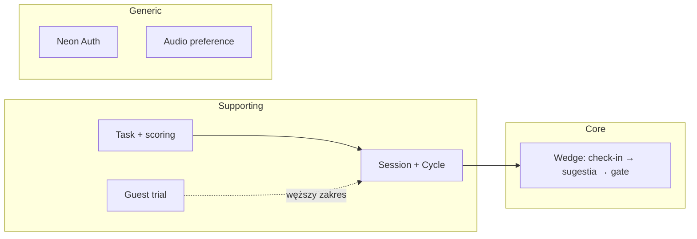
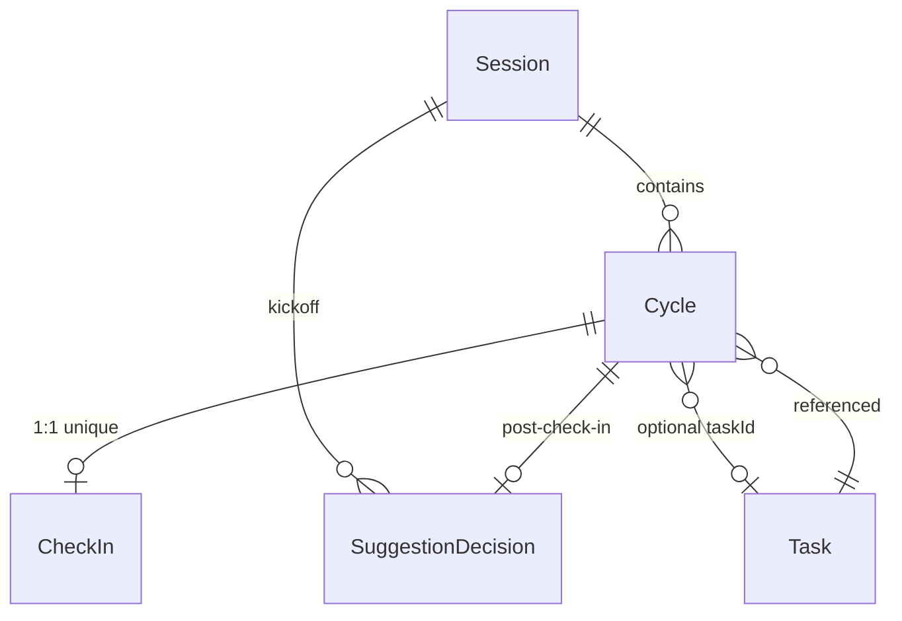

# FlowState — destylacja domeny (KROK 0–5)

Destylacja odkryta z dokumentów `context/foundation/` oraz kodu `src/` i `prisma/`. Nazwy bytów, agregatów i wymagań **nie były zakładane z góry** — wynikają ze źródeł. Walidacja: sub-agenci explore (kontekst, język z kodu, agregaty/rozjazdy, klasyfikacja subdomen, ranking refaktoru) + ręczna weryfikacja cytatów w plikach wskazanych poniżej.

---

## KROK 0 — Kontekst projektu

### Dokumenty źródłowe

| Dokument | Rola | Status |
|----------|------|--------|
| `context/foundation/prd.md` | Kontrakt produktowy v3 (US-01–04, guardrails, non-goals) | draft |
| `context/foundation/roadmap.md` | Indeks slice'ów; definicja **wedge** | draft |
| `context/foundation/user-flow.md` | Aktualne zachowanie UI; macierz overlayów; tarcia T-01–T-05 | draft |
| `context/foundation/tech-stack.md` | Stack autorytatywny (T3 monolith) | — |
| `context/foundation/prd-refs.md` | Mapowanie US ↔ roadmap | — |
| `prisma/schema.prisma` | Model persystencji (encje, enumy) | shipped |
| `DESIGN.md` | System wizualny Serene Pastel | — |
| `README.md` | Pitch + getting started | **przestarzały** (Drizzle, Next 15) |

**Ograniczenie:** Brak dedykowanego słownika domenowego — terminologia rozproszona między PRD, user-flow a kodem. `README.md` nie jest wiarygodnym źródłem stacku; autorytet: `tech-stack.md` + `package.json`.

### Wizja produktu (cytaty)

> FlowState is a shipped single-user web app for interrupt-driven knowledge work. A logged-in user manages tasks, runs Pomodoro cycles linked to a selected task, completes mindful energy check-ins at cycle boundaries, and receives deterministic next-task suggestions with one-line rationale — always with override freedom.  
> — `context/foundation/prd.md:20`

> **Wedge:** the system observes session state and proposes the *next* task with rationale while preserving override freedom. Every decision below protects that wedge.  
> — `context/foundation/roadmap.md:25`

> FlowState ma prowadzić wiedzowego pracownika przez **świadome przejścia** między cyklami pracy — nie maksymalizować throughput.  
> — `context/foundation/user-flow.md:16`

### Stack i struktura repo

| Warstwa | Lokalizacja | Rola |
|---------|-------------|------|
| UI / prezentacja | `src/app/_components/` | Overlaye wedge, dashboard, timer |
| Orkiestracja klienta | `src/hooks/use-pomodoro-cycle.ts` | Maszyna stanów cyklu, flagi gate'ów |
| Logika domenowa (czysta) | `src/lib/scoring/`, `src/lib/session/`, `src/lib/catch-up/` | Scoring, narracja, wind-down, catch-up |
| Anti-corruption / tryby | `src/lib/data-mode/`, `src/lib/guest/` | Guest vs authenticated |
| API / serwisy aplikacyjne | `src/server/api/routers/*.ts` | tRPC procedures |
| Persystencja | `prisma/schema.prisma`, `src/server/db/` | Prisma 7 + Neon |

**Brak pakietu `src/domain/`** — logika domenowa współdzielona z hookiem i dashboardem.

### Konteksty ograniczone (emergentne)



---

## KROK 1 — Ubiquitous Language

Dla każdego pojęcia: definicja, cytat źródłowy, lokalizacja w kodzie (lub adnotacja **BRAK w kodzie**.

### Pojęcia produktowe (dokumenty)

| Termin | Definicja | Cytat źródłowy | W kodzie |
|--------|-----------|----------------|----------|
| **Wedge** | System obserwuje stan sesji i proponuje następne zadanie z uzasadnieniem; użytkownik zawsze może nadpisać | `roadmap.md:25` | Copy + `useWedgeGateSuppressed` — `src/app/_components/return-handoff-banner-mount.tsx:7-28`; **brak typu/modułu `Wedge`** |
| **Transition beat** | Granica przejścia między cyklami; max jedna linia interstitial + jeden gate | `prd.md:49`, `prd.md:62` | **BRAK w kodzie** — brak `transition-conductor` w `src/` (grep: 0 dopasowań) |
| **Interstitial fatigue** | Zmęczenie przez nakładające się powierzchnie wedge | `prd.md:34`, `prd.md:149` | **BRAK w kodzie** (pojęcie produktowe) |
| **Calm closure** | Spokojne zamknięcie sesji (closure line) | `prd.md:49`, `user-flow.md:16` | `buildClosureLine()` — `src/lib/session/narrative-builder.ts:92+`; `SessionClosureOverlay` — `src/app/_components/session-closure-overlay.tsx:18+` |
| **Override freedom** | Sugestia zawsze z możliwością wyboru innego zadania | `prd.md:20`, `prd.md:120` | `SuggestionDecision.accepted` — `prisma/schema.prisma:154` |
| **Pause** | Zawieszenie timera bez liczenia jako przerwanie; cap ~30 min → auto-end sesji | `prd.md:54`, `prd.md:151` | **BRAK w kodzie** — brak `PAUSED` w `CycleState` (`prisma/schema.prisma:30-34`); UI „Interrupt” zamiast Pause |
| **Standing tasks** | Codzienne zadania z resetem o północy lokalnej | `prd.md:55`, `prd.md:106` | **BRAK w kodzie** (planowane US-03) |
| **Persona preset** | Preset atrybutów przy tworzeniu zadania | `prd.md:101`, `prd.md:78-80` | `Task.personaPresetId` — `prisma/schema.prisma:75`; pełny trust bridge **częściowy** |

### Pojęcia persystencji i API

| Termin | Definicja | Cytat źródłowy | W kodzie |
|--------|-----------|----------------|----------|
| **Session** | Agregat sesji fokusowej użytkownika ze stanem, licznikiem przerwań, closure line | `prd.md:143` (session state w scoringu) | `prisma/schema.prisma:91-108`; `sessionRouter` — `src/server/api/routers/session.ts` |
| **SessionState** | `ACTIVE` \| `ENDED_BY_USER` \| `ENDED_BY_TIMEOUT` | `prisma/schema.prisma:24-28` | `Session.state` — `prisma/schema.prisma:94` |
| **Cycle** | Timowany interwał WORK/BREAK w sesji | `user-flow.md:62-72` | `prisma/schema.prisma:110-131`; `cycleRouter` — `src/server/api/routers/cycle.ts` |
| **CycleKind** | `WORK` \| `SHORT_BREAK` \| `LONG_BREAK` | `prisma/schema.prisma:36-40` | `use-pomodoro-cycle.ts:96`, `152-154` |
| **CycleState** | `RUNNING` \| `COMPLETED` \| `INTERRUPTED` | `prisma/schema.prisma:30-34` | `cycle.complete` → COMPLETED — `src/server/api/routers/cycle.ts:188` |
| **CheckIn** | Jedna odpowiedź energii na cykl WORK | `user-flow.md:24`, `prd.md:122` | `prisma/schema.prisma:133-144`; `checkInRouter` — `src/server/api/routers/check-in.ts` |
| **EnergyLevel** | `FOCUSED` \| `STEADY` \| `FADING` | `prisma/schema.prisma:18-22` | `CheckInOverlay` — `src/app/_components/check-in-overlay.tsx:33-38` |
| **Task** | Element pracy z atrybutami scoringowymi | `prd.md:28`, `prd.md:143` | `prisma/schema.prisma:62-89`; `taskRouter` — `src/server/api/routers/task.ts` |
| **WorkType** | `DEEP_WORK` \| `OPERATIONAL` \| `REACTIVE` | `prisma/schema.prisma:12-16` | `TYPE_FIT` — `src/lib/scoring/score-task.ts:27-31` |
| **SuggestionDecision** | Rekord: sugerowane vs wybrane zadanie, accepted | `prd.md:143` (suggestion) | `prisma/schema.prisma:146-165`; `suggestionRouter` — `src/server/api/routers/suggestion.ts` |
| **SuggestionContext** | `POST_CHECK_IN` \| `KICKOFF` | `prisma/schema.prisma:42-45` | `suggestion.ts:16-28` |
| **interruptionCount** | Licznik sygnałów reaktywności na sesji | `prd.md:143` | `prisma/schema.prisma:98`; inkrement przy `rebindTask` — `cycle.ts:288-289` |
| **ScoringContext** | Wejścia do deterministycznego rankingu | `prd.md:143` | `src/lib/scoring/score-task.ts:7-13` |

### Pojęcia orkiestracji UI (kod)

| Termin | Definicja | Cytat źródłowy | W kodzie |
|--------|-----------|----------------|----------|
| **Kickoff readiness** | Energia na start sesji → pierwsza sugestia | `user-flow.md:25`, `user-flow.md:51-52` | `KickoffReadinessOverlay` — `src/app/_components/kickoff-readiness-overlay.tsx:27-41`; `kickoffEligible` — `use-pomodoro-cycle.ts:1070+` |
| **awaitingCheckIn** | Blokada UI po zakończeniu WORK do check-in | `user-flow.md:65-66` | `use-pomodoro-cycle.ts:1924-1935` |
| **Wind-down nudge** | Zachęta do końca sesji przy FADING + fatigue | `user-flow.md:27`, `user-flow.md:66-68` | `shouldShowWindDownNudge` — `src/lib/session/wind-down-nudge.ts:13-18` |
| **CatchUpGate** | Bramki powrotu do karty: WORK_CONFIRM, CHECK_IN, BREAK_CONFIRM, SUGGESTION_ACCEPT | `user-flow.md:97` (mutual exclusion) | `src/lib/catch-up/types.ts:1-5`; `deriveCatchUpGate` — `src/lib/catch-up/derive-gate.ts:16-41` |
| **Return handoff** | Banner po ≥8h od końca sesji | `user-flow.md:30`, `user-flow.md:93` | `RETURN_HANDOFF_THRESHOLD_MS` — `src/lib/session/narrative-builder.ts:10` |
| **DataMode** | `guest` \| `authenticated` — wybór repozytoriów | `user-flow.md:20-34`, `prd.md:135` | `src/lib/data-mode/types.ts:63`; `DataModeProvider` — `src/lib/data-mode/data-mode-context.tsx:21-39` |
| **GuestSnapshotV1** | Lokalny snapshot zadań/sesji/cykli | `prd.md:24` | `src/lib/guest/schema.ts:97-111` |

### Mapa relacji (kod)



---

## KROK 2 — Klasyfikacja subdomen

| Obszar / pojęcie | Core | Supporting | Generic | Uzasadnienie (cytat) |
|------------------|:----:|:----------:|:-------:|----------------------|
| **Adaptive wedge** (check-in + sugestia + orkiestracja gate'ów) | ✓ | | | „proposes the *next* task with rationale while preserving override freedom” — `roadmap.md:25`; primary success US-01 — `prd.md:49` |
| **Pomodoro cycle / timer** | | ✓ | | „mindful Pomodoro cycles linked to tasks” — `roadmap.md:23`; mechanizm, nie przewaga — guardrail ±2s — `prd.md:61` |
| **Task management & scoring** | | ✓ | | „observes … task attributes … and suggests which task to work on next” — `prd.md:143`; „Deterministic scoring — no trained model” — `prd.md:123` |
| **Session lifecycle & narrative** | | ✓ | | closure, wind-down, handoff w orchestracji — `prd.md:49`, `prd.md:149`; Stream G/H — `roadmap.md:98-100` |
| **Guest trial / data mode** | | ✓ | | „Guest trial remains narrower — no full wedge stack” — `prd.md:57`, `prd.md:135` |
| **Onboarding** | | ✓ | | „first-run teaches check-in → suggestion wedge” — `roadmap.md:49` (S-11) |
| **Auth** | | | ✓ | „Auth model — email, OAuth, guest merge unchanged” — `prd.md:125`; „No access control changes” — `prd.md:157` |
| **User preferences (audio)** | | | ✓ | S-20 w roadmap; brak w PRD success criteria — mechanizm UX, nie wedge |

**Rdzeń produktu = adaptive wedge.** Bez session-aware suggestions FlowState jest generycznym Pomodoro + listą zadań (`prd.md:44` — persona szuka odpowiedzi „what do I do *right now*”).

---

## KROK 3 — Kandydaci na agregaty i niezmienniki

### 1. Wedge Gate Orchestration (proces domenowy — **nie persystowany**)

| Niezmiennik | Cytat źródłowy | Status w kodzie |
|-------------|----------------|-----------------|
| Max **jedna** linia interstitial + **jeden** gate na beat przejścia | `prd.md:62`, `prd.md:149` | **Ignorowany** — closure (z=58) + kickoff (z=60) bez wzajemnego guarda — `pomodoro-dashboard.tsx:371-395`; macierz — `user-flow.md:241-247` |
| Conductor definiuje priorytet beatów | `prd.md:103`, `prd.md:149` | **Ignorowany** — brak modułu conductor w `src/` |
| Check-in → sugestia perceived ≤200ms | `prd.md:64` | **Ignorowany** (post-check-in) — sekwencyjne `await` — `use-pomodoro-cycle.ts:1797-1818` |
| Handoff wyciszony gdy widoczny gate | `user-flow.md:97` | **Deklarowany** — probe DOM, nie wspólny stan — `return-handoff-banner-mount.tsx:7-28` |

### 2. Session (aggregate root)

| Niezmiennik | Cytat źródłowy | Status w kodzie |
|-------------|----------------|-----------------|
| Co najwyżej jedna ACTIVE sesja na użytkownika | implikacja lifecycle | **Egzekwowany** — `findOrCreateActiveSession` — `active-session.ts:13-19` |
| Auto-end po 4h bez aktywności cyklu | `user-flow.md:32` | **Egzekwowany** — `SESSION_INACTIVITY_TIMEOUT_MS` — `active-session.ts:7`, `25-36` |
| Auto-end po ~30 min **pause** | `prd.md:54`, `prd.md:151` | **Ignorowany** — brak pause w domenie |
| Closure nie nakłada się na kickoff/check-in (calm closure) | `prd.md:49`, `user-flow.md:264` | **Ignorowany** — T-01 — `user-flow.md:253-261` |
| Dane sesji nie giną po refresh/merge | `prd.md:60` | **Egzekwowany** (serwer + guest merge path) |

### 3. Cycle (encja w Session)

| Niezmiennik | Cytat źródłowy | Status w kodzie |
|-------------|----------------|-----------------|
| Co najwyżej jeden RUNNING cycle na użytkownika | implikacja timera | **Egzekwowany** — CONFLICT — `cycle.ts:116-124` |
| WORK wymaga focused task | `user-flow.md:124` (timer panel) | **Deklarowany (klient)** / **ignorowany (serwer)** — `use-pomodoro-cycle.ts:1306-1308` vs `taskId` optional — `cycle.ts:87,133` |
| BREAK bez focused task | `user-flow.md:168` | **Egzekwowany** — create bez `taskId` — `use-pomodoro-cycle.ts:1598-1605` |
| Long break co 4 WORK | `user-flow.md:126` | **Egzekwowany** — `use-pomodoro-cycle.ts:1591-1592` |
| Pause zachowuje remaining time; nie INTERRUPTED | `prd.md:90-94` (US-04) | **Ignorowany** — `interrupt` → INTERRUPTED — `cycle.ts:314`; `timer-panel.tsx:126` |
| Jedno CheckIn na cykl WORK | `prd.md:122` | **Egzekwowany (schema)** — `cycleId @unique` — `prisma/schema.prisma:135` |

### 4. Task (osobny aggregate root)

| Niezmiennik | Cytat źródłowy | Status w kodzie |
|-------------|----------------|-----------------|
| Task należy do userId; cycle nie binduje cudzego taska | izolacja danych | **Egzekwowany** — `cycle.ts:104-111` |
| Mid-cycle rebind zachowuje RUNNING WORK | `user-flow.md:136` | **Egzekwowany** — `rebindTask` — `cycle.ts:227-294` |

### 5. CheckIn (encja 1:1 z Cycle)

| Niezmiennik | Cytat źródłowy | Status w kodzie |
|-------------|----------------|-----------------|
| Authenticated: WORK complete → gate energii przed break | `user-flow.md:148-149` | **Egzekwowany** — guest skip — `use-pomodoro-cycle.ts:1924-1935` |
| Wind-down przed break gdy FADING + progi | `user-flow.md:153-156` | **Egzekwowany** — `use-pomodoro-cycle.ts:1977-1997` |

### 6. SuggestionDecision (rekord zdarzenia)

| Niezmiennik | Cytat źródłowy | Status w kodzie |
|-------------|----------------|-----------------|
| Zapis suggested vs chosen; override sygnalizuje scorer | `prd.md:120` | **Egzekwowany** — model + `recordDecision` |
| Post-check-in wymaga CheckIn przed `next` | wedge flow | **Egzekwowany** — `suggestion.ts:142-146`, `365-369` |
| Kickoff używa `sessionId`; post-check-in `cycleId` | konteksty wedge | **Egzekowany** — `prisma/schema.prisma:42-45`, `149-150` |

---

## KROK 4 — Rozjazdy MODEL vs KOD

| # | Dokument mówi (X) | Kod robi (Y) | Dowód |
|---|-------------------|--------------|-------|
| G1 | **Transition conductor** orkiestruje beaty (`prd.md:103`) | Brak modułu; logika w hook + dashboard | grep `transition-conductor` w `src/`: 0 wyników |
| G2 | Max jeden interstitial + jeden gate (`prd.md:62`) | Closure + kickoff mogą współistnieć | `user-flow.md:247-248`; `pomodoro-dashboard.tsx:371-395` |
| G3 | T-01: closure nie stackuje z kickoff/check-in | Kickoff guard bez `!pendingClosureLine` | `user-flow.md:257-261`; `pomodoro-dashboard.tsx:371-375` vs `390-395`; check-in `397-399` |
| G4 | `kickoffEligible` nie podczas closure | Brak `pendingClosureLine` w eligibility | `user-flow.md:103-106`; `use-pomodoro-cycle.ts:1070-1080` |
| G5 | **Pause/resume** + cap ~30 min (`prd.md:54`, US-04) | Tylko **Interrupt**; brak PAUSED | `prisma/schema.prisma:30-34`; `timer-panel.tsx:126`; `use-pomodoro-cycle.ts:1501-1572` |
| G6 | Pause nie liczy się jako interruption | Interrupt niszczy remaining time — nie pause | `cycle.ts:324-327`; `use-pomodoro-cycle.ts:1533-1535` |
| G7 | Check-in → sugestia ≤200ms (`prd.md:64`) | `continueAfterCheckIn` awaituje sieć przed sugestią | `use-pomodoro-cycle.ts:1797-1818` |
| G8 | Optimistic wedge jak B-03 (`prd.md:109`) | Optimistic tylko start/interrupt cyklu | `use-pomodoro-cycle.ts:1284-1367` vs `1214-1232` |
| G9 | WORK zawsze z taskiem | Klient wymaga; API `taskId: null` dozwolone | `use-pomodoro-cycle.ts:1306-1308`; `cycle.ts:87,133` |
| G10 | Timeout closure przy powrocie (T-03) | Closure defer do start cyklu / getOrCreateActive | `user-flow.md:270-272`; `use-pomodoro-cycle.ts:1388-1390` |
| G11 | Guest bez pełnego wedge stacku (`prd.md:57`) | `enableCheckInGate` tylko authenticated | `pomodoro-dashboard.tsx:485-487` — **zgodne** |
| G12 | Persona w rationale pierwszej sugestii (US-02) | `personaPresetId` w Task; trust bridge częściowy | `prisma/schema.prisma:75`; pełna cytacja preset w rationale — **BRAK w kodzie** (planowane) |
| G13 | Standing tasks + recap (US-03) | **BRAK w schema i UI** | `prd.md:83-88` — planowane |

### Tarcia T-01–T-05 (skrót)

| Beat | Dokument | Kod |
|------|----------|-----|
| T-01 Closure vs kickoff | Aktywny bug — `user-flow.md:253-264` | **Rozjazd** G2–G4 |
| T-02 Flash po check-in | Naprawione — `user-flow.md:266-268` | `isPostCheckInTransitioning` — `pomodoro-dashboard.tsx:353-355` |
| T-03 Timeout na load | Defer — `user-flow.md:270-272` | **Rozjazd** G10 |
| T-04 End session przy running | Zamierzone — `user-flow.md:274-276` | `disabled={state === "running"}` — `pomodoro-dashboard.tsx:440` |
| T-05 Guest vs auth | Świadomy split — `user-flow.md:278-280` | **Zgodne** G11 |

---

## KROK 5 — Ranking refaktoru agregatów

Kryteria: **wartość rdzeniowa** (jak centralny dla wedge/US-01) × **ryzyko luki egzekucji** (jak słabo egzekwowany dziś).

| Rank | Kandydat | Rdzeń (1–10) | Luka (1–10) | Suma | Uzasadnienie |
|------|----------|:------------:|:-----------:|:----:|--------------|
| **#1** | **Wedge Gate Orchestration** | 10 | 10 | 20 | US-01 guardrail aktywnie łamany (T-01); `top_blocker: flow-coherence (B-05 → F-07)` — `roadmap.md:11` |
| #2 | Session | 8 | 6 | 14 | Serwer OK; calm closure / timeout beats słabe po stronie klienta |
| #3 | Cycle | 8 | 5 | 13 | RUNNING mutex OK; monolityczny hook; S-24 niezaimplementowany |
| #4 | CheckIn | 7 | 4 | 11 | Schema + server gates; widoczność overlay czysto kliencka |
| #5 | SuggestionDecision | 6 | 3 | 9 | Server enforcement solidny; S-34 zablokowany do F-07 |
| #6 | Task | 5 | 2 | 7 | Supporting; walidacja tRPC silna |

### #1 do refaktoru: Wedge Gate Orchestration

**Dlaczego:** To jedyny obszar, który jest jednocześnie **definicją przewagi produktu** (orchestrated wedge transitions — `prd.md:49`) i **aktywnym błędem produkcyjnym** (T-01). Kod rozprosza priorytety między ~40 flag `useState` w hooku a warunkami `&&` w dashboardzie zamiast jednego kontraktu domenowego. Roadmap już sekwencjonuje naprawę: **B-05** (mutex closure↔kickoff) → **F-07** (pełny conductor). S-34 (optimistic wedge) **nie powinien** wejść przed F-07 — pogorszyłby race T-01.

**Dowód luk:**

```371:395:src/app/_components/pomodoro-dashboard.tsx
			{enableSuggestionGate &&
				pomodoro.awaitingKickoffReadiness &&
				!pomodoro.awaitingCheckIn &&
				!pomodoro.awaitingWindDown &&
				!pomodoro.isPostCheckInTransitioning && (
					<KickoffReadinessOverlay ... />
				)}

			{pomodoro.pendingClosureLine != null && (
				<SessionClosureOverlay ... />
			)}
```

Kickoff guard **nie** sprawdza `!pendingClosureLine` — naruszenie guardrail `prd.md:62`.

**Kolejność po #1:** Session (timeout-on-load, przyszły pause cap) → Cycle (wydzielenie PAUSED, dekompozycja hooka) → dopiero potem S-34 na SuggestionDecision/CheckIn ścieżkach.

---

## Metadane destylacji

| Pole | Wartość |
|------|---------|
| Data | 2026-06-17 |
| Źródła | `prd.md` v3, `roadmap.md` v3, `user-flow.md` v1, `prisma/schema.prisma`, `src/hooks/use-pomodoro-cycle.ts`, `src/app/_components/pomodoro-dashboard.tsx` |
| Sub-agenci walidacyjni | kontekst (KROK 0), język z kodu (KROK 1), agregaty/rozjazdy (KROK 3–4), subdomeny (KROK 2), ranking (KROK 5) |
| Następny krok DDD | Anti-corruption layer dla wedge conductor (F-07) lub invariant aggregate refactor na Session+Cycle (S-24) |
