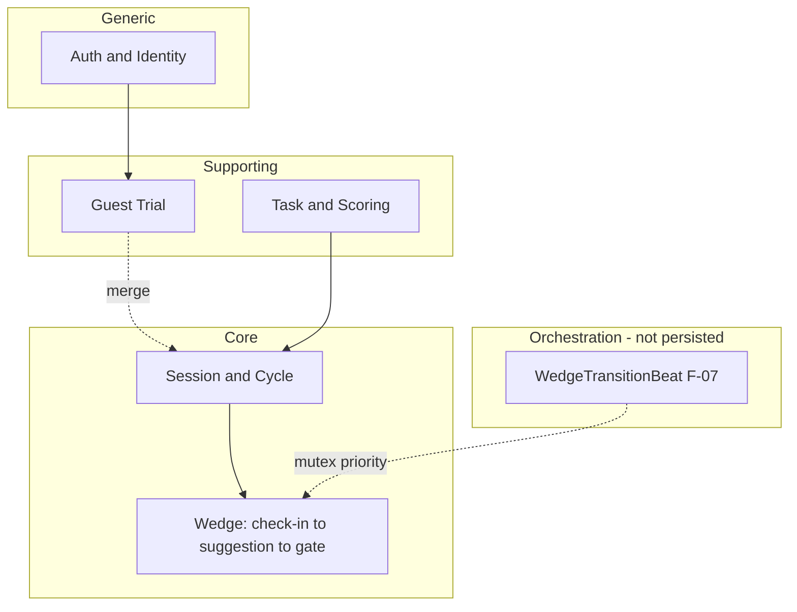

# FlowState — Event Storming (warsztat 2026-06-18)

Wynik warsztatu Event Storming prowadzonego na żywej tablicy (`event-storming-canvas`). Uzupełnia destylację domeny (`01`–`03`) o **oś czasu**, **polityki reaktywne**, **hotspoty** i **decyzje warsztatowe**. Walidacja: sub-agenci explore (zdarzenia, komendy/aktory, pause, T-01) + review bounded contexts.

**Faza tablicy:** `aggregates` (kompletna dla MVP+PRD v3 spine).

---

## 1. Konteksty ograniczone (bounded contexts)

Mapowanie zgodne z emergentną klasyfikacją z `01-domain-distillation.md`, doprecyzowane na tablicy etykietami:



| Kontekst | Etykieta na tablicy | Zakres x (oś czasu) | Agregaty | Systemy zewnętrzne |
|----------|---------------------|---------------------|----------|-------------------|
| **Generic — Auth & Identity** | `lbl-6` | merge beat (~280) | — | Neon Auth |
| **Supporting — Guest Trial** | `lbl-1` | 80–360 | Task (lokalny) | Browser localStorage |
| **Supporting — Task & Scoring** | `lbl-5` | 80–1080 | Task | Neon Postgres |
| **Core — Wedge + Session** | `lbl-2` | 480–2680 | Session, Cycle, SuggestionDecision, CheckIn* | Neon Postgres, Tab Visibility |
| **Orchestration — Transition Beats** | `lbl-7` | cała oś (priorytet beatów) | WedgeTransitionBeat (proces) | — |

\*CheckIn persystowany w Prisma; na tablicie zmodelowany jako zdarzenie `Energy Check-In Completed`, nie osobny agregat-sticky.

**Reguła integracji:** Guest Trial ma **węższy** zakres wedge (brak check-in, kickoff, wind-down). Po merge dane przechodzą przez ACL `data-mode` do kontekstu Core.

---

## 2. Oś czasu — happy path (authenticated)

Kolejność lewo → prawo na tablicy (`y: 330`):

| # | Zdarzenie | Status | Kontekst |
|---|-----------|--------|----------|
| 1 | Task Created | shipped | Task & Scoring |
| 2 | Guest Trial Data Merged | shipped (opcjonalnie) | Guest → Core |
| 3 | Return Handoff Composed | shipped (beat wejścia ≥8h) | Orchestration |
| 4 | Focus Session Started | shipped | Session |
| 5 | Kickoff Readiness Declared | shipped | Wedge |
| 6 | Next Task Suggested | shipped | Wedge |
| 7 | Suggestion Decision Recorded | shipped | Wedge |
| 8 | Work Cycle Started | shipped | Cycle |
| 9 | Work Cycle Completed | shipped | Cycle |
| 10 | Energy Check-In Completed | shipped | Wedge |
| 11 | Wind-Down Opportunity Surfaced | shipped (warunkowo) | Wedge |
| 12 | Break Started | shipped | Cycle |
| 13 | Break Completed | shipped | Cycle |
| 14 | Session Ended | shipped | Session |
| 15 | Session Closure Presented | shipped | Orchestration |
| 16 | Session Closure Line Recorded | shipped | Session |

Pętla: po Break Completed → kolejny Work Cycle Started (multi-cycle session).

### Beat wejścia (≥8h return)

Osobna ścieżka (`lbl-4`), **nie** replay closure overlay:

```
Return Handoff Composed → dismiss → Kickoff Readiness Declared → …
```

Polityka `pol-10`: kickoff deferowany, dopóki handoff niedismissed.

---

## 3. Gałąź mid-cycle (`lbl-3`)

Trzy **różne intencje** użytkownika od `Work Cycle Started` — nie jedna gałąź:

| Intencja | Komenda | Zdarzenie | Cykl | interruptionCount | Remaining time |
|----------|---------|-----------|------|-------------------|----------------|
| Porzucenie timera | Interrupt Cycle | Work Cycle Interrupted | INTERRUPTED | nie | utracony |
| Zmiana zadania w bloku | Mark Task Done → Rebind | Task Rebound Mid-Cycle | RUNNING | **tak** | zachowany |
| Wczesne zakończenie + przerwa | End Cycle And Break | rejoin przy Check-In | COMPLETED | opcjonalnie | — |
| Zawieszenie (S-24) | Pause / Resume | Cycle Paused / Resumed | PAUSED | nie | zachowany |

**Decyzja warsztatowa:** Rebound wymaga wcześniejszego `Task Marked Done Mid-Cycle` (FR-015) — nie jest równoległym wyjściem do `Work Cycle Completed`.

**Decyzja warsztatowa (pause):** model **hybrydowy** — zdarzenia na gałęzi + `CycleState.PAUSED` + `pausedAt` + `remainingDurationSec` w schema (S-24). Cap ~30 min → `Session Ended` (`pol-8`).

---

## 4. Agregaty

| Agregat | Typ | Granica | Invarianty kluczowe |
|---------|-----|---------|---------------------|
| **Task** | root | `userId` | scoring attributes, personaPresetId, sortOrder |
| **Session** | root | `userId`, max 1 ACTIVE | interruptionCount, closureLine, 4h idle |
| **Cycle** | w Session | max 1 RUNNING/PAUSED | WORK/BREAK kinds, 1:1 CheckIn on WORK |
| **SuggestionDecision** | event record | per kickoff lub post-check-in | accepted override freedom |
| **WedgeTransitionBeat** | proces (niepersystowany) | F-07 conductor | I-01: ≤1 interstitial + ≤1 gate |

Obwódka `agg-2` Session obejmuje oś 480–2680; `agg-3` Cycle — 1280–2280; `agg-5` WedgeTransitionBeat — warstwa orchestracji pod wedge gates.

---

## 5. Polityki (purple)

| ID | Polityka | Status |
|----|----------|--------|
| pol-1 | Whenever guest signs in → merge local snapshot | shipped |
| pol-2 | Whenever beat fires → max 1 interstitial + 1 gate | **częściowo** (T-01 narusza) |
| pol-3 | Whenever WORK completes → require energy check-in | shipped (auth) |
| pol-4 | Whenever check-in saved → fetch suggestion ≤200ms | **gap** (sekwencyjne await) |
| pol-5 | Whenever FADING + fatigue → offer wind-down | shipped |
| pol-6 | Whenever 4th WORK completes → long break | shipped |
| pol-7 | Whenever 4h idle → auto-end session | shipped |
| pol-8 | Whenever pause >30min → calm session end | planned (S-24) |
| pol-9 | Whenever closure overlay active → suppress kickoff + check-in | **fix pending** (B-05) |
| pol-10 | Whenever handoff undismissed (≥8h) → defer kickoff | **not wired** |
| pol-11 | Whenever task rebound mid-cycle → increment interruption count | shipped |
| pol-12 | Whenever cycle paused → suppress wedge gates | planned (S-24) |

**Priorytet beatów (OQ2 / F-07):**  
`closure > wind-down > check-in > suggestion > kickoff > narrative > catch-up`

---

## 6. Hotspoty — status po warsztacie

| ID | Hotspot | Werdykt | Slice / akcja |
|----|---------|---------|---------------|
| hot-1 | Guest merge wedge surprise (T-05) | świadomy trade-off | post-merge onboarding UX; nie pełny wedge dla gościa |
| hot-2 | First suggestion lacks persona trust | luka US-02 | S-32 trust bridge |
| hot-3 | Pause vs Interrupt vs Rebind — 3 intents | rozstrzygnięte na tablicy | S-24 pause; nie mylić z Interrupt |
| hot-4 | Network loss on wedge gates | guardrail gap | S-34 optimistic wedge + calm recovery |
| hot-5 | T-01 closure vs kickoff | **closure wins** | B-05 → F-07 |
| hot-6 | Per-user data isolation | guardrail ACL | protectedProcedure + data-mode |
| hot-7 | Handoff before kickoff not wired | handoff first | F-07 + kickoffEligible + handoff dismiss |

---

## 7. Decyzje warsztatowe (podsumowanie)

1. **Gałąź mid-cycle:** TAK — Interrupt (dead-end), Rebind (po Mark Done), End & Break (rejoin Check-In), Pause/Resume (planned).
2. **T-01:** Closure wygrywa na tej samej wizycie; po ≥8h closure przez handoff banner, potem kickoff.
3. **Pause:** hybryda event + `PAUSED` state; nie overload `INTERRUPTED`.
4. **Persona trust:** rozszerzenie read modelu sugestii (S-32), nie nowe zdarzenie.
5. **WedgeTransitionBeat:** proces orchestracji (F-07), nie tabela w Prisma.

---

## 8. Zdarzenia planned (poza happy path, roadmap)

| Zdarzenie | Slice | US |
|-----------|-------|-----|
| Cycle Paused / Cycle Resumed | S-24 | US-04 |
| Session Auto-Ended After Pause Cap | S-24 | US-04 |
| Daily Standing Tasks Reset | S-27 | US-03 |
| Daily Work Timing Recap Shown | S-30 | US-03 |

---

## 9. Mapowanie na artefakty L5 i rollout

| Wynik warsztatu | Artefakt | Następny krok | Status |
|-----------------|----------|---------------|--------|
| I-01 beat-mutex, pol-2/9 | `02-invariant-aggregate-refactor.md` | B-05 → B-06 → F-07 (`refactor-opportunities/plan.md`) | B-05 done; B-06 active |
| pol-10 / hot-7 handoff→kickoff | `F-07.md`, `user-flow.md` T-06 | F-07 conductor + `kickoffEligible` | scope w roadmapie 2026-06-18 |
| 4 intencje mid-cycle | `user-flow.md` §4 | drift pause=interrupt naprawiony | done 2026-06-18 |
| pol-8, pol-12 pause | `S-24.md`, `02` L9 | S-24 + F-07 `gatesWhilePaused` | scope w roadmapie 2026-06-18 |
| hot-1 / T-05 post-merge UX | `S-11 ext.`, `flow-coherence-recommendations.md` Phase 4 | po F-07; P-GAP-102 promoted | active extension |
| hot-2 / S-32 persona trust | `01` G12, slice S-32 | read model, nie nowe zdarzenie | S-32 ready |
| PAUSED schema | `02` G5, `prisma/schema.prisma` | S-24 cycle-pause-resume | ready |
| Guest ACL | `03-anti-corruption-layer.md` | K2 data-mode hardening | in rollout |
| Tablica wizualna | `event-storming-canvas/board.json` | utrzymywać przy kolejnych slice'ach | ongoing |

---

## 10. Aktorzy i systemy zewnętrzne

**Aktorzy:** Knowledge Worker (pełny wedge), Guest User (węższy trial).

**External:** Neon Auth, Neon Postgres, Browser localStorage (`GuestSnapshotV1`), Browser Tab Visibility (catch-up gates).

---

*Tablica źródłowa: `event-storming-canvas/board.json` (title: Event Storming — FlowState). Odświeżenie: `node server.js` → `http://localhost:4000`.*
