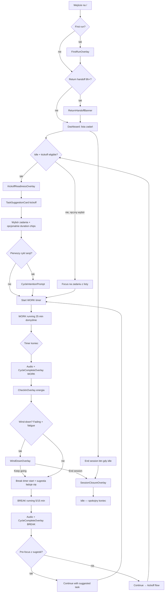

# FlowState — mapa flow użytkownika

Dokument opisuje **aktualne** zachowanie aplikacji (stan kodu 2026-06-13): co użytkownik widzi, w jakiej kolejności, ile trwa, jaki efekt ma wywołać. Odniesienia implementacyjne: `pomodoro-dashboard.tsx`, `use-pomodoro-cycle.ts`, `home-shell.tsx`.

## Cel produktowy flow

FlowState ma prowadzić wiedzowego pracownika przez **świadome przejścia** między cyklami pracy — nie maksymalizować throughput. Każda granica cyklu to moment zatrzymania (potwierdzenie, check-in energii, sugestia), a koniec sesji ma zostawić **spokojne zamknięcie dnia** (closure line, handoff po powrocie), nie poczucie chaosu.

---

## Dwie ścieżki: authenticated vs guest

| Obszar | Authenticated (zalogowany) | Guest (przed rejestracją) |
|--------|---------------------------|---------------------------|
| Check-in energii po cyklu pracy | Tak (`CheckInOverlay`) | Nie — od razu break |
| Kickoff readiness (energia na start) | Tak | Nie |
| Sugestia następnego zadania | Tak (kickoff + post-check-in) | Nie |
| Wind-down (zachęta do końca sesji) | Tak | Nie |
| Intencja sesji (pierwszy cykl) | Tak | Tak (ten sam prompt) |
| Session closure overlay | Tak | Tak (ten sam overlay) |
| Return handoff (powrót po 8h+) | Tak | Tak |
| First-run onboarding | Tak | Tak (osobna treść copy) |
| Session timeout 4h | Tak (serwer) | Nie (brak auto-timeout) |

Guest ma ten sam timer, listę zadań i potwierdzenia cyklu — bez „wedge stacku” adaptacyjnego.

---

## Diagram głównej pętli (authenticated)

---

## Fazy szczegółowe

### 1. Wejście i kontekst (0–30 s)

| Moment | Warunek | UI | Czas | Efekt |
|--------|---------|-----|------|-------|
| First-run | Pierwsza wizyta, brak cycle-complete / merge overlay | `FirstRunOverlay` (z-index 58) | do dismiss | Wprowadza w check-in → sugestia (treść zależy od guest/auth) |
| Return handoff | Ostatnia sesja zakończona ≥ 8h temu, nie dismissed | `ReturnHandoffBanner` u góry | do dismiss | Przywraca kontekst: closure + resume note / pierwsze aktywne zadanie |
| Guest banner | `mode === guest` | `GuestBanner` | stały | Przypomina o rejestracji |
| Merge success | Po imporcie guest → account | `MergeSuccessOverlay` | do dismiss | Potwierdza merge |

**Mutual exclusion:** handoff jest tłumiony gdy widoczny dowolny wedge gate (timer running, check-in, sugestia, closure, wind-down, kickoff readiness, first-run, merge, cycle-complete).

---

### 2. Kickoff sesji — idle start (15–60 s interakcji)

**Warunki `kickoffEligible`** (`use-pomodoro-cycle.ts`):
- authenticated, `state === idle`, brak focused task, brak aktywnych gate'ów check-in/wind-down/post-check-in
- `hasActiveTasks === true`
- `sessionStartIdleFlag || postBreakIdleFlag` (po wejściu bez aktywnego cyklu lub po break bez pre-focus)

| Krok | UI | Czas | Efekt |
|------|-----|------|-------|
| 1 | `KickoffReadinessOverlay` — „How's your energy to start?” (Focused/Steady/Fading) | ~3–10 s | Energia trafia do `suggestion.next` kickoff |
| 2 | `TaskSuggestionCard` (loading → ready/empty/error) | 0.2–3 s fetch | Pokazuje zadanie + rationale + opcjonalnie „Why this?” |
| 3 | Accept → pre-focus task; opcjonalnie `KickoffDurationChips` per work type | ~5–15 s | Ustawia duration preset per typ pracy |
| 4 | Override (klik innego zadania) | ~2 s | `overrideAcknowledgement` strip ~kilka sekund |

Skip readiness → domyślnie **Steady**.

---

### 3. Start pierwszego cyklu pracy

| Moment | Warunek | UI | Efekt |
|--------|---------|-----|-------|
| Intencja sesji | `completedWorkCycles === 0` i brak wcześniejszej intencji | `CycleIntentionPrompt` (z=60) | Opcjonalna linia kotwicy w in-flow summary |
| Timer panel | focused task + start | `TimerPanel` countdown mono | WORK cycle w DB, session auto-create |

**Domyślne czasy:** praca 25 min, krótka przerwa 5 min, długa 15 min co 4. ukończone cykle pracy (`duration-storage.ts`).

---

### 4. Cykl pracy (WORK) — ~25 min

| Element | Kiedy | Efekt |
|---------|-------|-------|
| Focus ring / highlight | task focused | Wizualna kotwica „tu jestem” |
| In-flow summary | idle między cyklami, bez gate'ów | Jedna linia: „N cycles · M tasks done · feeling X · intention” |
| Mid-cycle complete | mark done podczas WORK | `MidCycleCompletionPrompt`: kontynuuj z innym zadaniem (resume note) LUB zakończ cykl → check-in |
| Pause/interrupt | użytkownik | Timer idle, cykl przerwany (nie liczy się jako interruption scoring) |
| Tab hidden + koniec | timer skończył się w tle | `TabReturnCatchUp` banner: WORK_CONFIRM |

Koniec cyklu: audio (Normal/Soft/Muted) + `state = completed` + `CycleCompleteOverlay`.

---

### 5. Granica WORK → check-in → break (~30–90 s)

| Krok | UI | Kto widzi | Efekt |
|------|-----|-----------|-------|
| 1 | `CycleCompleteOverlay` — Done / Continue later | wszyscy | Użytkownik decyduje o task done |
| 2 | `CheckInOverlay` — „How's your energy?” | authenticated | **Blokuje** cycle-complete overlay (B-04 fix: ukryty gdy `awaitingCheckIn`) |
| 3a | `WindDownOverlay` | Fading + (≥3 cykle LUB ≥2 interruptions) | Opcja End session / Keep going |
| 3b | Break start + suggestion fetch | domyślnie | Automatyczny SHORT/LONG break; sugestia ładuje się równolegle |

**Wind-down warunki** (`wind-down-nudge.ts`):
- energia = FADING
- nie dismissed wcześniej w sesji
- `completedWorkCycles >= 3` **lub** `interruptionCount >= 2`

Uwaga: `completedWorkCycles` jest liczone **przed** inkrementacją przy starcie break — wind-down przy samym progu „3 cykle” zadziała dopiero przy check-inie **po zakończeniu 4. bloku WORK** w sesji (gdy w stanie jest już 3 ukończone), chyba że wcześniej zadziała próg przerwań.

Po check-in: `isPostCheckInTransitioning` ukrywa cycle-complete overlay podczas fetch sugestii (naprawa flash B-04).

---

### 6. Przerwa (BREAK) — 5 lub 15 min

| Element | Kiedy | Efekt |
|---------|-------|-------|
| Timer break | running | Teal tint, brak focused task na break |
| `TaskSuggestionCard` | break running + suggestion ready | Accept → pre-focus na następny WORK |
| Override innej task | break + suggestion ready | Ack strip + scoring zapis override |
| Tab catch-up | hidden tab + suggestion ready | `SUGGESTION_ACCEPT` gate |

Koniec break: `CycleCompleteOverlay` (break variant) — Continue / Continue with [task] / Choose different.

---

### 7. Koniec sesji

**Triggery:**
- przycisk „End session” (disabled gdy timer running)
- wind-down → End session
- timeout serwera: **4h bez startu cyklu** (`SESSION_INACTIVITY_TIMEOUT_MS`)

| Ścieżka | UI | Efekt emocjonalny |
|---------|-----|-------------------|
| Explicit end | `SessionClosureOverlay` (z=58) — closure line + „Got it” | Spokojne podsumowanie: cykle, taski, energia |
| Timeout | Closure przy **następnym** `getOrCreateActive` ze zmianą session id | „Sesja wygasła” — closure z `getLastEnded` |
| Po dismiss closure | idle dashboard | Brak aktywnej sesji do następnego startu cyklu |

**Return handoff:** przy powrocie ≥8h później — banner (nie overlay) z max 2 klauzulami: resume note + closure.

---

## Happy path — pełny dzień pracy (authenticated, domyślne czasy)

Scenariusz: 6–7 cykli pracy (~2,5–3 h czystego focusu + przerwy), 3 taski ukończone, jedna sesja rano + jedna po południu.

### Sesja poranna (4 cykle → long break)

| # | Faza | Czas wall-clock | Interakcja użytkownika |
|---|------|-----------------|------------------------|
| 0 | Login, ewentualnie first-run/handoff | 0–1 min | dismiss onboarding |
| 1 | Kickoff readiness + sugestia + accept + intention | 1–2 min | energia, accept task, opcjonalna intencja |
| 2 | WORK #1 | 25 min | praca |
| 3 | Complete → check-in → break + sugestia | 1–2 min | energia Steady, review sugestii |
| 4 | BREAK #1 | 5 min | odpoczynek, accept next task |
| 5 | WORK #2 | 25 min | praca |
| 6 | Complete (mark done) → check-in | 1–2 min | Done + Focused |
| 7 | BREAK #2 + sugestia | 5 min | |
| 8 | WORK #3 | 25 min | |
| 9 | Complete → check-in | 1–2 min | Steady |
| 10 | BREAK #3 | 5 min | |
| 11 | WORK #4 | 25 min | |
| 12 | Complete → check-in → **LONG BREAK** | 1–2 min | |
| 13 | LONG BREAK | 15 min | |
| 14 | Break complete → kickoff flow (brak pre-focus) | 1–2 min | readiness + sugestia |
| 15 | End session | 10 s | closure overlay |

**Suma orientacyjna sesji 4-cyklowej:** ~25×4 + 5×3 + 15 + ~15 min interakcji ≈ **2h 25min – 2h 40min** wall-clock.

### Sesja popołudniowa (4 cykle, zmęczenie)

| # | Faza | Efekt |
|---|------|-------|
| 1 | Kickoff readiness (postBreakIdle lub nowy idle) | szybszy start |
| 2–3 | 2× (WORK + check-in + break) | in-flow summary rośnie |
| 4 | WORK #3 + check-in Steady | completedWorkCycles = 2 — wind-down jeszcze nie |
| 5 | WORK #4 + check-in **Fading** (completedWorkCycles = 3) | `WindDownOverlay` |
| 6 | End session | closure z „feeling fading” |

**Efekt końcowy dnia:** lista active vs completed czytelna, closure line + ewentualny handoff następnego ranka.

---

## Macierz overlayów — kto z kim współistnieje

| Overlay / surface | z-index | Blokuje inne? | Uwagi |
|-------------------|---------|---------------|-------|
| TabReturnCatchUp | 55 / 65 | nie — towarzyszy gate | Banner u góry |
| CycleCompleteOverlay | 50 (default scrim) | częściowo | Ukryty gdy check-in / wind-down / post-check-in |
| SessionClosureOverlay | 58 | **nie** | Brak guard vs kickoff readiness |
| WindDownOverlay | 58 | tak (check-in off) | Przed break |
| KickoffReadinessOverlay | 60 | **nie vs closure** | Może przykryć closure |
| CycleIntentionPrompt | 60 | tak | Przed startem |
| CheckInOverlay | 60 | tak | Po WORK complete |

**Zasada PRD (guardrail):** „At most one interstitial line plus one gate per transition beat” — w praktyce **closure + kickoff readiness mogą się nałożyć** (patrz: znane tarcia).

---

## Znane tarcia i konflikty (stan 2026-06-13)

### T-01: Closure vs kickoff readiness / check-in

**Objaw:** `SessionClosureOverlay` (z=58) znika lub jest widoczny „ przez sekundę”, zaraz pojawia się popup energii (kickoff readiness z=60 lub check-in).

**Przyczyna techniczna:**
- `pomodoro-dashboard.tsx` renderuje `SessionClosureOverlay` bez warunku `!awaitingKickoffReadiness` / `!pendingClosureLine` w kickoff guard
- Kickoff readiness/check-in mają wyższy z-index (60 > 58)
- Po `endSession()` wywoływane jest `clearKickoffIdleFlags()`, ale kickoff effect może ponownie ustawić `awaitingKickoffReadiness` gdy użytkownik jest idle z `sessionStartIdleFlag` (np. recovery po timeout) **w tej samej wizycie**
- **Race:** async `getOrCreateActive()` w kickoff effect może rozwiązać się **po** `endSession()` i ponownie otworzyć readiness nad closure
- Dedup closure w `sessionStorage` (`wasClosureShown`) — ten sam session id nie pokaże overlay drugi raz

**Intencja produktowa vs rzeczywistość:** closure ma dać moment oddechu; natychmiastowy popup energii **psuje** calm closure (naruszenie FR-040 / guardrail interstitial fatigue).

### T-02: Cycle complete flash po check-in (B-04 — naprawione)

Po submit check-in `isPostCheckInTransitioning` ukrywa cycle-complete overlay. Historyczny bug — obecnie mitigowany.

### T-03: Timeout closure nie na load

Closure po timeout sesji pokazuje się dopiero przy **starcie następnego cyklu** (`maybePresentTimeoutClosure`), nie przy samym wejściu na stronę — użytkownik może najpierw zobaczyć kickoff readiness bez kontekstu „poprzednia sesja się skończyła”.

### T-04: End session disabled during running

Użytkownik nie może zakończyć sesji w trakcie timera — musi interrupt lub poczekać. To zamierzone, ale może frustrować przy nagłym końcu dnia.

### T-05: Guest vs authenticated cognitive split

Gość nie ćwiczy check-in/sugestii — po merge pierwsze doświadczenie authenticated może zaskoczyć gęstością gate'ów.

---

## Czasy domyślne — skrót

| Parametr | Wartość |
|----------|---------|
| Work cycle | 25 min (konfigurowalne 1s–90 min) |
| Short break | 5 min |
| Long break | 15 min co 4. WORK |
| Session timeout | 4h bez nowego cyklu (tylko authenticated, serwer) |
| Return handoff threshold | 8h od `endedAt` |
| Override ack visible | kilka sekund (`OVERRIDE_ACK_VISIBLE_MS`) |
| Suggestion fetch feedback | loading card; NFR >1s continuous feedback |

---

## Mapowanie na FR (wybrane)

| Flow beat | FR |
|-----------|-----|
| Cycle confirm + audio | FR-013, FR-014 |
| Check-in po WORK | FR-020 |
| Kickoff readiness | FR-033 |
| Sugestia + override ack | FR-021, FR-022, FR-029, FR-026 |
| Wind-down | FR-027 |
| Mid-cycle prompt | FR-015, FR-028 |
| Session closure + handoff | FR-040 |
| Tab catch-up | FR-031 |
| Cycle intention | FR-041 (re-entry copy family) |
| Guest trial | FR-003b–003c |

---

## Pliki źródłowe (orientacyjnie)

- Orkiestracja UI: `src/app/_components/pomodoro-dashboard.tsx`
- State machine: `src/hooks/use-pomodoro-cycle.ts`
- Shell + handoff: `src/app/_components/home-shell.tsx`, `src/hooks/use-return-handoff.ts`
- Narracja: `src/lib/session/narrative-builder.ts`
- Wind-down logika: `src/lib/session/wind-down-nudge.ts`
- Session timeout: `src/server/api/lib/active-session.ts`
