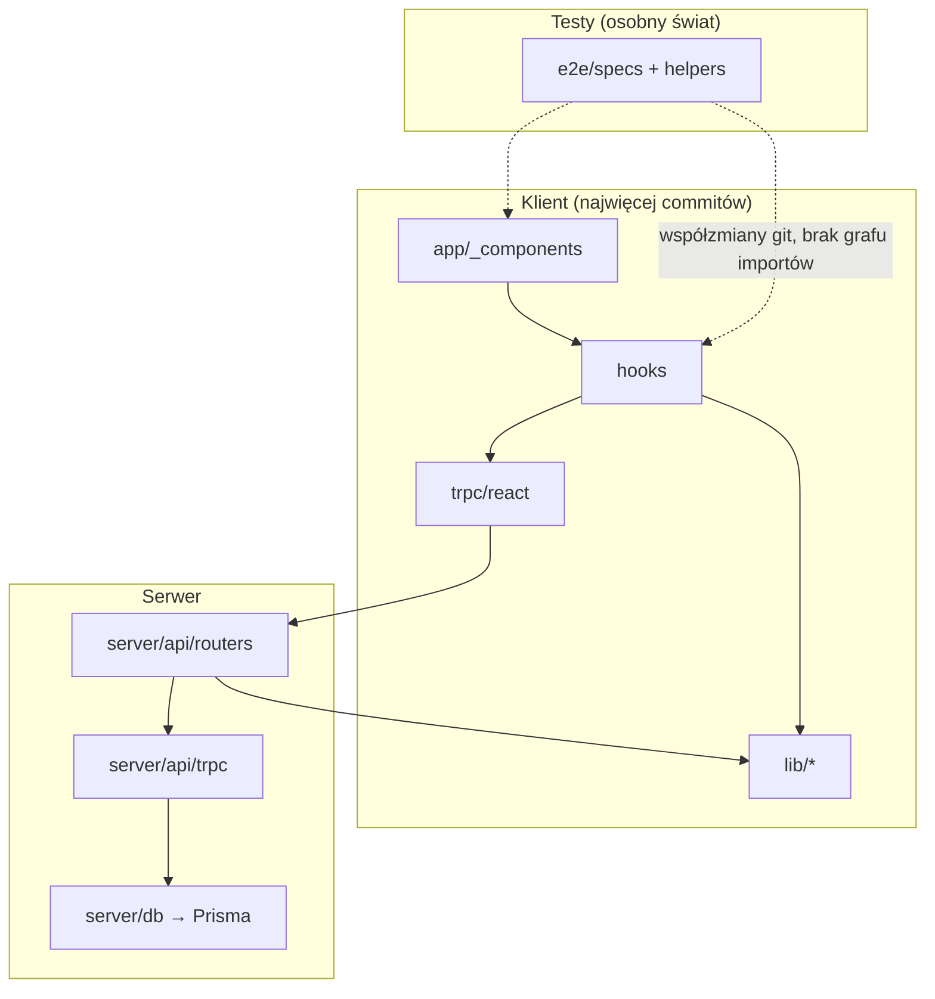

# FlowState — mapa repo (onboarding)

Skrót dla nowego developera: gdzie żyje kod, jak jest powiązany, co jest ryzykowne i od czego zacząć.
Synteza z [artifact-1](./artifact-1-territory.md) (git) · [artifact-2](./artifact-2-structure.md) (graf) · [artifact-3](./artifact-3-contributors.md) (ludzie).

---

## 1. TL;DR

**FlowState** to aplikacja Pomodoro (Next.js App Router, tRPC, Prisma/Neon, Playwright). Mimo etykiety „legacy”, cała historia produktu mieści się w **~3 tygodniach** (maj–czerwiec 2026) — to młode, solo-maintained repo, nie wieloletzowy monolit.

Praca skupia się na **vertical slice'u timera**: UI (`_components`) → hooki → routery tRPC → E2E. ~50% aktywności to cykl Pomodoro + zadania; ~21% to testy przeglądarkowe. Architektura warstwowa w rdzeniu jest **zdrowa** (acykliczna, jednokierunkowa), ale **kosztowna w testach** — jeden hub (`use-pomodoro-cycle`) ciągnie 18 modułów i wymaga mocków albo E2E.

**Boli:** szeroki blast radius timera, bus factor (jeden autor), wyjątki od wzorców (dual tRPC w dashboardzie, guest merge przez 3 kanały, cykl w sign-in). **Bezpieczny wzorzec:** `lib/scoring` — czysta domena, tanie testy unit.



---

## 2. Teren

### Gdzie jest odpowiedzialność

| Strefa | Głębokość | Aktywność git | Uwaga |
|--------|-----------|---------------|-------|
| **Epicentrum** — timer + zadania | Głęboka | ~50% commitów | `use-pomodoro-cycle`, dashboard, task-list, `cycle.ts` |
| **Drugi klaster** — scoring + sugestie | Średnia | ~5% ścieżkowo, ~20% tematycznie | Mało plików, dużo logiki PRD |
| **Pas testowy** — `e2e/` | Głęboka (harness) | ~21% | Równy UI pod względem churnu; **poza grafem depcruise** |
| **Guest / data-mode** | Głęboka architektonicznie, płytka w git | ~3% ścieżkowo | Folder `lib/repositories` wygląda na peryferię — w grafie to most guest↔server |
| **Auth** | Płytka ostatnio, głęboka historycznie | 5%, trend ↓ | Zbudowany w W21, potem rzadko ruszany |
| **Infra** — `env.js`, CI, Prisma | Płytka, szeroki zasięg | Rzadko | `env.js` dotyka 9/9 kategorii modułów w jednym commicie |

### Folder ≠ aktywność (pułapki mapy katalogów)

- **`src/lib/repositories/`** — mało commitów, ale `data-mode-context` tu buduje ACL; zmiana gościa/server mode uderza w hook timera. *Wiedza z grafu importów, nie z rankingu git.*
- **`src/server/api/trpc.ts`** — niewidoczny w TOP-10 folderów, ale **25 dependents** w grafie; każdy router przez niego przechodzi.
- **`src/app/auth/`** — malejący churn, ale jedyny cykl importów w repo i ścieżka wejścia użytkownika.
- **`prisma/`** — wykluczone z analizy terytorium; zmiana schematu = **regeneracja** klienta (`pnpm prisma generate`), nie ręczne edycje w `generated/`.

### Aktywność w czasie (git)

```
W21 scaffold → W22 MVP → W23 szczyt (timer, scoring, E2E) → W24 polish + harness
```

Trend czerwca: ↑ hooks, components, lib, e2e · ↓ routers, auth, infra. Nowy dev trafia w **dojrzały timer i harness E2E**, nie w świeży scaffold auth.

---

## 3. Realne powiązania

Legenda źródeł: **git** = współzmiany w commitach · **graf** = dependency-cruiser na `src/` · **unknown** = poza zakresem grafu · **regen** = sprzężenie przez generację/mock, nie ręczną edycję

### Silne sprzężenia (planuj zmianę razem)

| Co się zmienia razem | Źródło | Siła | Uwaga |
|----------------------|--------|------|-------|
| `_components` ↔ `hooks` | git (35 wspólnych commitów) + graf (7 modułów → hook) | Wysoka | 50% commitów UI idzie z hookiem |
| `hooks` ↔ `routers` | git (21) + graf (hook → trpc → routers) | Wysoka | Zmiana API cyklu = hook + `cycle.ts` |
| `hooks` ↔ `e2e/specs` | git (27) | Wysoka | Graf **nie obejmuje** `e2e/` — coupling tylko z historii |
| `e2e/helpers` ↔ `e2e/specs` | git (31) | Wysoka | Harness; poza grafem importów TS |
| `_components` + `hooks` + `routers` | git (10 commitów trójka) | Średnia | Kanoniczny vertical slice |
| `data-mode` + `repositories` + `routers` | git (9) + graf (context → repos → trpc) | Średnia | Niski churn git, wysoki wpływ strukturalny |

### Sprzężenia warstwowe (graf — zdrowe, ale szerokie)

| Kierunek | Wynik | Źródło |
|----------|-------|--------|
| UI/hooks → serwer | Tylko przez `~/trpc/react` | graf ✓ |
| serwer → UI | Brak importów | graf ✓ |
| lib → serwer runtime | Tylko `import type` AppRouter | graf ✓ |
| serwer → lib/scoring | Domain w lib, router orkiestruje | graf ✓ |

**Wyjątki od wzorca** (graf + git): `pomodoro-dashboard` woła `api` bezpośrednio obok hooka · `guest-import` = server action + tRPC + localStorage.

### Cykle i regen

| Element | Status | Źródło |
|---------|--------|--------|
| Rdzeń Pomodoro | Acykliczny | graf |
| `sign-in/action ↔ sign-in-form` | **Jedyny cykl** w `src/` | graf |
| `generated/prisma/client` | Używany w lib/scoring, lib/guest — **regen** po `schema.prisma` | graf widzi krawędź; **git nie liczy** `prisma/` w terytorium |
| `Co-authored-by: Cursor` | ~273 commitów — asysta AI, autor człowiek | git / artifact-3 |
| Neon Auth, Vercel, GitHub Actions | **unknown** — brak grafu zależności | poza depcruise |
| Playwright auth pool (`e2e/.auth/`) | **unknown** w grafie; generowane przy `global-setup` | regen/mock, nie ręczna edycja |

### Co git mówi, a graf nie (i odwrotnie)

- **Git bez grafu:** E2E ↔ produkcja — realne sprzężenie dostawy, niewidoczne w importach TS.
- **Graf bez git:** `server/api/trpc.ts` fan-in 25 — architektoniczny hub, mało własnych commitów.
- **Oba zgodne:** hook timera to centrum — #1 plik w git, 18 fan-out w grafie.

---

## 4. Strefy ryzyka

| # | Strefa | Dlaczego (jedna linia) |
|---|--------|------------------------|
| 1 | **`use-pomodoro-cycle.ts`** | 18 zależności, test ~2700 linii, 9 dependents — zmiana bez E2E = ślepa strefa |
| 2 | **Guest merge flow** | 3 kanały persystencji (action, tRPC, store); 11 fan-in na `guest/store`; brak testu `data-mode-context` |
| 3 | **E2E harness** | 11% plików z historii już usuniętych po konsolidacji (`6ed9bda`); pokrycie scenariuszy nie wynika z kodu |
| 4 | **`pomodoro-dashboard.tsx`** | 21 importów + dual path do tRPC; test to smoke ze stubami |
| 5 | **Auth / sign-in** | Jedyny cykl importów; wiedza „zamrożona” z maja; błąd = brak wejścia do app |
| 6 | **Bus factor** | 100% commitów = jeden autor; brak rotacji wiedzy między ludźmi |

---

## 5. Kogo zapytać

Repo jest **solo-maintained**. We wszystkich strefach jeden kontakt:

| Strefa ryzyka | Kto | Kiedy | Faza, którą zna najlepiej |
|---------------|-----|-------|----------------------------|
| Hub timera | **Konrad Zieliński** `konrad.kaluzny@ceneo.pl` | Worker, stany cyklu, mid-cycle rebind | W22–W23 (MVP → szczyt) |
| Guest / data-mode | **Konrad Zieliński** | Dlaczego server action zamiast routera; kolejność merge | W23 |
| E2E harness | **Konrad Zieliński** | Co zastąpiło usunięte specy; konwencje helperów | W23–W24 |
| Scoring / sugestie | **Konrad Zieliński** | Reguły PRD, `recordDecision`, wind-down | W22–W23 |
| Auth | **Konrad Zieliński** | Neon Auth, cykl sign-in, OAuth | W21 (scaffold) |

**Tip:** Zacznij od rozmowy o hubie timera — rozstrzyga większość pytań z pozostałych stref.

---

## 6. Pierwszy dzień — co przeczytać (kolejność)

| # | Plik / moduł | Dlaczego teraz |
|---|--------------|----------------|
| 1 | `AGENTS.md` + `context/foundation/prd.md` (skim) | Zasady repo i produkt — *poza mapą, ale niezbędne* |
| 2 | `src/hooks/use-pomodoro-cycle.ts` | Serce produktu (#1 churn); zrozum zanim dotkniesz UI |
| 3 | `src/app/_components/pomodoro-dashboard.tsx` | Jak hook spotyka UI i overlaye |
| 4 | `src/lib/data-mode/data-mode-context.tsx` | Most guest ↔ server — klucz do trybu gościa |
| 5 | `src/server/api/routers/cycle.ts` | Kontrakt API cyklu (tRPC) |
| 6 | `src/lib/scoring/score-task.ts` | Wzorzec „dobra” domeny — krótki, testowalny |
| 7 | `e2e/pomodoro-cycle.spec.ts` + `e2e/helpers/work-cycle.ts` | Jak produkt jest dowodzony end-to-end |
| 8 | `reports/timer-hub.svg` | Wizualny blast radius huba — *artifact-2* |

Po przeczytaniu uruchom: `pnpm dev`, `pnpm test`, `pnpm depcruise` — poczuj harness lokalnie.

---

## 7. Ograniczenia

| Czego ta mapa **nie mówi** | Dlaczego |
|----------------------------|----------|
| Zachowanie w produkcji (Neon, Vercel) | Poza git i grafem TS — **unknown** |
| Pełna historia > 3 tygodni | Okno „12 miesięcy”, ale repo młodsze |
| Zależności w `e2e/` | dependency-cruiser skonfigurowany na `src/` |
| `prisma/`, CI, configi | Wykluczone z terytorium git lub poza grafem |
| Intencja usuniętych E2E speców | Wymaga autora — git pokazuje *że* usunięto, nie *dlaczego* |
| Jakość kodu / pokrycie % | Mapa aktywności i struktury, nie audyt jakości |

| Metoda | Zakres | Data |
|--------|--------|------|
| Git log (`--since=2025-06-12`) | Aktywność, współzmiany | artifact-1 |
| dependency-cruiser 17.4.3 | `src/`, 231 modułów | artifact-2 |
| Autorzy git (znormalizowani) | 468 commitów, 1 człowiek | artifact-3 |

**Regeneracja vs ręczna edycja:** Zmiana `prisma/schema.prisma` → `pnpm prisma generate` → aktualizacja `generated/` i wszystkich importów typów Prisma — **tańsze psychicznie** niż sprzężenie git (jeden krok toolchain), ale **nie ignoruj** w planowaniu. Podobnie: `e2e/.auth/worker-*.json` — generowane przez `global-setup`, nie edytuj ręcznie.

---

*Szczegóły: [artifact-1-territory.md](./artifact-1-territory.md) · [artifact-2-structure.md](./artifact-2-structure.md) · [artifact-3-contributors.md](./artifact-3-contributors.md)*
